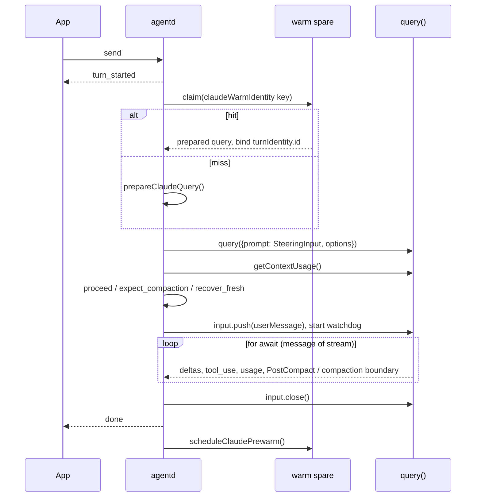
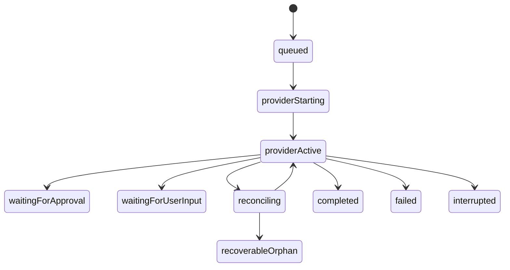

# Inside agentd

agentd is the headless Node ESM process the app spawns, one per provider lane, and drives with
newline-delimited JSON over stdio. [AGENTD-PROTOCOL.md](./AGENTD-PROTOCOL.md) documents the seam.
This document covers the inside.

These three grow with almost every commit. Run them rather than quoting them; the numbers below were
true at 0.26.9 and are here only to set the scale.

```
$ find agentd/src -name '*.mjs' | wc -l                   # 70
$ find agentd/src -name '*.mjs' -exec cat {} + | wc -l    # 26638
$ wc -l < agentd/src/agentd.mjs                           # 9773
```

State the shape first, because the file count misleads: **there is no `Provider` interface.**
Nothing in `agentd/src` declares one, and the three lanes (Claude, OpenAI, Codex) share no
transport, no session model, and no tool-execution strategy. They share the emitted event vocabulary
plus a ring of small pure modules around large lane-specific implementations. Adding a lane means
writing a lane, not implementing an interface.

## 1. Shape of the daemon

`agentd.mjs` has no `main()`. The module body *is* the boot sequence, and it ends in a `readline`
interface over stdin. There is no worker and no thread pool: concurrency is many in-flight `async`
turn functions keyed by turn id in `activeTurns`.

The daemon is provider-fixed. `PROVIDER` and `AUTH_MODE` are module constants computed once from
`MECHANICIAN_PROVIDER` and `MECHANICIAN_AUTH`, so every later branch compares against a constant.
The app runs one daemon per lane concurrently, which is why allowlists, config directories and MCP
OAuth Keychain records are all route scoped. See
[PROVIDER-LANES-AND-ACCOUNTS.md](./PROVIDER-LANES-AND-ACCOUNTS.md).

Some handlers close over state declared further down the file; those are deferred with
`setTimeout(..., 0)` so they run after module evaluation finishes. Grep `startCodexProvider()` and
`probeCommands(cwd)` for both.

## 2. Boot: environment surgery in order, then the SDK import

Boot is a sequence of deletions and assignments to `process.env`, and the order is the point. The
Claude Agent SDK inspects the environment when it is imported, and every child agentd later spawns
inherits it.

1. `PROVIDER` and `AUTH_MODE` resolve (`resolveAnthropicAuthMode` in `claude-secure-spawn.mjs`).
2. `MECHANICIAN_MANAGED_MODEL` and `MECHANICIAN_ROUTE_IDENTITY` are captured into constants and
   deleted, so app control metadata never reaches a child.
3. `scrubUnsupportedClaudeRoutes(process.env)` removes every enterprise backend selector
   (`UNSUPPORTED_CLAUDE_ROUTE_ENVIRONMENT`). `ANTHROPIC_AUTH_TOKEN` and
   `CLAUDE_SECURESTORAGE_CONFIG_DIR` are deleted outright.
4. The lane's credential is resolved, with a `security find-generic-password` fallback for the
   API-key lanes. Only the Anthropic API-key lane is then both captured into a module constant
   (`ANTHROPIC_API_CREDENTIAL`) and deleted from `process.env`. The subscription lane captures its
   token into `EXPLICIT_CLAUDE_OAUTH_CREDENTIAL` and deliberately writes `CLAUDE_CODE_OAUTH_TOKEN`
   back into the environment after deleting it, because the engine child reads it there.
5. `CONFIG_DIR` is created, `CODEX_CONFIG_DIR` is derived from its basename, `CLAUDE_CONFIG_DIR` is
   set per route, and Vertex or Bedrock selectors are added back only from the explicit keep-lists.
6. Only now does `await import('@anthropic-ai/claude-agent-sdk')` run, and only when `wantSdk`.

Import earlier, or scrub later, and a lane labelled "Claude subscription" can run against a backend
inherited from the launching shell. Capture a credential after the import and it stays in the
environment of every tool the agent runs. `resolveClaudeBin()` returns `null` unless
`MECHANICIAN_CLAUDE_BIN` is set: the engine is never discovered on `PATH`, because a GUI or updater
relaunch has a minimal `PATH` where a third-party `claude` wrapper exits 127, which the daemon would
misread as a signed-out account.

A failed import leaves `mode = 'unavailable'`, never fabricated output, unless
`MECHANICIAN_ENABLE_MOCK_PROVIDER === '1'`. `mode` has four values: `sdk`, `unavailable`, `mock`,
`starting` (Codex, until its `initialize` handshake completes). The header comment at the top of
`agentd.mjs` is stale on two counts: it lists three modes, and its provider paragraph omits the
Codex lane.

## 3. The stdin dispatcher and the request families

One `readline` interface, one `switch (req.type)`.

```
$ awk "/^rl.on\('line'/,0" agentd/src/agentd.mjs | grep -cE "^    case '"   # 36
```

The `default` branch routes `git_`, `term_` and `build_` prefixes to `handleGit`, `handleTerm` and
`handleBuild`, so those families extend in their own switch. Anything else gets `control_error`.

`case 'send'` validates, rejects a duplicate turn id, parses the optional nested `claude` block into
a frozen per-turn snapshot (`parseClaudeTurnConfiguration` in `claude-turn-options.mjs`, so a
malformed option is a rejected request rather than a turn that dies mid-stream), registers the turn,
emits `turn_started`, and calls `handleSend(...)` **without awaiting it**. That is what keeps
`interrupt`, `permission_response`, `ping` and other turns serviceable while a turn streams.
`handleSend` is the only place the lanes fork.

`handleGit('git_status')` has a second, evidence-only layer above porcelain status. With the real
Git CLI it resolves the canonical common directory, exact worktree/HEAD/ref state, local refs,
registered worktrees, bounded candidate reachability, and an optional frozen-target graph
relationship. Each optional census carries its own availability state; proving repository identity
does not authorize a fabricated branch or worktree list when a later command fails. The fallback
may still support basic Changes presentation, but it marks repository evidence
`git_cli_unavailable`. The Swift side therefore cannot mistake fallback output for release or
cross-Conversation proof.

## 4. The Claude lane

`runSdk` wraps `streamOnce`. The ordering in `streamOnce` is the non-obvious part.



**The query is created before the prompt exists.** The turn's provider input is a `SteeringInput`
(`steering.mjs`), a push-driven async iterable that `query()` consumes for the life of the turn. The
user message is pushed only after the context preflight passes. `input.close()` must run both on the
`result` message and in the `finally` block, or the SDK never completes the turn and the engine child
is retained.

**The warm spare.** `warm-query-spare.mjs` is a provider-agnostic single slot with `warm(key, factory)`
and `claim(key)`, ownership transfer on claim, and a five-minute idle expiry, filled by
`scheduleClaudePrewarm` and by the app's `prewarm` request when a conversation is selected. The rule
`claudeWarmIdentity` encodes: anything that is a `query()` *startup* argument belongs in the hash
(cwd, model, effort, settings, permission mode, resume id, project instructions, extension
fingerprint, capability digest, MCP status fingerprint), because none of it can be patched after a
claim. It is deliberately not keyed by conversation id, so a new conversation can still claim a
ready process.

**The context guard.** `claude-context-guard.mjs` is pure and holds every threshold in a frozen
`CLAUDE_CONTEXT_POLICY`. `prepareClaudePromptForDelivery` asks the live stream for
`getContextUsage()` and feeds `claudeContextDecision`, which returns `proceed`, `expect_compaction`,
`recover_fresh`. `getContextUsage()` is bypassed on Vertex: the pinned SDK exposes
the method there but the route does not answer it, so method presence is explicitly not treated as a
capability probe. A cached usage sample is single-consumer (`take()` always deletes) and is never
seeded when two turns resume the same session concurrently.

**The message loop.** `for await (const message of stream)` is the whole fan-out: watchdog
observation, session id, deltas, tool use and results, usage, subagent and workflow updates, tool
catalog, compaction. One branch matters more than the rest: on `compact_result: failed` the stream
aborts immediately by throwing `ClaudeCompactionRecoveryRequired`, because the CLI otherwise falls
through into the original oversized request and turns a recoverable maintenance failure into a
second, noisier one.

Successful compaction has two SDK surfaces. The streamed `compact_boundary` supplies trigger and
token counts. The supported root `PostCompact` hook supplies the exact provider-authored continuity
summary plus session/prompt correlation; it does not expose every other effective-context component.
Subagent hook events are ignored because they do not reset the root conversation context. The SDK
does not promise which surface arrives first, so agentd emits an independent turn-scoped
`compaction_summary`. Both surfaces carry independently counted, positive per-turn
`compactionSequence` ordinals, and Swift merges either arrival order by turn plus sequence into one
transcript boundary.

`claude-compaction-summary.mjs` keeps a serialized event inline only when it is at most 4 KiB. Larger
summaries cross through a random 0600 temp-file handoff that Swift validates, reads, and deletes. The
summary itself is bounded to 1 MiB at a valid UTF-8 boundary and is explicitly marked if truncated.
Codex normalizes App Server `contextCompaction` into the same successful provider-neutral boundary,
but its compacted state is opaque and therefore has no readable summary payload or fabricated
substitute.

The SDK also streams lifecycle messages for the programmatic observer because hook events are
enabled for replay safety. Only lifecycle whose `hook_event` is `PostCompact` remains replay-safe:
it is Mechanician's read-only summary observer. Every project/tool hook lifecycle remains fail-closed
because those hooks can have external side effects.

`runSdk` has two recovery triggers, each firing at most once: that compaction error, and a
stale-resume message match. The stale-resume trigger goes straight to `retryFreshWithBoundedHistory`,
which invalidates the session and replays a bounded transcript. The compaction trigger retries once
in the *same* session first, because losing the session is what a person experiences as their
conversation restarting, and rebuilds only if that also fails. On a first message it never rebuilds
at all: `freshRebuildCannotDiffer` ends the turn, because a bounded rebuild would re-send identical
bytes. A retry is refused outright if the turn already observed provider work, already delivered
guidance, or was interrupted.

When a retained context is rejected, the replacement attempt uses the request's `freshPrompt`
instead of reusing the retained-context prompt. This restores app-composed context that was
omitted from the old context because it had already been delivered there; the replacement session
correctly absent from the retained thread, so a replacement receives it on its first turn
instead of one turn late.

`createProviderResponseWatchdog` (`provider-preflight.mjs`) measures time since the last sign of
life, not time since the prompt, and gives compaction a much larger budget
(`PROVIDER_COMPACTION_TIMEOUT_MS` 900,000 ms against `PROVIDER_FIRST_RESPONSE_TIMEOUT_MS` 180,000 ms).
Aborting mid-compaction wedges a conversation permanently.

## 5. The OpenAI lane

`runOpenAI` uses no SDK. It is a bounded `for (let round = 0; round < 32; round += 1)` loop that
POSTs `/responses` with `store: false`, streams SSE through `consumeOpenAISSE`, executes every
returned `function_call` itself, and feeds results back through `continueResponsesInput`
(`openai-runtime.mjs`). Because `store: false`, each round resends the full local conversation: the
app owns the transcript and no remote history is created. Termination is a round with no function
calls. `sessionId` on this lane is the last Responses `response.id`.

That response id is correlation, not retained context. App-composed context is absent from
the dialog-only history used to rebuild the next `store:false` request, so the OpenAI lane
intentionally attaches it again per request instead of applying Claude/Codex
context-epoch deduplication.

`mode = 'sdk'` here is set purely from the presence of an API key, and `runOpenAI` is deliberately
still called without one so the user gets a structured authentication error rather than mock output.

## 6. The Codex lane

`codex-app-server.mjs` is a thin JSON-RPC transport over `codex app-server --stdio`: requests,
notifications, server-initiated requests, per-request timeouts, a close watchdog. It knows nothing
about turns.

`runCodex` returns only when a promise resolved by `finishCodexTurn` settles. Event handling lives in
`handleCodexNotification` and `handleCodexRequest`, so reading `runCodex` top to bottom shows you
almost none of it. Notifications can arrive before `turn/start` returns its turn id, so early events
buffer per context with byte and entry caps and replay in wire order.

`ensureCodexThreadLoaded` reuses a thread only when its resume proof matches the same
`CodexAppServer` instance, the same process generation, and the same config signature. A separate
`instructionSignature` covers workspace instructions; a mismatch forces a replacement thread rather
than answering from stale standing instructions.

`codex-lifecycle.mjs` is pure: ten phases, an explicit legal transition map, mismatch and failure
counters, and the guarantee of exactly one terminal transition.



That is the common path only. `CODEX_LIFECYCLE_TRANSITIONS` is the authority, and every non-terminal
phase can reach every terminal phase. A silence timer arms `reconcileCodexTurn`, which issues
`thread/read(includeTurns: true)` and hands the result to `classifyCodexThreadRead`; the reducer's
`reconcile()` then decides terminal, remain active, retry ownership, recoverable orphan, system
error, or restart. Behavior under dropped, duplicated, reordered or stale events belongs in that
module, not in the transport callbacks.

The JSON-RPC schema is version-locked: `npm test` runs `scripts/verify-codex-schema.mjs` first, and
the lock's `schemaSHA256` is stamped onto the App Server instance and into the diagnostics export. A
Codex dependency bump requires `npm run update:codex-schema`. For reading a trace, see
[CODEX-LIFECYCLE-DIAGNOSTICS.md](../CODEX-LIFECYCLE-DIAGNOSTICS.md).

## 7. What the three lanes actually share

| Module | What it owns |
| --- | --- |
| `provider-errors.mjs` | The only sanctioned path from a provider failure to the wire: secret scrubbing, UTF-8-safe truncation, `PROVIDER_ERROR_MAX_BYTES = 6144`, one `errorKind` vocabulary. |
| `provider-preflight.mjs` | Credential-probe normalization, the single-flight credential trust window, the response watchdog. |
| `runtime-policy.mjs` | Provider-neutral tool classification: read-only, edit and sensitive sets, plan-mode policy, local-tool authorization, credential-store read denial, the unattended withheld list. |
| `model-catalog.mjs`, `provider-capabilities.mjs` | Catalog normalization, and capability records that keep provider availability and Mechanician support independent. |
| `interaction-closure.mjs`, `response-ack-cache.mjs` | Turn-scoped interaction cleanup, idempotent acknowledgement of app replies. |

Each lane still writes its own `normalizeXError` and its own catalog probe. The ring is where the
classification lives so the lanes cannot drift apart on it.

## 8. Tools: separate definitions, no shared source

```
$ grep -c "createSdkMcpServer({" agentd/src/agentd.mjs                                  # 10
$ awk "/^const openAITools = \[/,/^\]$/" agentd/src/agentd.mjs \
    | grep -c "^    type: 'function', name: '"                                          # 18
$ awk "/^async function executeOpenAITool/,/^}$/" agentd/src/agentd.mjs \
    | grep -cE "^    case '"                                                            # 19
$ awk "/^const MECHANICIAN_DYNAMIC_TOOLS = new Set/,/\]\)/" agentd/src/codex-tools.mjs \
    | grep -cE "^  '"                                                                   # 10
```

The Claude lane gets tools as ten in-process SDK MCP servers built by `buildToolServers`, each with
a zod schema. The OpenAI lane gets flat JSON-schema function specs in `openAITools`, executed by the
`switch` in `executeOpenAITool`. The Codex lane derives its specs from `openAITools` through
`codexDynamicToolSpecs`, filtered by `MECHANICIAN_DYNAMIC_TOOLS` in `codex-tools.mjs`; a name absent
from that set is not denied on Codex, the model never sees it.

They do not share a source because the shapes differ (zod plus MCP server versus JSON schema plus
function spec). The cost is real: adding a tool means editing all three, plus a classification in
`runtime-policy.mjs`, plus usually a system-prompt append.

```
$ grep -c "settingSources: \[\]," agentd/src/agentd.mjs        # 4
$ grep -oE "\bquery\s*\(\s*\{" agentd/src/agentd.mjs | wc -l   # 4
```

`agentd/test/runtime-hardening.test.mjs` asserts both counts against the file's own text, so a fifth
`query({` fails the test even when configured correctly. That is deliberate: it forces review of a
new provider entry point. `settingSources: []` is what keeps the user's `~/.claude` settings, hooks
and MCP servers out of Mechanician turns.

## 9. MCP and extensions

`<support>/extensions.json` is written only by the app (`ExtensionsStore.swift`) and read only by
agentd. Nothing in `agentd/src` writes it. It holds `mcpServers[]` and `plugins[]`, with credential
values replaced by opaque `keychain://` references.

```
extensions.json ──┬── Claude lane: loadUserExtensionsFile -> mcpOAuth.applyAuthorization
                  │                -> prepared-extensions-cache -> mcpAvailability.filter
                  │                -> per-turn options.mcpServers (+ headersHelper)
                  │
                  └── Codex lane:  applyCodexMcpConfig -> managed region of
                                   $CODEX_HOME/config.toml + credential env at spawn
```

On the Claude lane, user servers merge into the per-turn `options.mcpServers` map only where the name
is free, so a built-in server always wins. For an OAuth server, `applyAuthorization` sets
`sdkServer.headersHelper` to a command running `mcp-auth-header-helper.mjs`, which re-reads
`extensions.json` at connect time, verifies `CLAUDE_CODE_MCP_SERVER_URL` canonically equals the
configured URL, and prints only the `Authorization` header. The bearer never enters argv, the Claude
process environment, or a config file.

On the Codex lane the same entries are rewritten into a delimited managed region of
`$CODEX_HOME/config.toml` plus an environment map merged into the App Server child at spawn.
`mcp_reload` re-applies the config and calls `config/mcpServer/reload`, so **definitions reload hot
but credentials do not**: a credential change applies when that provider restarts, and
`reloadCodexMcpConfiguration` logs that rather than leaving a server silently unauthenticated.

### The OAuth story has moved

The older model, that the Claude SDK drives the whole MCP OAuth flow through runtime-only control
methods while agentd relays a loopback callback, is no longer how configured servers work.
`handleMcpAuthorize` branches on `loaded.oauthBindings[name]`:

- **Present in `extensions.json`.** Mechanician's own manager runs (`mcp-oauth.mjs`, built on
  `@modelcontextprotocol/sdk`'s OAuth 2.1 client: discovery, dynamic client registration, PKCE,
  resource indicators, token exchange, refresh). Registration and tokens persist only in the macOS
  Keychain, in records scoped by `provider:auth:routeIdentity` and bound to the server's UUID and
  canonical URL (`mcpOAuthBinding` in `mcp-oauth-keychain.mjs`). Changing a server URL makes the old
  record inert.
- **Absent from `extensions.json`.** A foreign claude.ai connector the subscription auto-mounts. Only
  here does the code fall through to `mcpAuthenticate` / `mcpSubmitOAuthCallbackUrl` / `mcpClearAuth`,
  which are undeclared in the pinned SDK's `sdk.d.ts` and are feature-detected before use. The
  connector's redirect returns to claude.ai and never to our loopback, so completion is detected by
  polling fresh short-lived mounts.
- **Codex lane.** Codex owns MCP credentials itself; `handleMcpAuthorize` delegates to
  `beginCodexOAuthLogin` before either branch above.

Authorization success is not tool readiness. Before any provider mutation, the app writes an exact
non-secret attempt record to `extensions.json`, keyed by provider lane, account-instance UUID,
route identity, stable configured-server UUID, and change UUID. A successful mutation atomically
moves that attempt to `pendingMCPReadiness`; it remains there across windows, app restarts, and
daemon replacement. The next real turn must start without the old opaque session, obtain a live
positive tool inventory for every exact claim, emit `mcp_readiness_proof`, and publish the new
provider session. Swift removes the claims only after that session receipt is durably committed to
the conversation. Generic status checks, an authenticated transport with no tool count, zero tools,
Review, and prewarm cannot consume or bypass this boundary.

Concurrent workspace daemons arbitrate generations through the atomic app ledger on Claude and a
per-server fsync'd generation marker under the Codex config lock. Codex OAuth completion is only
name-addressed and has no cancel RPC, so a canceled or timed-out flow retains its exact attribution
until completion, account rotation, or App Server retirement; another flow for that name cannot
start while that tombstone exists. Interactive provider-account reloads use the same non-secret
account-instance UUID on every daemon `ready` event, and the app keeps every live window's lane
unusable until all of them acknowledge the rotated identity.

Two in-source comments still assert the old model and are wrong today: the `mcpStatusControl` doc
comment in `ExtensionsView.swift` and the `case 'mcp_authorize'` comment in `agentd.mjs`. The header
of `agentd/src/oauth.mjs` describes the same superseded model; that module is now used only by the
connector fall-through, its one remaining caller.

## 10. Shutdown

Closing stdin starts a drain, not a kill. `rl.on('close')` calls `beginDaemonDrain`, which marks the
daemon closing, clears the warm spare, stops UI-owned children immediately (a build holding up a turn
would otherwise stall the drain), cancels pending interactions, and exits at once if idle. Otherwise
it arms a bounded deadline (`MECHANICIAN_DRAIN_TIMEOUT_MS`, default 10,000 ms) after which
`forceDaemonDrainExit` aborts turns and force-kills.

Three other paths reach the same code. A stdout write failure calls `handleEventPipeFailure`, which
makes every later `emit` a no-op and drains within 1 s: a daemon that has lost its app never
re-attaches. `unhandledRejection` and `uncaughtException` route through `beginFatalDaemonDrain`, which
aborts turns and exits nonzero. `SIGTERM`, `SIGINT` and `SIGHUP` drain with a 2 s budget.
`process.on('exit')` SIGKILLs every child as a last resort.

`emit()` swallows serialization failures and only logs to stderr, so a non-serializable field makes
an event vanish silently. Check that first when an event never arrives.

## 11. Module map

```
agentd/src
├── agentd.mjs ................ the daemon (9,773 lines)
├── ambientd.mjs .............. separate scheduler daemon; see BACKGROUND-WORK.md
├── ambient-agentd-runner.mjs . spawns agentd per unattended run; LANE_ROUTES gates which lanes
│
├── Claude cluster ........... claude-turn-options, claude-context-guard, claude-message-events,
│                              claude-secure-spawn, claude-rate-limit, claude-plugins,
│                              warm-query-spare, steering, vertex-adc, bedrock-catalog
├── Codex cluster ............ codex-app-server, codex-lifecycle, codex-server-requests,
│                              codex-tools, codex-workflows, codex-skills, codex-plugins,
│                              codex-plugin-viability, codex-model-attribution, codex-runtime,
│                              codex-runtime-path, codex-mcp-{apply,auth,config,status},
│                              codex-config-file, codex-bundled-marketplaces,
│                              codex-inline-visualization
├── OpenAI ................... openai-runtime
├── Pure ring ................ provider-errors, provider-preflight, provider-capabilities,
│                              model-catalog, runtime-policy, interaction-closure,
│                              response-ack-cache, provider-access
├── MCP / extensions ......... mcp-secrets, mcp-availability, mcp-oauth, mcp-oauth-keychain,
│                              mcp-oauth-errors, mcp-auth-header-helper, mcp-status,
│                              mcp-turn-readiness, mcp-elicitation, mcp-agent-guidance,
│                              prepared-extensions-cache, managed-plugin-installer, oauth
└── Infrastructure ........... scoped-allowlist, write-containment,
                               background-processes, background-process-monitor,
                               build-scheduler, git-fallback,
                               credential-services, native-notification-relay,
                               authority-inbox-envelope, workspace-instructions,
                               anthropic-turn-errors, browse-errors
```

`mcp-auth-header-helper.mjs` is imported by nothing: it is spawned as its own process by the
`headersHelper` command. `convrec/` and `mac-bridge/` are separate small trees.

**Three modules that look deletable and are not.**

- `codex-server-requests.mjs` answers Codex server-initiated requests that need no person. Its header
  states the failure mode: a server-initiated request answered with a JSON-RPC error does not fail
  the turn, it leaves the caller waiting for an answer it can act on, and the lane wedges. Its test
  asserts that elicitation is deliberately *absent* from the table, because absence is what routes
  elicitation to the user.
- `codex-plugin-viability.mjs` is a narrow hard-coded allowlist keyed on `plugin@marketplace` that
  hides plugins measured as non-functional inside Mechanician. Hidden rather than badged, because a
  plugin you cannot use is not a choice worth evaluating. The list stays narrow so a future upstream
  plugin surfaces rather than being swallowed.
- `credential-services.mjs` validates Keychain service names, which cross from the signed app as a
  single argument, against a reverse-DNS alphabet. An invalid or inherited value falls back to the
  historical public service rather than addressing an arbitrary Keychain record.

## 12. Testing agentd

```
$ ls agentd/test/*.test.mjs | wc -l                          # 83
$ grep -l "src/agentd.mjs" agentd/test/*.test.mjs | wc -l    # 19
```

`npm test` in `agentd/` runs `scripts/verify-codex-schema.mjs` and then
`node --test test/*.test.mjs`. There is no test framework: `node:test` plus `node:assert/strict`, one
file per module, named after the module.

**Module tests.** Import the module and assert on it. Most of `agentd/src` is pure for this reason.
If your change is a rule about ordering, thresholds, or classification, put the rule in a pure module
and test it here. `codex-lifecycle.test.mjs` and `claude-context-guard.test.mjs` are the models.

**Daemon tests.** Spawn `src/agentd.mjs` with `MECHANICIAN_PROVIDER`, `MECHANICIAN_AUTH`, a temporary
`MECHANICIAN_CONFIG_DIR`, and empty `ANTHROPIC_API_KEY` / `OPENAI_API_KEY`. Write NDJSON to stdin,
split stdout on newlines, `JSON.parse` each line, poll for the expected event with a deadline, and
clean up in `t.after`. Two ways to get a provider without a credential: set
`MECHANICIAN_ENABLE_MOCK_PROVIDER: '1'`, or, when you need specific SDK behavior, register a
module-resolution hook that shortcircuits `@anthropic-ai/claude-agent-sdk` to a fixture and start the
child with `spawn(process.execPath, ['--import', loader, agentd])`. `daemon-shutdown.test.mjs` does
the second and is the reference.

A third kind should stay rare: `runtime-hardening.test.mjs` reads `agentd.mjs` as text and asserts on
the source. Use it only for invariants with no runtime observation point.

Diagnostics go to stderr, which the app captures to a per-lane log file. `[latency]` and
`[codex-lifecycle]` lines are the primary field-diagnostic channel.

## Related documents

[AGENTD-PROTOCOL.md](./AGENTD-PROTOCOL.md) (the wire vocabulary) ·
[SECURITY-AND-PERMISSIONS.md](./SECURITY-AND-PERMISSIONS.md) (`makeCanUseTool`, write containment,
the scoped allowlist) · [PROVIDER-LANES-AND-ACCOUNTS.md](./PROVIDER-LANES-AND-ACCOUNTS.md) (routes,
sign-in, catalogs) · [BACKGROUND-WORK.md](./BACKGROUND-WORK.md) (`ambientd`, unattended runs) ·
[OVERVIEW.md](./OVERVIEW.md) (process topology) ·
[BUILD-AND-PACKAGING.md](../development/BUILD-AND-PACKAGING.md) (staging and version pins).
