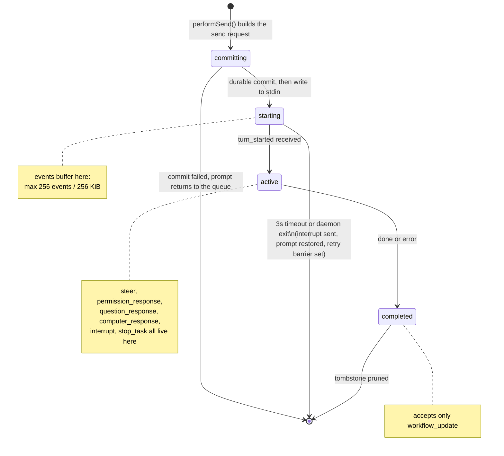
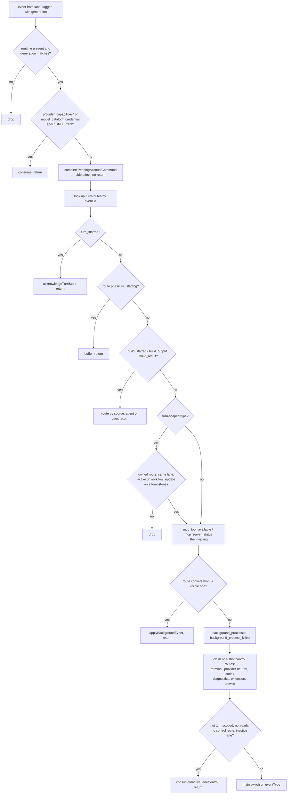
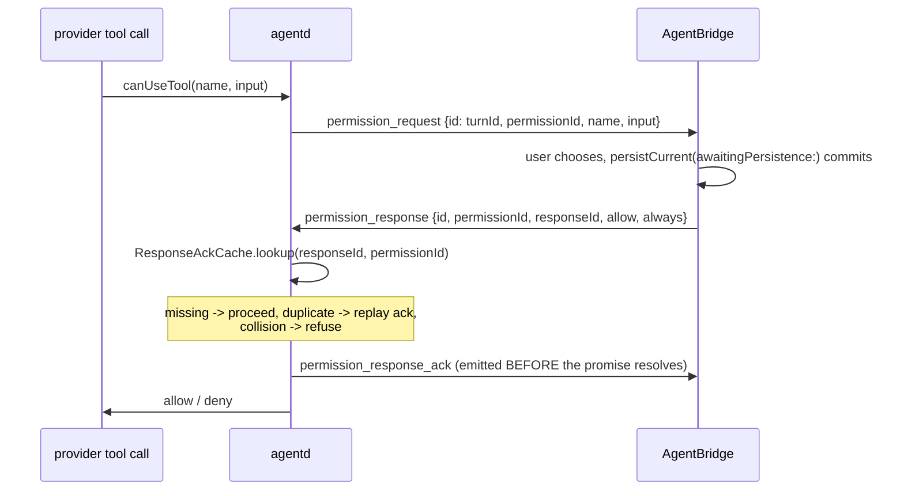

# The app-to-daemon protocol

Audience: anyone adding a tool, a control verb, an event type, or a provider lane. This is the seam
nearly every non-trivial change crosses.

Related: [OVERVIEW.md](OVERVIEW.md), [AGENTD-INTERNALS.md](AGENTD-INTERNALS.md),
[SECURITY-AND-PERMISSIONS.md](SECURITY-AND-PERMISSIONS.md),
[PROVIDER-LANES-AND-ACCOUNTS.md](PROVIDER-LANES-AND-ACCOUNTS.md).

The 46-line comment at the top of `agentd/src/agentd.mjs` is a historical sketch, not the contract.
It lists 8 request shapes and 16 event lines against 62 request types and 99 emitted event types.
Treat it as orientation only, and prefer this document plus the source.

```
sed -n '8,17p'  agentd/src/agentd.mjs | grep -c '"type"'   # 8  request shapes in the header
sed -n '20,35p' agentd/src/agentd.mjs | grep -c '"type"'   # 16 event lines in the header
```

## 1. What the wire actually is

One JSON object per line, in both directions, on the child's stdin and stdout.

Outbound from the daemon, `emit()` in `agentd/src/agentd.mjs` is the only stdout writer, and a
message is literally `JSON.stringify(obj) + '\n'`. Inbound to the daemon, `rl.on('line')` with
`switch (req.type)` is the only stdin dispatcher. On the Swift side, `AgentdRuntime.write` serialises
with `JSONSerialization` and appends `0x0A`, and `AgentdNDJSONFramer` splits incoming bytes on the
same byte.

There is no envelope, no version negotiation, no handshake beyond the daemon's one-shot `ready`
event, no sequence numbers, no message ids distinct from the payload's own `id`, and no ack cursor.
Nothing is replayed. If the daemon dies, everything in flight is lost and the app rebuilds what it
can from its own routing tables and durable conversation state.

**stdout carries only NDJSON.** Every human-readable diagnostic goes to stderr through `log()`, which
the app redirects to a per-lane file. A stray `console.log` writes an unparseable line, and the Swift
framer decodes with `try? JSONSerialization.jsonObject(...)`, so that line and anything concatenated
onto it vanish with no error anywhere.

**Delivery is synchronous and ordered.** The reader queue hands each decoded event to the main actor
with `DispatchQueue.main.sync` (`deliverSynchronously` in `AgentdRuntime.swift`). That is deliberate
backpressure: wire order is exact and no unbounded queue of decoded dictionaries can form. It also
means main-actor work that blocks on the reader queue deadlocks, and a slow handler backs up the
daemon's pipe.

## 2. The overloaded `id` field

`id` means different things depending on the message class. This is the trap.

| Class | What `id` is |
|---|---|
| Turn-scoped events (`delta`, `tool_use`, `done`, ...) | the turn id minted by the app in `performSend` |
| One-shot control replies (`loaded`, `cwd`, `git_*_result`, `mcp_*`, `login_*`, `build_*`, `codex_diagnostics`) | the request id the app sent, echoed back |
| `control_error` for unparseable JSON | `null` |
| `interrupt`, `stop_task` requests | a fresh request id (`UUID().uuidString`), with the *target* named separately by `turnId` |
| `steer`, `steer_cancel` requests | the turn id, repeated in `turnId`; the per-request id is `steerId`. The daemon reads `turnId` and `steerId`, never `id` |

The comment above `turnScopedEventTypes` in `AgentBridge.swift` states the rule the code depends on:
ownership cannot be inferred from the mere presence of an `id`. The app decides by event type first,
and only then looks the id up.

`interrupt` is the sharpest case. It takes two ids: `id` is a fresh request UUID, and `turnId`
selects the target. With no `turnId`, the daemon interrupts every in-flight turn it owns
(`req.turnId ? [one] : [...activeTurns.values()]`), and one daemon multiplexes every conversation on
its lane. The app always sends `turnId`.

Type-specific ids also travel outside `id`: `steerId`, `permissionId` plus `responseId`, `reqId`
(questions, computer use, provider access, ambient mutations), `termId`, `taskId`.

## 3. Turn lifecycle



`performSend` in `AgentBridge.swift` mints `turnId = UUID().uuidString`, installs a `TurnRoute` in
phase `.starting`, and builds the request: `type`, `id`, `prompt`, `model`, `permissionMode`,
`ultracode`, `sessionId` (or `NSNull`), `convId`, `cwd`, optional `effort`, an optional nested
`claude` object, optional `history` / `replayHistory`, and the workspace instruction snapshot.
Claude-only preferences stay nested under `claude` so they cannot leak into a Codex or OpenAI
request. Under SQLite authority nothing is written until `pendingTurnPrompt` has committed: provider
exposure is gated on durability.

On the daemon, `case 'send'` rejects an empty or duplicate id with `control_error`, validates the
optional `claude` block *before* acceptance (a malformed option is a rejected request, not a turn
that dies mid-stream), snapshots `cwd`, registers the turn, emits `turn_started`, and only then calls
`handleSend` fire-and-forget so `interrupt`, permission replies and `ping` stay serviceable while the
turn streams.

`acknowledgeTurnStart` promotes the route to `.active`, commits the user entry and clears
`pendingTurnPrompt` in one store write, delivers steers typed while the route was `.starting`, and
replays the buffered events. If the conversation was deleted meanwhile it writes an `interrupt` for
that turn and drops the route.

`done` (optionally with `interrupted: true`) or `error` ends the turn. `completeTurn` moves the route
to `.completed(Date)`, falls unacknowledged guidance back to the durable queue, marks unacknowledged
permission and question responses with user-visible copy, and prunes old tombstones. Then
`dispatchAfterTurn` runs a pending interjection, an auto-resume, or a queued prompt, in that order.

## 4. `turn_started` is the ownership boundary

A successful write is not acceptance. `AgentdRuntime.write` returning `true` means only that a valid
record was accepted for the current live process. The actual `FileHandle.write` happens later on the
per-runtime serial writer queue, and if it throws the child is terminated so the ordinary restart
path recovers. Never read `true` as delivery.

The daemon must emit exactly one `turn_started` for an accepted id, before any other event for that
id. `agentd/test/turn-start.test.mjs` spawns a real daemon and asserts both halves: one
acknowledgement, and its index in the event stream ahead of the first `delta`/`done`/`error`.

If that contract is broken the failure is quiet and asymmetric. The app's route stays `.starting`,
events buffer to the bound, then `failPendingTurnStart` fires: it sends an `interrupt`, drops the
route, restores the prompt to the queue, and sets a retry barrier so the same prompt is not
auto-redispatched into the same unresponsive process. Meanwhile the daemon happily keeps running the
turn. The user sees their prompt come back while work continues invisibly.

## 5. The inbound event gauntlet

`AgentBridge.handle(_:from:generation:)` is the single entry point for every daemon event. Gates run
in this order, and most of them `return`:



Two facts about this path matter more than the rest.

**The turn-scope allowlist is the transcript's protection.** `turnScopedEventTypes` in
`AgentBridge.swift` lists the event types that require an owned route. `assistant_frame` and
`model_refusal` were added to it late, after refusals arriving from a finished or backgrounded turn
were applied to whichever conversation happened to be on screen. The source comment records that.
Anything that can mutate a transcript belongs in this set. `info` is a special case: it is treated as
turn-scoped only when it carries an id.

```
sed -n '/turnScopedEventTypes: Set<String> = \[/,/^    \]$/p' \
  app/Sources/Mechanician/AgentBridge.swift | grep -oE '"[a-z_]+"' | sort -u | wc -l   # 45
```

**There are two switches, not one.** When the route's conversation is not the visible one, the event
diverts to `applyBackgroundEvent`, which writes into the shared store rather than the live view. An
event handled only in `handle`'s main switch silently does nothing the moment the user switches
conversations.

## 6. Interaction round-trips

Permissions, questions, computer use, provider access and ambient task mutations all follow the same
shape: the daemon parks a promise in a pending map, emits a request event tagged with the turn id
plus its own request id, and the app answers.



Four rules hold this together.

**Write back through the runtime that asked.** `write(_:to interaction:)` revalidates that this exact
turn is still active, on this exact conversation and selection, before delivering. Its sibling
`write(_:to access:)` checks only lane readiness. The two overloads sit next to each other and using
the wrong one for an interaction reply is the classic cross-wiring bug: the real daemon blocks on its
promise until timeout while another daemon receives an unmatched id and answers `accepted: false`.

**Responses are idempotent by `responseId`.** `ResponseAckCache` (bounded at 256 entries) returns
`duplicate` so the ack can be replayed, or `collision` when a `responseId` is reused for a different
request, which is refused. The provider promise resolves exactly once. Note that the daemon's
permission handler reads `!!req.allow`; an absent `allow` key is a deny.

**The user's decision is durable before the model can act on it.** Steers go through
`persistCurrent(awaitingPersistence:)` and permission and question replies through
`releaseInteractionResponseAfterPublication`. Both re-check ownership after the commit and before the
write, and both have a named user-visible failure string for each way it can go wrong.

**Turn death closes interactions without inventing an answer.** `agentd/src/interaction-closure.mjs`
deletes ownership first, emits `interaction_closed`, and only then settles the provider promise. A
click racing that closure hits the daemon's existing negative acknowledgement and can never resume a
turn the app has already shown as cancelled.

Computer use is the one interaction the app performs itself rather than routing to a tool. The daemon
emits `computer_request` and `handleComputerRequest` acts in the app process, because macOS applies
Accessibility and Screen Recording grants to the calling process. Any future capability needing a TCC
grant must follow the same pattern.

Guidance has its own vocabulary: `steer` is answered with `steer_ack` or `steer_rejected`, and
`steer_cancel` is a best-effort retraction that only works while the steer is still queued waiting
for the provider thread.

Missing, duplicate, mismatched and late acknowledgements fail closed. Codex's
suppressed history-selection fallback emits no acknowledgement and creates no card.

## 7. Death and recovery

**Identity, liveness and authority are three separate facts.** A durable record naming a turn, a
lane, or a runtime is never evidence that the thing is running or addressable now. The code expresses
each fact in a different place: `TurnRoute` carries identity and authority (which conversation,
which selection, which snapshot), `TurnRoutePhase` carries liveness, and `runtimeGenerations` carries
process liveness for the lane. When those collapse into one value, call sites become individually
patchable and collectively wrong, because the type cannot say "routed but dead". If you add state
here, extend the type rather than adding a check at the call site.

**Intentional stop.** `AgentdRuntime.stop()` clears `self.process` *before* calling `terminate()`.
The termination handler distinguishes deliberate shutdown from a crash purely by pointer identity,
with no second flag. Reorder those two lines and every provider switch and window close is reported
to the user as an unexpected exit and triggers an auto-restart. `stop()` then closes stdin (EOF is
the cooperative shutdown request), waits 3 seconds, sends TERM, waits 2 more, then KILL.

**Drain, not kill.** On the daemon, `rl.on('close')` calls `beginDaemonDrain`, which stops
non-provider children, cancels outstanding interactions, lets live turns finish, and force-exits at
`MECHANICIAN_DRAIN_TIMEOUT_MS` (default 10 s, clamped 50 ms to 120 s). The same bounded path handles
SIGTERM/SIGINT/SIGHUP and uncaught exceptions. If stdout itself fails, `emit()` becomes a no-op and a
short drain begins; a daemon that has lost its app never re-attaches.

**Unexpected exit.** `terminationHandler` drains the pipe's remaining bytes with a nonblocking POSIX
read under the reader queue, so final events keep their order, then calls `handleDaemonExit`. That
recovers pending starts, clears turn routing and the lane's background-process slice, terminalises
affected conversations with a `agentd_exit_N` style diagnostic code, and auto-restarts only if the
previous unexpected exit on that lane was more than 30 seconds ago.

**Generation guards.** `ensureRuntime` mints a fresh generation UUID per launch and captures it in
every callback. `handle` rejects any event whose generation no longer matches. Without it, a dying
daemon's queued events mutate the replacement daemon's state.

## 8. Transport bounds

| Bound | Value | Where |
|---|---|---|
| Maximum NDJSON frame | 32 MiB, fatal | `AgentdReaderState` in `AgentdRuntime.swift` |
| Inline artifact source | 4096 bytes, then temp-file handoff | `ARTIFACT_INLINE_MAX` in `agentd.mjs`, and a second literal in `emitOpenAIArtifact` |
| Claude compaction summary | serialized event <= 4 KiB inline; otherwise a temp-file handoff; summary <= 1 MiB | `claude-compaction-summary.mjs`, `resolvingCompactionSummaryHandoff` in `AgentBridge.swift` |
| Codex generated image | one-shot temp-file handoff; source and normalized PNG <= 32 MiB | `codexGeneratedImageHandoff` in `agentd.mjs`, `resolvingGeneratedImageHandoff` in `AgentBridge.swift` |
| Pending-start timeout | 3 s | `turnStartTimeout` in `AgentBridge.swift` |
| Pending-start buffer | 256 events / 256 KiB | `turnStartBufferedEventLimit`, `turnStartBufferedByteLimit` |
| Turn stall watchdog | 180 s default, clamped 10 s to 30 min | `MECHANICIAN_TURN_STALL_SECONDS` |
| Daemon drain deadline | 10 s default, clamped 50 ms to 120 s | `MECHANICIAN_DRAIN_TIMEOUT_MS` |
| Restart backoff | 30 s since the previous unexpected exit | `handleDaemonExit` |
| Response idempotency cache | 256 entries | `agentd/src/response-ack-cache.mjs` |
| Provider access acknowledgement | 20 s, then the tool call rejects | `agentd/src/provider-access.mjs` |
| Harness retry history | 16 content-free entries; true count retained separately | `agentd/src/harness-observations.mjs` |
| Harness metadata arrays / rate-limit buckets / daily account buckets | 8 / 16 / 366 | `agentd/src/harness-observations.mjs` |
| Claude assistant usage message ids retained per turn | 4096, oldest evicted | `agentd/src/harness-observations.mjs` |
| Local OTLP metrics request / normalized samples | 1 MiB / 512 | `agentd/src/otel-metrics-receiver.mjs` |

A frame over 32 MiB is fatal by design: the framer drops its buffer and terminates the child rather
than letting a missing newline grow app memory without bound.

The 4096-byte artifact cap exists because large single lines used to overrun the control channel and
the event was dropped. The source comment cites an observed failure floor around 6 KB. Over the cap,
the daemon writes a temp file and sends `sourcePath` instead of `source`; the app reads it and
deletes it in `artifactSource`. Claude compaction summaries follow the same control-bus rule: the
complete serialized event, including its newline, stays inline only through 4096 bytes. Otherwise
agentd writes the summary to a random owner-only file in the process temporary directory and sends
`summaryPath`. Swift admits only the expected regular-file name in that directory, verifies the
declared UTF-8 byte count and 1 MiB ceiling, reads it, and deletes every admitted handoff. The stdout
stream is a control and event bus, not a payload channel. If you add an event that can carry bulk
content, use the same handoff. Codex image generation follows it too: the daemon copies the
provider-owned `savedPath` into a random owner-only `mechanician-generated-image-*.image` handoff;
Swift consumes and deletes that file before route checks, validates the declared byte count, then
normalizes it into the conversation-owned PNG media store. Provider temporary paths never become
transcript state.

## 9. Other clients of this protocol

`agentd/src/ambient-agentd-runner.mjs` is a second, independent client. The scheduler spawns its own
`agentd` with `MECHANICIAN_UNATTENDED=1`, waits for `ready`, sends one `send`, folds events with the
pure `applyAgentdEvent`, and exits. Renaming or restructuring `ready`, `delta`, `done`, `error`,
`permission_request`, `question_request`, `unattended_denied` or `artifact` breaks scheduled tasks
even though nothing in Swift changed. Only three lanes appear in its `LANE_ROUTES` map.

**It mirrors the daemon's exact wire shapes; it is not a looser reference implementation.** Focused
tests pin the three seams that differ most from an intuitive standalone client:

- A fallback permission reply echoes the turn `id`, request `permissionId` and `responseId`, plus
  `allow` and `always: false`. The default unattended mode sends `allow: false` with the bounded
  denial message; an explicitly trusted task sends `allow: true` without inventing a remembered
  grant.
- A fallback question reply echoes `id`, `reqId` and `responseId` with `answers: {}`. Nobody is
  present to answer, but the correlated empty response lets the daemon close the request rather
  than waiting until the scheduled run times out.
- An artifact event is `{artifactType,title,source}` or carries the one-shot `sourcePath` handoff.
  The runner normalizes it to `{title,type,source}` for the scheduler, and reads then removes a
  file-backed handoff even when the read fails.

Changes to those shapes must update both daemon handlers and this independent client together.

## 10. Checklists

**Adding a request type.** Add one `case` to the stdin switch in `agentd.mjs`, or extend one of the
three prefix families (`git_*`, `term_*`, `build_*`) that the `default` branch routes to `handleGit`,
`handleTerm` and `handleBuild`. Echo the request's `id` back on the reply. On the app side, build the
dictionary and call `write(_:to:)` with an explicit lane; the bare `write(_:)` targets whichever lane
is currently visible and is almost never what you want. If the reply is a one-shot control, register
a route (`providerNeutralControlRoutes`, `extensionControlRoutes`, `codexDiagnosticsRoutes`,
`browseControlRoutes`) so it can be matched by echoed id plus lane, or `consumeInactiveLaneControl`
will swallow it whenever the user has switched lanes. Unknown types get
`control_error: 'unknown request type: ...'`.

**Adding an event type.** Emit it only through `emit()`. If it can mutate a conversation, add it to
`turnScopedEventTypes` *and* handle it in both `handle`'s main switch and `applyBackgroundEvent`'s
switch. If it is lane-scoped control state, also teach `consumeInactiveLaneControl` so a background
lane's copy is cached rather than allowed to overwrite visible controls. Emitting an event the app
does not name is not an error and produces no warning: it falls through to `default: break`.

**Adding a provider lane.** Add a `ModelAccess` case, map it to a `MECHANICIAN_PROVIDER` /
`MECHANICIAN_AUTH` pair in `AgentdRuntime.route(for:)`, and add its credential-isolation branch so
the child environment carries exactly that lane's secret and no other. On the daemon, branch in
`handleSend` and in the `login_start` / `logout` / `account_reload` cases, add catalog discovery, and
add an error normaliser. The provider is fixed at spawn: `MECHANICIAN_PROVIDER` and
`MECHANICIAN_AUTH` are read once at module load, so switching providers means spawning a different
daemon, never sending a different message. To make the lane schedulable, add it to `LANE_ROUTES` in
`ambient-agentd-runner.mjs`.

## Reference: request types

63 types: 51 in the stdin dispatcher, plus three prefix families that the `default` branch forwards.

```
sed -n "/^rl.on('line'/,/^rl.on('close'/p" agentd/src/agentd.mjs \
  | grep -oE "^    case '[a-z_]+'" | sort -u | wc -l                       # 51
grep -oE "^    case 'git_[a-z]+'"  agentd/src/agentd.mjs | sort -u | wc -l # 6
grep -oE "^    case 'term_[a-z]+'" agentd/src/agentd.mjs | sort -u | wc -l # 4
grep -nE "req\.type (===|!==) 'build_[a-z]+'" agentd/src/agentd.mjs        # build_run, build_cancel
```

| Family | Types |
|---|---|
| Turn control | `send`, `review_start`, `prewarm`, `interrupt`, `steer`, `steer_cancel`, `stop_task` |
| Interaction replies | `permission_response`, `question_response`, `computer_response`, `provider_access_response`, `mcp_elicitation_response`, `ambient_task_mutation_response` |
| Window state | `load`, `set_cwd`, `reset` |
| Accounts | `login_start`, `logout`, `account_reload` |
| Discovery | `model_catalog`, `provider_capabilities` |
| Extensions, MCP, plugins | `mcp_authorize`, `mcp_reauthorize`, `mcp_clear_auth`, `mcp_authorize_cancel`, `mcp_reconcile`, `mcp_status`, `mcp_reload`, `claude_plugins`, `codex_plugins`, `browse_fetch` |
| Capabilities | `capability_execute` |
| Scoped allowlist | `get_allowlist`, `remove_allowed` |
| Background processes | `kill_background_process` |
| Diagnostics and liveness | `codex_diagnostics`, `ping` |
| App-owned Help tool replies | `help_search_response`, `workflow_advice_response`, `show_mechanician_response`, `operate_mechanician_response` |
| Runtime residency | `provider_residency` |
| Verified build observation | `verified_build_workspace_snapshot` |
| Git (prefix, `handleGit`) | `git_status`, `git_diff`, `git_stage`, `git_unstage`, `git_commit`, `git_push` |
| Terminal (prefix, `handleTerm`) | `term_start`, `term_input`, `term_resize`, `term_kill` |
| Build (prefix, `handleBuild`) | `build_run`, `build_cancel` |

`ping`, `reset` and `get_allowlist` are implemented in the daemon but the Swift app never constructs
them (`grep -rn '"ping"' app/Sources` finds nothing). They are legacy and manual-testing surface.
`kill_background_process` refuses any pid the daemon's own tracker did not record.

## Reference: event types

The app's main event switch currently names 83 types, in addition to events handled and returned
before it (`turn_started`, `build_started`, `build_output`, `build_result`,
`mcp_tool_available`, `mcp_server_status`, `waiting`, `background_processes`,
`background_process_killed`, `model_catalog`, `model_catalog_error`, `provider_capabilities`,
`provider_capabilities_error`).

```
sed -n '/switch eventType {/,/^        default:$/p' app/Sources/Mechanician/AgentBridge.swift \
  | grep -E '^        case "' | grep -oE '"[a-z_]+"' | sort -u | wc -l     # 83
```

| Family | Types | Owned turn required |
|---|---|---|
| Turn stream | `turn_started`, `session`, `session_invalidated`, `agent_model`, `tool_surface`, `harness_observation`, `delta`, `thinking`, `assistant_frame`, `model_refusal`, `status`, `provider_status`, `usage`, `context_usage`, `compaction_summary`, `compact_boundary`, `history_reduced`, `subtraction`, `prompt_suggestion`, `artifact`, `workflow_update`, `done`, `error`, `info` | yes (`info` only when it carries an id) |
| App-owned authorities | `help_search_request`, `help_search_ack`, `workflow_advice_request`, `workflow_advice_ack`, `show_mechanician_request`, `show_mechanician_ack`, `operate_mechanician_request` | yes |
| Tools | `tool_use`, `tool_result` | yes |
| Interactions | `permission_request`, `permission_response_ack`, `question_request`, `question_response_ack`, `computer_request`, `provider_access_request`, `ambient_task_mutation_request`, `interaction_closed`, `steer_ack`, `steer_rejected`, `waiting` | yes |
| Provider-native review | `review_started`, `review_result` | yes |
| Lane state | `ready`, `loaded`, `cwd`, `allowlist`, `commands`, `tool_catalog` (legacy presentation only) | no |
| Extensions and MCP | `mcp_tool_available`, `mcp_server_status`, `mcp_auth_hint`, `mcp_readiness_proof` (turn-scoped); `mcp_credentials_changed`, `mcp_status_result`, `mcp_authorize_url`, `mcp_authorize_ok`, `mcp_authorize_error`, `mcp_authorize_cancel_ok`, `mcp_clear_auth_ok`, `mcp_reconcile_ok`, `mcp_reconcile_error`, `mcp_reload_ok`, `mcp_reload_error`, `mcp_elicitation`, `mcp_elicitation_closed`, `claude_plugins_result`, `codex_plugins_result`, `capability_execute_result`, `browse_result` | mixed |
| Accounts | `login_started`, `login_url`, `login_ok`, `login_error`, `logout_ok`, `account_reload_ok`, `harness_account_usage` | no |
| Catalog and capabilities | `model_catalog`, `model_catalog_error`, `provider_capabilities`, `provider_capabilities_error` | no (credential-epoch gated) |
| Git | `git_status_result`, `git_diff_result`, `git_push_result`, `git_done` | no |
| Terminal | `term_started`, `term_data`, `term_exit` | no (routed by `termId`) |
| Build | `build_started`, `build_output`, `build_result` | no (routed by `source` plus request id) |
| Background processes | `background_processes`, `background_process_killed` | no |
| Errors and liveness | `control_error`, `pong`, `reset_ok` | no |
| Codex diagnostics | `codex_diagnostics` | no |
| Unattended | `unattended_denied` | no |
| Activity telemetry | `capability_run`, `capability_saved`, `automation_run`, `shortcut_run`, `computer_action`, `harness_metrics` | no |

### Repository evidence on `git_status`

`git_status` still returns the existing branch/ahead/behind and porcelain file rows. Callers may
also supply a bounded `candidateOIDs` array of full commit ids and one `frozenTargetOID`. The
additive `repositoryEvidence` result keeps physical Git facts separate from dirty paths:

- canonical `gitCommonDir` (the cross-worktree repository join key) and `worktreeRoot`;
- checked time and exact HEAD state (`attached`, `detached`, `unborn`, or unavailable), full OID,
  full symbolic/upstream refs, and upstream divergence when available;
- independently available local-branch and registered-worktree censuses;
- per-candidate full-OID resolution, the current local refs which contain it, and an immutable
  `targetRelationship` to this same probe's captured checkout HEAD (`equal`, `ancestor`,
  `notAncestor`, `missing`, or unavailable);
- an optional frozen-target relationship (`equal`, ahead, behind, diverged, missing, unavailable)
  with exact counts when Git supplies them.

The JavaScript fallback returns `git_cli_unavailable` and no invented HEAD, ref, worktree, or
reachability facts. The app routes background evidence probes separately from the visible Changes
status, so a turn in another worktree cannot replace the inspector's current checkout. The existing
`activityCommits` display id remains abbreviated; `fullCommit` is the immutable evidence value and
the echoed lowercase SHA-256 binds that commit claim to the exact file bytes the caller supplied.

### Provider-harness observations

Harness telemetry uses three events because their correlation guarantees differ. Treating them as
one stream would manufacture turn attribution for aggregate exporter samples or account state.

`harness_observation` is turn-scoped and carries the app-minted turn `id`, `lane` (`claude` or
`codex`), a closed `event`, `provenance`, `scope`, and `aggregation`. Provider-authored categories
are reduced to closed Mechanician vocabularies; the remaining model and correlation identifiers
are length- and character-bounded. It never carries prompt, response, reasoning, command, path,
tool input or output, or error prose. Current event-specific facts are:

- `phase`: `provider_ready`, `thread_ready`, `request_accepted`, `first_output`, and `terminal`,
  with Mechanician-clock `elapsedMs` and the exact daemon ISO-8601 `at` boundary; the applicable
  event may also carry `warm`, `threadAction`, `outputKind`, or `terminalOutcome`. Each phase is
  emitted at most once per accepted turn, and Swift uses `at` rather than IPC receipt time.
- `retry`: Codex's ordered `retryAttempt`, `willContinue`, closed `errorKind`, and optional
  `httpStatusCode`, emitted only when App Server says it will retry. A terminal error after at
  least one scheduled retry is `retry_exhausted`; a first non-retrying terminal error is the
  separate `internal_error` event. A later successful terminal emits `retry_recovered` with
  `retryAttempts`, the true `retryHistoryCount`, and at most 16 content-free history rows. Error
  kinds are coarsened to a fixed Mechanician vocabulary; provider enum strings never cross. App
  Server reports neither a retry delay nor a maximum-attempt count, so the daemon does not invent
  either.
- `tool`: the provider item `toolUseID`, coarse `toolKind`, `toolOutcome`, and exact
  `toolDurationMs` from the item's reported duration, falling back to App Server's
  `startedAtMs`/`completedAtMs` lifecycle timestamps. Inputs, outputs, command text, server/tool
  names, paths, and errors remain on their existing user-facing tool events and never enter this
  observation.
- `compaction`: `compactionDurationMs` from paired provider timestamps when available, otherwise
  from paired lifecycle boundaries on the Mechanician clock. Codex pairs `contextCompaction` item
  start/completion (including child-thread `agentID`); Claude pairs `status: compacting` with the
  successful compact boundary or a typed failure. Trigger, occurrence sequence, and coarse failure
  category are closed metadata. A missing start and missing provider timestamp pair remain unmeasured,
  never zero.
- `model_rerouted`, `model_safety`, and `model_verification`: bounded model ids and finite coarse
  Mechanician categories for reroute reason, safety reason/use case, and verification. Unknown
  provider strings become `other`; each category array retains at most 8 distinct values and a
  separate true count. Safety display prose and provider enum strings are not retained.
- Claude `result`: provider-reported `durationMs`, `apiDurationMs`, `timeToFirstTokenMs`,
  `streamTimeToFirstOutputMs`, `timeToRequestMs`, `timeToRequestFromSpawnMs`, warm-spare status,
  and the uncached/cache-write/cache-read/output token components. A nonempty SDK `modelUsage` map
  is summed without retaining its model/route keys and marked `scope: agent_tree`, because it covers
  the main loop, Tasks, sidechains, compaction and workflows. Older results fall back to main-loop
  `usage` with `scope: request`. Both streamed usage and the result carry the same positive
  `providerQuerySequence`: recovery can issue several billable provider queries inside one
  Mechanician turn, and a final replaces provisional samples only within its query. A crash/startup
  result whose model totals are all zero is not
  authoritative; all-zero chosen usage omits final token fields while retaining result timing. The
  Mechanician-clock terminal phase remains the whole-turn boundary.
- Claude task lifecycle `workflow_update` events carry that same positive
  `providerQuerySequence`. Child usage derived from those events can therefore be replaced by a
  same-query agent-tree final without erasing billed child work from an earlier recovery query.
- Claude Agent/Task ownership is provider-session state, not query-local state. A background child
  launched in one Mechanician turn can report progress, child model/tool activity, usage, and its
  terminal notification while a later resumed query is being consumed; those events retain the
  original launching turn id. Only positively classified Agent/Task/workflow evidence creates that
  route. Background Bash tasks that share the SDK's `task_*` protocol fail closed. A task terminal
  retires its route, while session reset, account rotation, logout, and provider shutdown emit a
  final `stopped` update on the original turn before clearing any remaining live routes.
- Codex can run the same child more than once within one Mechanician turn. One unique
  provider-authored `Interacted` or `sendInput` item starts a new child lifecycle generation.
  Duplicate item replay and the provider's mixed representations of the same child turn enrich the
  existing generation without opening another. Swift uses that explicit boundary for current
  liveness while retaining every completed generation in the Trace.
- Claude `context`: the SDK's `contextTokens`, `contextUsableWindow`, `contextRawWindowTokens`, and
  a closed token composition (`system_prompt`, `system_tools`, `mcp_tools`, `deferred_tools`,
  `memory`, `agents`, `skills`, `commands`, `messages`, `compaction_buffer`, `free`, `other`). File,
  tool, agent, skill, and category display names are classified locally and discarded.

`harness_metrics` is provider-level, never turn-scoped: `{type, provider, samples}` has no `id`.
One authenticated loopback OTLP/HTTP JSON receiver is started lazily for the primary Claude or Codex
process and is not enabled for catalog/auth probes or rented Codex servers. It accepts a maximum
1 MiB request and 512 allowlisted samples, strips every attribute outside its closed vocabulary,
coarsens tool names, and disables prompt, response, tool-content, log, and trace export. Exporter
batches have no stable Mechanician turn identity, so these samples belong only in aggregate
diagnostics and must never be joined to the currently visible turn by arrival time.
The allowlist includes Codex approval, hook, and MCP connection/reliability metric families. Those
are useful operational aggregates, but remain provider-level for the same attribution reason.

`harness_account_usage` is Codex account-level and also has no turn `id`. `kind: rate_limits`
publishes a merged snapshot from `account/rateLimits/read` plus sparse
`account/rateLimits/updated` notifications: at most 16 buckets containing primary/secondary used
percent, window minutes, reset time, a reached-limit boolean, credit booleans, and non-monetary spend-control
state. Whether any rate limit was reached is a boolean; the provider's plan and reached-type strings
are discarded. Opaque limit ids, display names, balances, reset-credit ids/text, and spend amount
strings are stripped. `kind: token_usage` publishes the account summary and at most 366 dated token buckets;
thread ids and estimated currency/credit cost are omitted. The daemon performs these reads
best-effort after a logged-in account becomes ready, and a failure cannot make the provider lane
unavailable.

The established turn-scoped `usage` event also carries measurement metadata. Claude assistant and
Codex last-call samples are `provenance: provider_report`, `scope: request`, `aggregation: delta`;
direct OpenAI `response.completed` usage is `aggregation: final`. Claude's stable assistant message
id is deduplicated within a turn because the SDK can repeat one frame through multiple callbacks;
id-less legacy samples preserve their prior pass-through behavior. Each Claude query has a bounded
positive `providerQuerySequence`; final reconciliation is sequence-scoped, so usage from an earlier
failed recovery attempt remains billed and an interrupted attempt with no final retains its streamed
fallback. Claude's terminal `result` observation remains the authoritative final cache-aware token
accounting for that query.

### Exact-turn tool surfaces

`tool_surface` is the advisory, turn-scoped answer to “which callable names did this exact provider
configuration receive?” It is deliberately separate from legacy `tool_catalog`: that older event
has no turn, conversation, profile, account, or runtime-generation identity and cannot populate a
capability authority.

The daemon emits at most one surface after provider acceptance and before the first provider output:

- Claude derives it from that turn's SDK `system/init.tools`;
- direct OpenAI derives it from the exact `openAIToolProfileSurface` included in the first accepted
  Responses request;
- Codex derives it from the exact dynamic-tool configuration of the thread whose `turn/start` was
  accepted.

The bounded event carries the root turn `id`, lane, tool profile, captured permission mode, exact
raw tool names, adapter revision, provenance, and coverage. Claude and direct OpenAI report
`complete`; Codex reports `mechanician-supplied` because App Server does not provide an exhaustive
enumeration of its provider-native file and shell tools. Missing names therefore prove
unavailability only under complete coverage. A reported empty array is distinct from no report.

Swift admits the event only through the already-owned active `TurnRoute` and stamps the durable
conversation, workspace, model/account, runtime generation, provider-session revision, instruction
revision, profile, and permission identity from that route. The daemon cannot select another
conversation by echoing a conversation id or cwd. Each `AgentBridge` keeps a bounded ephemeral
catalog, so a background turn or another window cannot overwrite the foreground route. Restart,
account, workspace, profile, model, permission, or schema-revision changes make old evidence
ineligible. No surface is persisted.

Names map to product abilities only through a fixed app-owned alias table. An arbitrary external
MCP suffix can remain visible but can never impersonate a built-in Mechanician tool. This entire
surface is observation for presentation and workflow advice, not authorization: the ordinary
provider policy, permission interaction, sandbox, application, and macOS/TCC checks still decide
every invocation.

### Correlated Help, workflow, presentation, and operation round trips

The daemon cannot open the signed Help database. A provider tool call emits a bounded,
turn-correlated request to the app, and the app returns the corresponding stdin response:

- `help_search_request {id, reqId, query, includeHistory?}` pairs with
  `help_search_response {id, reqId, ok, empty, text}`;
- `workflow_advice_request {id, reqId, goal, demonstrationID?}` pairs with
  `workflow_advice_response {id, reqId, ok, empty, text}`;
- `show_mechanician_request {id, reqId, guideID}` pairs with
  `show_mechanician_response {id, reqId, ok, state, text}`;
- `operate_mechanician_request {id, reqId, operation, target?}` pairs with
  `operate_mechanician_response {id, reqId, ok, text}`.

A successful Help search response carries one bounded, single-line `mechanician.help.v2` JSON
envelope: complete signed claims plus at most four provider-safe current guide summaries grounded
in those matched claims. Guide steps and routing stay app-private.

`demonstrationID`, when present, is the exact reviewed recipe selected by **Try workflow**. It is never
a ranking hint: the app returns only that current signed recipe or an empty answer. Requirements,
risk, mode, conversation and workspace identity are never accepted from tool input.

`guideID` is the only presentation input. It must be the exact stable ID of a current signed guide
returned by Help. No selector, coordinate, input text, script, URL, route, or workspace comes from
the provider. Swift admits success only after its app-owned coordinator has started the bounded
overlay, returning `ok: true, state: "started"`; any other or missing state is failure. That result
does not mean the person completed the guide, and completion/dismissal never crosses this wire.

The root turn supplies `id`; provider arguments cannot name a conversation, workspace, route,
requirements, mode, or tool inventory. Swift admits the request only through that active immutable
`TurnRoute`. Workflow advice is additionally restricted to an interactive standard conversation
and revalidates the exact accepted `tool_surface` after asynchronous corpus retrieval. Presentation
is restricted to an interactive standard or Help-expert conversation and revalidates that exact
profile before request, response, and acknowledgement; Review and unattended routes cannot
advertise or invoke it.

Operation is restricted to an active interactive conversation and one closed app-owned operation
vocabulary. The optional target is re-resolved by the app rather than treated as a route. Plan
withholds `OperateMechanician` and both daemon and Swift route admission reject a forged or stale
Plan call. No operation can change permission mode, connect or disconnect an account, send a
message, delete anything, or act outside Mechanician. Enabling or disabling a configured extension
waits without a deadline for the app-owned confirmation card; its response distinguishes declined,
unanswered, and never presented.

`help_search_ack` and `workflow_advice_ack` are separate daemon-to-app events emitted only after the
provider-facing result boundary succeeds. They allow Swift to commit a concise consultation receipt
without claiming that an unanswered, timed-out, cancelled, empty, or undelivered result reached the
model. `show_mechanician_ack` instead consumes the provisional guide/session token after delivery so
the already-visible app-owned overlay can outlive the provider turn; it never appends a consultation
receipt or claims the person completed the guide. Wrong-turn and duplicate responses or
acknowledgements are ignored. Search and workflow advice are read-only; `ShowMechanician` instead
has a dedicated bounded-local-presentation authorization class. It is Plan-compatible because every
route, target, highlight, and restoration step is signed and app-owned, not because it is generic
read access or external automation.
`OperateMechanician` has no acknowledgement event: its correlated response already reports the
verified operation outcome, and no presentation remains waiting for a later delivery receipt.

Codex may issue App Server requests concurrently. Its Search response therefore carries a local
write-completion barrier: the daemon emits `help_search_ack` from the successful JSON-RPC write
callback before forwarding a subsequent `ShowMechanician` request that could have learned that
result. A Show request received while Search is still executing is a same-round parallel request and
is denied; it is never queued until an answer it could not yet have seen becomes available.

`compaction_summary` and `compact_boundary` are two correlated facts about one successful Claude
compaction. Each carries the turn id and a positive, per-turn `compactionSequence`; the independent
hook and stream counters pair their first boundary as 1, their second as 2, and so on. The Claude
Agent SDK's supported root `PostCompact` hook carries the exact provider-authored continuity summary,
while the streamed boundary carries trigger and token counts. That summary is the text Claude chose
to continue from, not a serialization of every effective-context component such as system
instructions, tool schemas, or other provider-owned state. Their relative arrival order is not part
of the SDK contract, so Swift merges either order into one durable transcript row by turn and
sequence.

The daemon retains the exact UTF-8 summary unless it exceeds the 1 MiB safety ceiling; an over-limit
summary is cut only at a valid UTF-8 boundary and marked `summaryTruncated`. A serialized event of at
most 4 KiB stays inline, while a larger summary uses the validated temporary-file handoff described
above. Raw SDK session and prompt handles stay transport-local. Codex emits only the provider-neutral
boundary because App Server exposes an opaque compaction item, not readable summary text. A failed
compaction emits neither successful fact.

### Typed Build observations inside `tool_result`

The app-owned `Build` tool uses the existing `tool_use` and `tool_result` event pair. A successful
build result's JSON text may contain `verifiedKnowledgeObservation` and
`verifiedKnowledgeCorrelationID`. This is not a generic metadata channel. The observation schema is
`mechanician.verified-build-observation.v1`, and agentd emits it only for `swift-build` and
`xcode-build` after equal before/after snapshots, exit code zero and zero compiler errors. The
payload contains only closed values and one-way digests: command, lifecycle, effect, timestamp,
root, HEAD, dirty tree, toolchain, invocation and diagnostics. It carries no output or diagnostic
prose.

`AgentBridge` consumes the observation only on the already admitted turn route and exact matching
Build row. It supplies Conversation, workspace and provider authority itself, canonicalizes the
validated receipt, and persists that content-free payload on `TranscriptEntry`. Claude's exact tool
identity is `mcp__dev__Build`; Codex's is `Build`. A wrong lane, profile, workspace root, turn, tool
call, correlation, command, digest, lifecycle or result status fails closed to an ordinary tool row.
No new event type or control route is introduced.

Nine of those 90 are emitted but read by nothing in the app. `unattended_denied` is consumed by the
ambient runner; the rest are currently write-only:

```
for t in account_reload_ok automation_run capability_run capability_saved computer_action \
         pong reset_ok shortcut_run unattended_denied; do
  printf '%-22s %s\n' "$t" "$(grep -rl "\"$t\"" app/Sources | wc -l)"   # 0, except unattended_denied
done
```

The reverse also exists: `case "models"` appears twice in `AgentBridge.swift` and is dead code. No
daemon module emits `type: 'models'` (`grep -rn "'models'" agentd/src/*.mjs` finds nothing). Codex
model catalogues arrive as `model_catalog`.

### `subtraction`: reporting what was withheld

The newest turn-scoped event, and the one you are most likely to need when adding a refusal. When the
daemon removes something the model could otherwise have used, it says so instead of failing silently.
Emit it through `emitSubtraction` in `agentd/src/agentd.mjs`, never by hand-building the payload: the
helper validates the vocabulary and drops a malformed report rather than letting it break a turn.

| Field | Meaning |
|---|---|
| `subject` | what was removed: `tool`, `server`, `skill`, `model`, `effort`, `capability`, `plugin`, `request`, `output` |
| `reason` | why: `plan_mode_readonly`, `unattended_withheld`, `unattended_denied`, `credentials_unavailable`, `network_unreachable`, `provider_unsupported`, `host_app_required`, `managed_profile_undeclared`, `adapter_unimplemented`, `context_budget` |
| `names` | the identifiers, capped at 8 |
| `count` | the true total, which stays honest when `names` is truncated |
| `message` | free text, truncated to 200 characters |
| `duration` | `turn` (default), `lane`, or `build` |
| `lane` | the provider lane, defaulted from `PROVIDER` |

An unknown `subject` or `reason` is refused and logged, not emitted, so adding a new refusal means
adding its term to `SUBTRACTION_SUBJECTS` or `SUBTRACTION_REASONS` first.

## Related

[./OVERVIEW.md](./OVERVIEW.md) ·
[./AGENTD-INTERNALS.md](./AGENTD-INTERNALS.md) ·
[./SECURITY-AND-PERMISSIONS.md](./SECURITY-AND-PERMISSIONS.md) ·
[./PROVIDER-LANES-AND-ACCOUNTS.md](./PROVIDER-LANES-AND-ACCOUNTS.md) ·
[./BACKGROUND-WORK.md](./BACKGROUND-WORK.md) ·
[../../CONTRIBUTING.md](../../CONTRIBUTING.md)

Superseded material lives in [../history/](../history/). ADR-002 in particular specifies a versioned
protobuf envelope with `protocol_version`, `correlation_id` and `sequence` fields. That protocol never
shipped. Nothing in this document resembles it.
