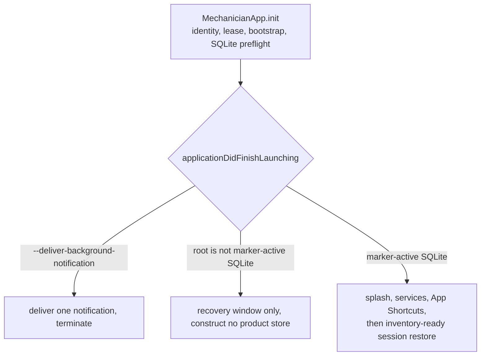
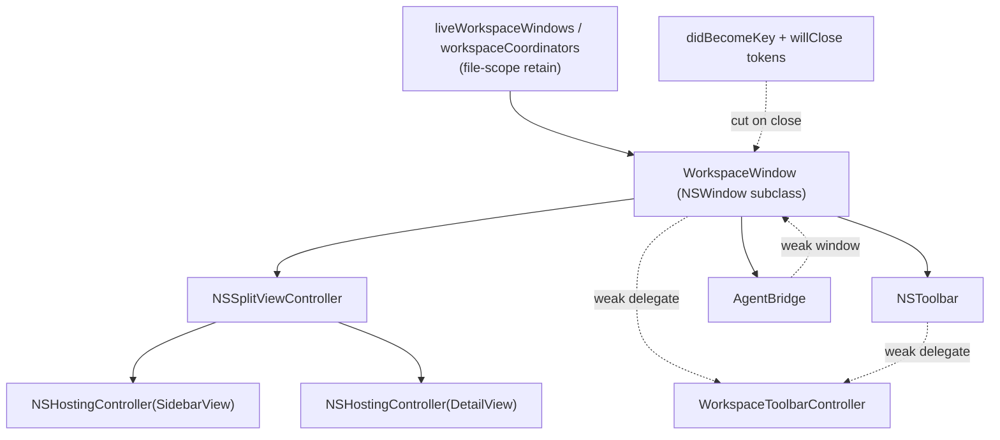

# The app shell: windows, the AppKit/SwiftUI boundary, and the UI seams

[ADR-004](../adr/ADR-004-appkit-swiftui-boundary.md) records the boundary decision and the test for
which side a surface belongs on, and stays the decision record. This is the map: where the shell
lives, and which invariants have each broken a shipped feature at least once.

Related: [OVERVIEW.md](./OVERVIEW.md), [STORAGE-AND-PERSISTENCE.md](./STORAGE-AND-PERSISTENCE.md),
[BACKGROUND-WORK.md](./BACKGROUND-WORK.md),
[BUILD-AND-PACKAGING.md](../development/BUILD-AND-PACKAGING.md). ADR-001 to ADR-003 describe a Runtime
Service that was built and reverted; they live in [docs/history/](../history/) and describe nothing in
the current tree.

## 1. The rule, and the test

**AppKit owns the shell. SwiftUI owns the content inside it.** ADR-004's test: does the surface's
correctness depend on an AppKit behaviour SwiftUI wraps and does not expose (event ordering, first
responder, scroll authority, item identity, view reuse)? Yes means AppKit.

ADR-004 deliberately records no fixed count: a previous one rotted badly enough to mislead, so it
keeps the criteria and drops the number. Run them yourself, from the repository root:

```
$ ls app/Sources/Mechanician/*.swift | wc -l
     188
$ grep -rlE 'NSViewRepresentable|: NSView\b|: NSViewController\b|NSWindowDelegate|NSToolbarDelegate' \
    app/Sources/Mechanician/*.swift | wc -l
      24
```

There are three local `NSEvent` monitors, not two (`grep -rn addLocalMonitorForEvents
app/Sources/Mechanician/`): `ContentView.swift` (`.scrollWheel`, scroll authority),
`WorkspaceToolbarController.swift` (right-click, which `NSToolbar` swallows before any view sees it),
`InspectorView.swift` (artifact-drag retention). The ADR's surface table also omits three AppKit
surfaces you meet early: the sidebar conversation list is a real `NSTableView` with SwiftUI rows in
`NSHostingView` (`ConversationPanel.swift`), assistant prose renders through a pure-TextKit cell with
no `NSHostingView` (`NativeAssistantCell.swift`), and the Files tab is an `NSOutlineView`
(`FileBrowserPanelView.swift`).

## 2. Boot: what is decided before any window exists

`MechanicianApp.init()` runs before `AppDelegate`. It bootstraps bundle identity (public, `.dev` or
tenant), which selects the Application Support folder, URL scheme and Keychain services. An ordinary
launch then recognizes storage, acquires the single-writer lease, provisions a genuinely empty
library if needed, preflights the writable SQLite repository and computes the values every scene
gates on. The short-lived background-notification relay is the exception: it takes no writer lease,
does not provision, delivers its one notification and terminates.
None of it is recoverable later: a scene must never construct a scoped store against a root the
process already judged unsafe.
`applicationWillFinishLaunching` applies appearance to `NSApp` (never per window) and sets
`NSWindow.allowsAutomaticWindowTabbing = false`, so macOS cannot reinterpret Open Workspace in New
Window as a merge into the current full-screen window.



The old migration-window/worker/relaunch branch no longer exists. A pristine root is bootstrapped
synchronously and marker-last during `MechanicianApp.init`; a root containing unmigrated JSON facts
or uncertain authority is recovery-only and directs the user to open it with 0.26.21. Only the normal
branch creates workspace windows. A malformed enterprise profile aborts inside it with an alert and
`NSApp.terminate`, before any window exists.

## 3. Window construction: one factory, no `WindowGroup`

Every workspace window is hand-built by `makeWorkspaceWindow(...)` in `MechanicianApp.swift`. The
reason is at the top of `MechanicianApp.body`: a scene `WindowGroup` plus `NavigationSplitView` welds
in an `NSTrackingSeparatorToolbarItem` that indents the toolbar past the sidebar, and only hand-hosted
windows escape it. The app wants a flush-left unified toolbar with the sidebar toggle over the
sidebar, so it owns the whole window.



- **Hosting controllers must set `sizingOptions = []`** (use `makeWorkspaceHostingController`). The
  default `.standardBounds` exports SwiftUI's changing measurements into AppKit constraints, and
  adding composer lines then enlarges the whole window.
- **Both `NotificationCenter` tokens must be removed in the `willClose` handler.** Both blocks
  strongly capture window, bridge and coordinator, so a missed token leaks the whole object graph
  (bridge, transcript, hosted SwiftUI trees, scroll-wheel monitor) for the process lifetime.
- **`applyInitialLayout()` runs before `observe()`**, or the first workspace-change notification
  resets the frame you restored.

`WorkspaceToolbarController` is that window's `NSToolbarDelegate`, `NSMenuDelegate` and
`NSWindowDelegate`. `workspaceUndoManager(for:)` finds the library undo stack by casting
`bridge.window?.delegate` to it, so the delegate assignment is load-bearing beyond toolbars.

New tabs go through `openWorkspaceTab()`. A new window must join the tab group **before** it is
ordered front; ordering front first hands it its own, then orphaned, Space in full screen, which no
later `collectionBehavior` fix reclaims. `addTabbedWindow` throws unless both share
`kWorkspaceTabbingID`. If a utility window is key, routing falls back to the last active live
workspace rather than creating a standalone workspace window. Source scope, requested Conversation,
and the fresh-Conversation flag are one immutable `WorkspaceTabIntent` passed into that tab's
`AgentBridge`; none is a process-global handoff that two rapid ⌘T requests can overwrite.

## 4. Scenes: the utility windows

`MechanicianApp.body` declares nine SwiftUI scenes plus a `MenuBarExtra`
(`grep -cE '^        (Window|WindowGroup)\(' app/Sources/Mechanician/MechanicianApp.swift` yields 9):
Workspaces launcher, About, Ambient/Tasks, Artifacts, Help, Extensions, Preview, Settings, Providers.
All nine carry `.defaultLaunchBehavior` (`grep -c defaultLaunchBehavior` on that file also yields 9)
and wrap their content in `StorageAuthorityContentGate`. All but the launcher are unconditionally
`.suppressed`; the launcher is suppressed in normal product and `.presented` when the root is blocked,
which is how recovery mode gets a window at all. Settings is a normal resizable `Window`, not
SwiftUI's fixed-size `Settings` scene, so `SettingsCommands` restores its menu item and shortcut.

AppKit cannot open a SwiftUI `Window(id:)`. The only bridge is the global `appOpenWindow`, declared at
the top of `WorkspaceToolbarController.swift` and captured in `DetailView.onAppear`. Anything that can
fire on a cold launch must use `openAppWindowWhenReady`, and anything opening a singleton utility
window should go through `UtilityWindowVisibility.show(_:open:)`: SwiftUI retains a closed scene's
native window, and asking it to open again builds a duplicate.

The Artifacts scene keeps its filters, preview, and dialogs in SwiftUI, but its inventory is an
`NSOutlineView` hosted by `AppKitArtifactBrowser`. That boundary owns native column resizing and
autosave, header sorting, selection, keyboard commands, context menus, and drag sessions. Rows are
reconciled by artifact UUID, while every mutation still goes through `ArtifactStore`: the files
exposed to Finder, sharing services, and drag destinations are scratch exports, never storage
authority.

## 5. Menus: enablement and lookup

All `Commands` structs hang off the Providers scene's `.commands`, the app's only `.commands`
modifier; SwiftUI populates the main menu
regardless of host scene. `StorageAuthorityCommandSet` keeps About and Check for Updates in every mode
(a build blocked by a bad release still needs a way to take the fix) and adds the rest only in normal
product. Commands resolve their target through `activeMenuBridge(_:)`: `@FocusedObject` when SwiftUI
supplies it, otherwise `ActiveWorkspace.shared.bridge`. `@FocusedObject` is often nil because
workspace windows are not scenes.

**Never read `NSApp.keyWindow` during command-body evaluation.** That read left New Conversation
permanently disabled on macOS 26. A command that needs the key window (undo, print) reads it inside
its action closure, where it is safe.

**A disabled `NSMenuItem` does not perform its key equivalent.** The practised rule is "always
enabled, no-op when there is nothing to do" for anything whose shortcut you cannot afford to lose.
Undo and Redo carry no `.disabled` at all; the find family is gated only on `activeBridge == nil`,
deliberately not on the match count, because gating on `find.matches` produced a Find Next that did
nothing while the bar read "1 of 9". Commands where losing the shortcut is acceptable (Stop, Rename)
are still gated on derived state, so read the neighbouring comment before copying either shape.

Nothing is located by title. `EditMenuActionNames`, installed before any window exists and refreshed
on `NSMenu.didBeginTracking`, finds Undo and Redo by key equivalent, because the title is the thing
being replaced and titles are translated. An earlier version matched `submenu?.title == "Edit"`, which
works in English and silently stops working everywhere else.

## 6. Undo routing

```
⌘Z
 ├─ key window is a WorkspaceWindow?
 │    ├─ composer focused and its ownUndoManager canUndo → composer text stack
 │    └─ otherwise → windowWillReturnUndoManager → workspaceUndoManager (library)
 └─ key window is a utility window (Artifacts, Ambient, Settings)
      └─ performWorkspaceUndo → active bridge's library stack
```

**Library actions register on `workspaceUndoManager(for: bridge)`, never on `window.undoManager`.**
`NSWindow.undoManager` consults the first responder first, and the composer is an `NSTextView` with
its own stack that nearly always has focus, so a workspace move performed while typing lands on the
composer's stack and the Edit menu validates an empty one. `WorkspaceWindow` exists only to fix this:
it overrides `undoManager`, AppKit's sole enablement lever for the standard Undo item (which AppKit
validates through neither `validateMenuItem` nor `validateUserInterfaceItem`), and declares
`undo:`/`redo:` so both stacks are readable when the keystroke arrives.

Worked examples, smallest first: `AmbientTaskDeleteUndo.swift`; `ConversationDeleteUndo.swift`, where
redo must capture fresh receipts because a spent trash slot brings the conversation back on next
launch; `WorkspaceMoveUndo.swift`, which records placement patches rather than whole values and
hydrates off the main actor.

## 7. The transcript, and the single scroll authority

```
SwiftUI  │ bridge.entries → appKitTranscriptRows (chunks: id + revision + chatScale)
─────────┼───────────────────────────────────────────────────────────────────────────
AppKit   │ Coordinator.presentationRows (expands activity groups)
         │  → prefix/suffix diff → insert/remove/reloadData(forRowIndexes:), unanimated
         │  → viewFor: four reusable cell identifiers
         │  → sizeThatFits at the real column width → acceptMeasuredHeight
         │  → coalesced noteHeightOfRows → reconcileDocumentGeometry
         │  → pin.nativeDocumentGeometryChanged()
```

**`TranscriptPinController` in `ContentView.swift` is the sole scroll authority, and no SwiftUI-side
follow or scroll mechanism may be added back.** Every earlier fix layered another SwiftUI mechanism on
top (an `onChange` follow, a 100 ms heartbeat, a geometry modifier, an app-wide wheel monitor) and
they fought: SwiftUI's `scrollTo` targets estimated row heights, so during a turn it overshot the
bottom and the AppKit clamp yanked it back about ten times a second. That was the visible bounce. The
app-wide monitor was the other half, letting a scroll in the sidebar detach follow.

The controller follows the bottom off document and viewport frame-change notifications; detaches only
on genuine user movement (the three live-scroll notifications plus a wheel monitor hit-tested to
*this* scroll view); reattaches only inside a 48 pt band; and treats the first movement away as
decisive. Programmatic scrolling produces neither signal, so it is invisible to the controller. A
second transcript renderer would mean a second pin controller and a second process-wide wheel monitor.

Conversation navigation starts on the first native selection callback; it has no fixed
double-click-disambiguation delay. If the destination is not resident, `AgentBridge` immediately
replaces the prior transcript with a loading presentation, then starts `recentTranscriptPage` and
full reconstruction concurrently. The bounded tail uses its own read-only SQLite connection so a
projection or authority write cannot stand in front of interactive presentation.
That page never enters `bridge.entries` or a `Conversation`, so it cannot reach persistence or
truncate authority. A newer selection withdraws both exact requests; a canceled read checks its
token between rows, while work already past an uninterruptible boundary remains fenced from
publication. Whichever useful result arrives first paints, and the full authoritative Conversation
atomically replaces any preview when ready. Double-click-to-tab carries the first click's displaced
selection as an explicit receipt and rolls it back instead of making every single click wait.

`AppKitTranscriptProjectionCache.projectionRevision` is local to one cache lifetime. Every projection
therefore also carries the cache's immutable `cacheID`, and the native coordinator synchronizes on the
pair. A fresh SwiftUI cache can legitimately emit revision 1 while a retained coordinator last saw
revision 1 from another conversation; comparing the number alone leaves stale rows on screen.

Height rules, in `AppKitTranscriptHost.swift`:

- `table.usesAutomaticRowHeights` stays **false**. Heights come only from the Coordinator's
  `measuredHeights` cache, via `tableView(_:heightOfRow:)`. Two caches for one hosted row give clipped
  content and phantom blank space.
- A measurement is accepted only if the reporting cell still represents the same row id **and** the
  same `revision`. Cells are reused, and streaming can replace a root before an earlier layout
  callback runs.
- `revision` is the only signal that reloads an existing row. Change content without bumping it and
  the row is silently stale; change identity and you get a full `reloadData`, losing expansion state
  and scroll position.
- `TranscriptHostingCell` measures with `sizeThatFits(in:)` at the real column width and
  `.greatestFiniteMagnitude` height, so any hosted view that expands to fill its proposed height (a
  `Chart`, a bare `Spacer`, a `Color`) measures degenerately and that height is cached. Give such
  views an explicit `.frame(height:)`. There is no SwiftUI Charts usage in the tree today
  (`grep -rn "import Charts" app/Sources` returns nothing); the Agents panel draws natively.
- Interactive SwiftUI in a row must call the `invalidateTranscriptRowHeight` environment action after
  changing its ideal height, and state that must survive cell recycling belongs on `AgentBridge`,
  folded into the row's revision.
- `table.rect(ofRow:)`, not `documentView.frame`, is the authoritative content height. `NSTableView`
  keeps a stale taller frame after a hosted row shrinks.

Layout supports this: the find bar sits *above* the transcript and live turn status in an
always-present fixed strip *below* it, so the clip view's height never changes mid-turn.

## 8. The inspector and the panel surfaces

`DetailView` lays out `ContentView` and `InspectorView` as a SwiftUI `HStack` sized by
`DetailColumnLayout.resolve`. The inspector is a SwiftUI column, not an `NSSplitViewItem`, and its
resolved width is published back to `bridge.inspectorWidth` and consumed by the toolbar so transcript
controls stay clear of the inspector's titlebar strip: one number, two owners. The ten-point divider
hit slab is an AppKit integration seam: `AppKitInspectorResizeHandleView` owns pointer capture,
cursor rects, keyboard adjustment, and splitter accessibility while SwiftUI only places it over the
resolved seam. `InspectorTab` has six cases (Files, Changes, Artifacts, Agents, Skills,
Help), and `visibleTabs` hides Files **and** Changes when `bridge.cwd` is empty, because git would
otherwise run in the daemon's global working directory, the last opened folder, and risk committing
in the wrong repository. Visibility, order, selection, and width are per-workspace view preferences;
the fixed Help workspace defaults to its own record tab, while that global reader
remain optional elsewhere. New, uncustomized inspectors default to 420 points; Help defaults to a
560-point document width. A one-time preference
migration appends Help to an already-customized Help workspace without replacing its other choices,
then leaves later hiding entirely under the person's control.

Each window's first Help entry with no restored layout keeps the inspector closed. A restored visible
or hidden state is stronger evidence; focusing an existing Help window or entering Help again in the
same bridge respects the person's current choice. `HelpWorkspaceInspectorVisibilityPolicy` owns the
fresh versus restored decision, while `AgentBridge` applies it at initial construction and first
in-place Help adoption.

Explicitly pressing an already-active record tab is a navigation event, not a redundant selection:
`InspectorTabUserActivation` carries a monotonic revision so Help can return to its
roots. Automatic restoration does not emit that event and therefore preserves reader navigation.

### Conversation-aware Changes

Changes remains one workspace-scoped inspector beside the active Conversation. It is not a release
dashboard, a transcript browser, or another window. Its scroll order is invariant:

1. **Current Conversation** — always first and expanded;
2. **Other Conversations** — exact saved titles joined through the current Git common-directory
   identity, with one inline disclosure per Conversation;
3. **Repository Changes** — the ordinary staged/unstaged status for the current checkout;
4. one shared preview, used by every file row.

An expanded Conversation never navigates the native sidebar. It keeps person request excerpts,
agent reports, and mechanical file/Git evidence in separately labelled bands: an assistant claim is
not promoted to Git proof. Dirty bytes are described as living in a worktree; immutable source
commits are described by current ref reachability; the comparison target is the active
Conversation's exact full symbolic ref and OID from the same Git census. Missing capture stays
visible as missing capture rather than becoming “no changes.”

The `ConversationWorkEvidence` adapter reads only records whose persisted repository id equals the
current probe's canonical `git-common-dir`. It never joins by title, similar path, recency, or a
relevance score. Selecting **Attach to next agent turn** freezes a visible, person-chosen disclosure
edge to the current Conversation's next provider turn. One delivered source is never internally
truncated: if its exact evidence does not fit the packet bound, the send fails closed; if several
selected source Conversations do not fit together, whole remaining sources stay visibly queued for
later turns. Deleting a source or changing repositories revokes the frozen disclosure. Provider
framing treats every nested string as untrusted evidence, explicitly grants no permission, and
records a digest on the acknowledged target turn. The attachment neither wakes nor interrupts the
source Conversation.

Current-file Git proof is strongest for Conversations that used the visible worktree: the daemon
can match a captured post-edit digest to the current file and its latest commit. A linked worktree's
HEAD/ref ancestry is still checked through the shared common directory, but its per-file worktree
state is labelled not checked rather than borrowed from the visible checkout.

Native Guided Help remains inside that exact window boundary. `GuidedHelpPresentationCoordinator`
captures one bridge, project, conversation, window, and signed corpus digest; semantic SwiftUI
anchors register live AppKit geometry in its per-window registry. `GuidedHelpOverlayView` owns the
full-window dimming layer, spotlight hit testing, resize tracking, and a SwiftUI callout with Back,
Next, Done, and Exit. Authored guides contain no selectors or coordinates, and duplicate, missing,
hidden, detached, or offscreen targets fail visibly instead of falling back to a key window. A guide
may temporarily navigate its own Help article scroll view, but it must never call or compete with
`TranscriptPinController`, the conversation transcript's sole scroll authority.

The **Agents panel is ADR-004's one named exception**, and the fullest expression of the rule.
`AgentsPanel` in `AppKitAgentsPanel.swift` is a lifecycle-only `NSViewRepresentable` with no
`NSHostingView` behind it: scrolling, rows, controls, the resizable split, timers, hit testing and
chart drawing are all native. Its SwiftUI predecessor materialized a view graph with nodes for every
agent card, trace span and usage bucket, which pointer inspection and a one-hertz clock invalidated
even when nothing had changed. The activity model it renders (`AgentActivityTimeline.swift`,
`ActivityGrouping.swift`) imports `Foundation` and no UI framework, so it stays renderer-agnostic by
construction. Keep the representable an integration seam.

## 9. Multi-window session capture and restore

The standing invariant: **relaunch must never appear to lose conversation state.** A change that left
the data intact but opened on a different surface still read as loss.

`WorkspaceSessionCapture.current(bridges:)` writes the ledger at `applicationWillTerminate` **and
nowhere else**, after unused Conversation placeholders have been pruned. It retains a durable
Conversation still hydrating and derives that row's Workspace from its authoritative summary, not a
transient bridge scope. A settled empty tab is explicitly marked and retained; an older unmarked nil
row remains a stale placeholder and is pruned. Each entry also captures its normal window frame,
sidebar visibility/width, inspector visibility/preferred width, terminal visibility/height, and tab
selection. Capturing on window-becomes-key fires during replay, so the first restored window rewrites
the ledger to one entry and destroys the session mid-restore. The source comment calls that the v0.80
incident.

`WorkspaceSessionPlan.restore` is a pure function. It drops deleted workspaces and missing
Conversations, rejects a Conversation recorded under the wrong Workspace, deduplicates
`(Workspace, Conversation)`, and normalizes every canonical Workspace to one native tab group while
preserving its distinct durable Conversation and explicitly blank tabs. Stale focus and selection
transfer to a surviving tab in the same Workspace. The rules are testable without building a window,
toolbar, or bridge. Restore waits for `ConversationStore.shared.whenLaunchInventoryResolved`, so
missing ids are judged against the complete authoritative inventory; a fail-closed load still opens a
shell that can show the persistence error. `WorkspaceSessionLaunchGate` holds every external route
until replay is complete, so Dock/Spotlight/Finder ingress cannot construct an eager Home group first.
Replay calls `makeWorkspaceWindow` directly because focus-or-create helpers cannot rebuild individual
ordered tabs. It seeds panel state before the hosting controllers and toolbar observe the bridge, then
applies native geometry before ordering the window front. The ledger is strictly additive; delete its
`UserDefaults` key and behaviour returns to the single-window `lastLocationProjectID` path and the
legacy panel/geometry preferences.

`WorkspaceSessionLedger.Entry` has a hand-written tolerant `init(from:)`. A synthesized `Decodable`
ignores property defaults, so adding a field makes every older record fail to decode as a whole, the
trap that quarantined conversations in 0.11.7. See
[STORAGE-AND-PERSISTENCE.md](./STORAGE-AND-PERSISTENCE.md).

## 10. External entry points converge on one funnel

`ActiveWorkspace.open(_ route:)` in `RootView.swift` is the single entry point for every
outside-the-window request, and the routing rules live in that switch and nowhere else. Callers today
(`grep -rn 'ActiveWorkspace.shared.open(' app/Sources/Mechanician/*.swift`): Launch Services document
and file opens, `mechanician://` links, Spotlight continuation, App Intents, the Services provider,
notification clicks, the capability runner, and two in-app reveals. `MechanicianRoute` has seven
cases; only `newConversation(sending:)` submits, and the URL grammar never constructs it. The call is
gated on `ConversationStore.shared.whenReady`, because a Spotlight hit can arrive while the launch
decode is still running.

Spotlight continuation belongs in `AppDelegate.application(_:continue:restorationHandler:)`, not
`.onContinueUserActivity` in a view: workspace windows are hand-built `NSWindow`s, so the SwiftUI
modifier misfires and logs a repeating "Cannot use Scene methods without SwiftUI Lifecycle" fault.
Registration is a separate problem from routing: App Intents metadata must be generated between
`swift build` and `codesign`, and Launch Services caches are verified with `lsregister -dump` or
`pbs -dump`, never by looking in a menu. See
[BUILD-AND-PACKAGING.md](../development/BUILD-AND-PACKAGING.md).

`ActiveWorkspace.pendingOpenConversation` is one process-global slot for the case where the
destination genuinely is not known yet. When you know it, pass `initialConversationID` to
`makeWorkspaceWindow`; the slot's own doc comment says using it otherwise is a correctness bug.

## 11. Extension points

- **A utility window.** A `Window(...)` scene wrapped in `StorageAuthorityContentGate`, with
  `.appChrome()` and `.defaultLaunchBehavior(.suppressed)`, plus a `WindowMenuCommands` entry. For the
  toolbar deck it also needs a `UtilityWindowID` case, `.tracksUtilityWindow(...)` and a
  `ToolbarUtilityDeck.Control` case. `WindowMenuCommands` uses
  `CommandGroup(replacing: .singleWindowList)` because SwiftUI auto-generates a Window-menu entry per
  scene; append instead of replace and every browser is listed twice.
- **A menu command.** Add it to the right `Commands` struct in `MechanicianApp.swift`, resolve through
  `activeMenuBridge(bridge)`, and read section 5 before adding `.disabled`.
- **A toolbar item.** Four edits in `WorkspaceToolbarController.swift`: an `NSToolbarItem.Identifier`
  static, an entry in `toolbarDefaultItemIdentifiers`, a branch in `itemForItemIdentifier` including a
  `menuFormRepresentation` (view-backed items get no usable overflow row for free), and an `if flag`
  guard around the retain. A customizable toolbar also asks for offscreen palette and overflow copies;
  retaining one redirects later state updates away from the deck the user can see.
- **A transcript row kind.** Add an `AppKitTranscriptPresentationRow.Kind` case, emit it from
  `presentationRows`, add a `viewFor` branch and reuse identifier, and report height. Reuse
  `TranscriptHostingCell` for SwiftUI content; follow `NativeAssistantCell`'s TextKit pattern for text
  that streams.
- **An inspector tab.** Add an `InspectorTab` case, place it in `tabBar`, decide its survival in
  `visibleTabs`, add a `content` branch. A removed case decodes to nil and falls back, so removal
  needs no migration. Content panels stay SwiftUI.
- **Any `NSViewRepresentable` seam.** `updateNSView` stays idempotent and `dismantleNSView` actually
  tears down observers. ADR-004 names this the standing cost of the boundary.

## 12. Conventions

**Every icon-only control carries an explicit `.accessibilityLabel`.** For a view-based
`NSToolbarItem` the rule has two halves: call `setAccessibilityLabel` on the hosted view **at the
item-creation site**, and set the item's own `toolTip`. A view-backed item publishes the item's
tooltip as its accessibility help, not the hosted button's, so setting one leaves a gap. Both halves
are live in `WorkspaceToolbarController.itemForItemIdentifier`. Current usage:

```
$ grep -rn '\.accessibilityLabel(' app/Sources/Mechanician/*.swift | wc -l
     201
$ grep -rn 'setAccessibilityLabel(' app/Sources/Mechanician/*.swift | wc -l
      61
```

Nothing enforces this globally: `grep -ci accessib scripts/check.sh` returns 0, and no sweep catches
a newly added control that lacks a label. Enforcement is per surface, and that is the pattern to
follow: `AgentTraceAccessibilityTests` (`AgentTraceRenderTests.swift`) asserts the trace's
accessibility contract, and 41 assertions across 10 test files pin specific labels. There is no global accessibility
test; review is what holds this up. Verify UI through accessibility actions rather than screen
coordinates: `AXUIElementPerformAction` with `kAXPressAction` invokes a control the way assistive
technology does, while a coordinate click can miss inside a larger accessibility frame and the miss is
indistinguishable from a broken control.

Two shell-wide conventions. Appearance is applied to `NSApp.appearance` with every window's own
`appearance` cleared to nil, so a stale per-window override cannot survive a Light-to-System change.
And `swiftLanguageModes: [.v5]` is pinned on purpose in `app/Package.swift`; expect
`MainActor.assumeIsolated` at every AppKit callback boundary as the idiom.

## Stale comments in the source

- `RootView.swift`, on `DetailView`: `.navigationTitle` is annotated "bridged to win.title via
  sceneBridgingOptions[.title]". `grep -rn sceneBridgingOptions app/Sources/` returns only that
  comment; `WorkspaceToolbarController.updateTitle()` sets the title.
- `MechanicianApp.swift`, `EditCommands`: the comment opens by describing an
  `installResponderChainUndoItems()` that does not exist, and which the same comment later records as
  measured and abandoned. The shipped design is the two always-enabled buttons below it.
- `MechanicianApp.swift`, `ViewCommands`: the Terminal toggle is called "the one panel with no
  shortcut" directly above the line giving it ⌃⌘T.
- `makeWorkspaceWindow`'s doc comment says `RootView` creates and owns its own `AgentBridge`. The
  factory creates it and injects it.
