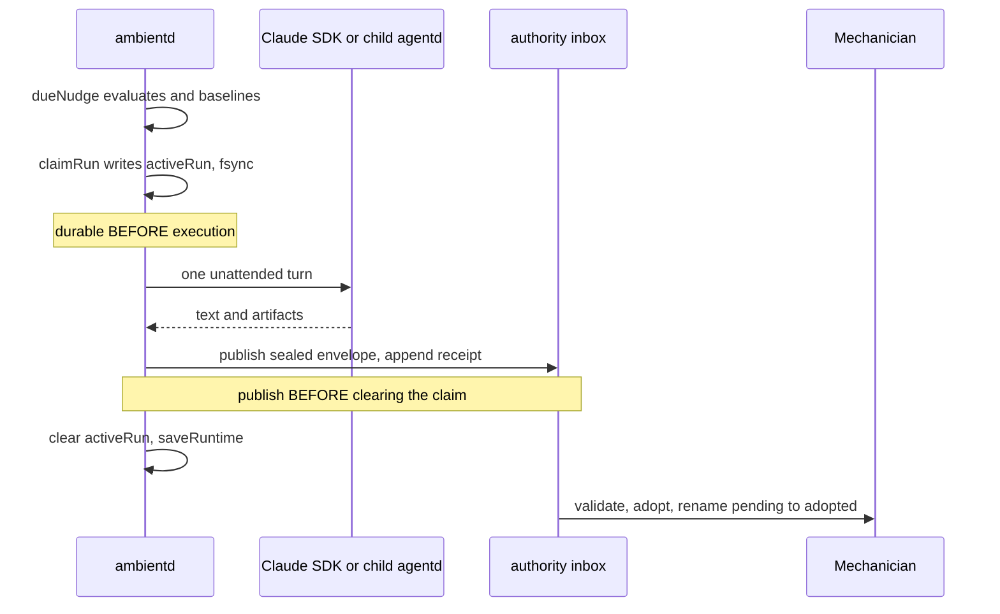

# Background work

Scheduled tasks, wait mode, delegated agents, and background processes.

Four unrelated machines meet in one window. This is also the only part of the product where a
separate process runs agents with no human present, sometimes against text an attacker can
influence. Read section 4 alongside [SECURITY-AND-PERMISSIONS.md](SECURITY-AND-PERMISSIONS.md).

## 1. Four machines, one window

| Machine | Who drives it | Where state lives |
| --- | --- | --- |
| Ambient scheduler | a separate Node process, `agentd/src/ambientd.mjs` | JSON files in the support directory |
| Wait mode | a 5 second `Timer` in each `AgentBridge` | `ArmedTrigger` on the Conversation |
| Delegated agents | the provider reports, the app projects | `SubagentRun` / `WorkflowRun` in the Conversation graph |
| Background processes | agentd polls `/bin/ps` | in agentd, mirrored in `BackgroundProcessStore` |

Only the ambient scheduler *starts* work. Wait mode resumes an existing conversation, delegated
agents are a read-only projection of what a provider says it did, and the tracker only observes and
kills. Mechanician never schedules or orchestrates a workflow node itself.

`AmbientView.swift` is the Schedule window. Its left column is three unrelated stores
(`AmbientStore`, `ConversationStore.summaries` filtered on `armedWaitSummary`, and
`BackgroundProcessStore`), scoped to the frontmost window's workspace unless "All Workspaces" is on.

## 2. The scheduler process, and the single-writer contract

`AmbientStore.shouldRunInProcess` returns true only when the launchd agent is **not** installed, a
bundled `ambientd.mjs` exists, and at least one task needing a scheduler has a ready credential for
its own lane. Then `AmbientDaemon.startInProcess` spawns ambientd as an app child, clearing
inherited bearer tokens and setting `MECHANICIAN_AMBIENT_INPROCESS=1`; `applicationWillTerminate`
stops it so it is never orphaned. "Run when closed" instead calls `AmbientDaemon.install`, which
writes `~/Library/LaunchAgents/ai.mechanician.ambient.plist` with `KeepAlive={SuccessfulExit:false}`
and `ThrottleInterval:60`, then bootout, bootstrap, kickstart.

"Dark by default" is therefore only half true. The launchd agent is opt-in
(`@AppStorage("ambientDaemonEnabled")` defaults to false, `AmbientView.swift:16`). The app-child
scheduler is not: it starts on any store mutation once a task has a credential. The model can also
create tasks mid-conversation through the `scheduler` MCP server in `agentd.mjs` (grep
`'ScheduleTask'`). In a `swift run` dev build `AmbientDaemon.ambientdPath` is nil, so the scheduler
is inert unless you set `MECHANICIAN_AMBIENTD`.

On-disk ownership is a contract, stated at `AmbientStore.swift:5-9`:

```
ambient/                        (ambient-projection/ once SQLite owns the library)
  tasks.json                    app only        AmbientStore.save()
  runtime.json                  ambientd only   saveRuntime()
  runs.json                     ambientd only   appendRun()
  heartbeat.json                ambientd only   writeHeartbeat()
  .scheduler-lease/owner.json   ambientd only   acquireSchedulerLease()
```

`save()` encodes only `AmbientTaskDefinition` values, never daemon runtime fields. Breaking the split
reintroduces a read/modify/write race where an editor save rewinds a trigger watermark and re-fires a
task. Editing a task mints a new `definitionRevision`, which is how the daemon learns to reset
baselines without ever writing `tasks.json`. The app watches the *directory*, not individual files,
because every writer publishes by atomic rename.

One ambientd owns a support directory at a time. The lease is an atomic `mkdir` plus a
token-verified `owner.json`, and a contender **waits as a standby** rather than exiting cleanly:
launchd's `SuccessfulExit:false` would otherwise leave a freshly installed job stopped once the old
child exits.

## 3. A tick, end to end

`tick()` runs every 30 seconds and is re-entrancy guarded.



`dueNudge` both decides and baselines. A time trigger with no `nextRun` sets it and returns null; a
file trigger with `lastMtime === undefined` records the mtime; an inbox trigger records the message
id. **A trigger's first observation never fires**, so a new watch task looks broken until something
changes. File watching is mtime polling on the same tick, not FSEvents, and folders are scanned
non-recursively. `computeNextRun` uses `s.hour ?? 9`, not `||`: hour 0 is valid, and `||` would make
"daily at 00:15" display midnight and fire at 09:15
(`agentd/test/ambient-trigger-baselines.test.mjs` guards this).

Two crash boundaries carry the design. `claimRun` re-reads the live task, refuses if the definition
revision changed mid-check or a claim exists, then writes `activeRun` and fsyncs before any model
call. `completeRun` publishes the envelope and the run receipt before clearing the claim. If
`saveRuntime()` throws, `fatalSchedulerError` exits rather than continuing on uncertain state. At
restart `recoverInterruptedRuns` records the real result when the claim's operation id already has a
published envelope, and otherwise records an interruption that is not retried.

ambientd never writes app-owned storage. Results cross as immutable, sha256-sealed envelopes the app
adopts (`AuthorityInboxAdopter` in `BackgroundConversationInboxAdopter.swift`, started from
`MechanicianApp.swift` only after the conversation inventory and workspace bindings are ready). The
adopter does not decode the tolerant `Conversation` schema. It decodes a finite DTO that rejects
unknown keys, refuses a provider session handle, and requires exactly two inert user/assistant
messages. See [STORAGE-AND-PERSISTENCE.md](STORAGE-AND-PERSISTENCE.md).

Notification delivery is split by who runs the scheduler: the in-process child returns early from
`notify()`, the launchd job relays through the signed app executable. Change one side alone and you
get duplicate banners or silence.

## 4. Unattended authorization

The default is **read-only**, not trust-all.

- The editor offers "Read-only workspace access" (`dontAsk`) first, "Trust all, full Mac access"
  (`bypassPermissions`) second (`AmbientView.swift:884-886`).
- On the direct Claude lane `dontAsk` is capped at exactly
  `['Read', 'Glob', 'Grep', 'mcp__artifacts__CreateOrUpdateArtifact']` in `runTaskViaSdk`.
- Model-created tasks are **forced** to `dontAsk` with an app-chosen workspace, in
  `AmbientStore.createFromAgent`.
- The query runs with `settingSources: []`, so workspace hooks, MCP servers and permission rules are
  never inherited.

An unattended run may never prompt: `unattendedToolAuthorization` in `agentd/src/runtime-policy.mjs`
answers allow or deny only, because a prompt would hang the task until its 30 minute timeout. Tools
needing a person or a foreground session are **withheld from the tool list** rather than denied at
call time, so the model does not plan around a tool that can only fail.

```
$ sed -n "/^const UNATTENDED_WITHHELD_TOOLS/,/^\])/p" agentd/src/runtime-policy.mjs \
    | grep -o "'[A-Za-z]*'" | wc -l
      11
```

`TaskReadiness.neverAvailable` (`TaskReadiness.swift:27`) is a hand-maintained mirror of that set.
Update one without the other and the editor's "Will this run?" section lies.

Only lanes with a metered credential the user owns may run unattended:
`AmbientLanePolicy.schedulable` (`AmbientProviders.swift:25`) and `LANE_ROUTES`
(`ambient-agentd-runner.mjs:25`). Subscription lanes stay in the picker with a stated reason.

Non-Claude lanes go through `ambient-agentd-runner.mjs`: it spawns a one-shot `agentd.mjs` with
`MECHANICIAN_UNATTENDED=1`, waits for `{type:'ready'}`, sends one turn, and folds events with the
pure `applyAgentdEvent`. agentd resolves the lane credential from the Keychain itself, so the
scheduler forwards no secrets. The runner is an independent client of the agentd protocol, not a
looser reference implementation. Its defensive permission reply echoes the turn `id`, request
`permissionId` and `responseId`, plus `allow` and `always: false`; its empty question reply echoes
`id`, `reqId` and `responseId` with `answers: {}`. Artifact events carry
`{artifactType,title,source}` or a one-shot `sourcePath`; the runner normalizes them to
`{title,type,source}` and removes a file-backed handoff after reading it, including on read failure.
Focused runner tests pin all three wire shapes. See
[AGENTD-PROTOCOL.md](AGENTD-PROTOCOL.md#9-other-clients-of-this-protocol).

## 5. Prompt injection surface

An inbox trigger reads the newest Mail message and puts its sender and subject in the prompt. Anyone
can email the user. `dueNudge` fences them as data inside an `<untrusted-email>` block, says they are
untrusted, and places the trusted task prompt **last** as the actual directive. Reordering that is a
prompt-injection regression, guarded by `agentd/test/ambient-inbox-untrusted.test.mjs`. A file
trigger fires on a path the user chose, but the contents are whatever wrote them.

This is prompt-level mitigation, not enforcement. The enforcement is the read-only default above,
plus one boundary that survives every permission mode: `ambientCanUseTool` denies provider and MCP
credential stores and the process table (`credentialStoreReadDenial` in `runtime-policy.mjs`),
including under `bypassPermissions`. A task set to "Trust all" on an inbox trigger keeps that
boundary and nothing else. In particular it has no write containment: `escapingWriteTarget` has no
call site in `ambientd.mjs`, because containment there works by prompting and an unattended run has
nobody to ask.

## 6. Wait mode

`WaitFor` exists because a model that says "I'll wait for X" cannot wake itself. The tool ends the
turn and asks the app to resume the conversation when a real event happens.

A supplied shell `check` must clear `authorizeWaitCheck` in `agentd.mjs`, the same bar as a Bash
call. Without it, arming a wait (auto-allowed as a benign `mcp__waitmode__` tool in
`runtime-policy.mjs`) would be a gate-free way to run arbitrary shell repeatedly. An unapproved check
with no time component is refused; with one, the wait degrades to time only.

agentd emits `{type:'waiting', ...}`; `AgentBridge` routes it to `armWait`, which floors polling at
10 seconds, caps the wait at 6 hours, writes an `ArmedTrigger` and starts a 5 second `Timer`.
`evaluateWaits` expires, fires on a deadline, or runs the check off-main via `runShellCheck`
(`/bin/zsh -lc`, 20 second timeout, conversation cwd). `fireWait` refuses while the conversation is
busy and leaves the trigger armed for the next tick.

`ArmedTrigger.lastCheckedAt` is deliberately outside `CodingKeys`, and the throttle stamp uses
`store.updateLive`, not `store.update`. Persisting it rewrote the whole conversation JSON once per
poll for the life of the wait.

Durability is re-adoption, not a daemon. Closing the app stops polling. At launch
`adoptPersistedWaits` drops expired triggers and atomically claims the rest against the process-wide
`AgentBridge.live` claim set, so windows readying together give each wait exactly one scheduler. From
any other surface act through the static `cancelWaitEverywhere` / `resumeWaitEverywhere`: the owning
window may be closed.

## 7. Delegated agents

Claude reports delegated work as `task_*` system messages, Codex as `collab*` and `subAgentActivity`
items. `agentd/src/codex-workflows.mjs` translates Codex into the same `workflow_update` shape
`emitWorkflowUpdate` produces for Claude, so the app sees one event. `WorkflowStore.swift` folds it
with pure reducers into `[String: SubagentRun]` and `[String: WorkflowRun]`.

- Terminal lifecycle is monotonic; the only refinement is completed to failed or killed
  (`reconciledWorkflowStatus`). Buffered progress must not resurrect a stopped agent.
- `applyWorkflowUpdate` mints a run only when `isWorkflowRun || taskType == "local_workflow" ||
  workflowProgress` is non-empty. Never synthesize a run for a stray child.
- `agentPath == "/root"` is the provider's own owning agent, not a child
  (`isProviderRootPseudoAgent`); filter it at every ingest point.
- Claude uses the same `task_*` protocol for background Bash.
  `createClaudeTaskLifecycleTracker` filters by tool name and task type; loosening
  `explicitlyVisible` floods the panel with shell calls.
- Absent metrics stay nil. A zero on a legacy aggregate means "not reported", while an *observed*
  Codex tool count of zero is authoritative (`SubagentRun.reportedToolUses`).

`subagentParentKey` resolves parentage from Claude's `parentToolUseId` or Codex's `agentPath` minus
its last segment; `subagentForest` is cycle-safe and ordered by start time. A third provider needs a
branch there and no UI change. `collapseWorkflowAggregateMirrors` retires the provisional standalone
Task card once a tool call is proven to own a workflow, and must run after every
`applyWorkflowUpdate`:

```
$ grep -c 'collapseWorkflowAggregateMirrors(' app/Sources/Mechanician/AgentBridge.swift
5
```

The execution trace is separate and persisted. `AgentActivityTimeline.swift` turns reducer steps into
point-in-time samples, canonicalizes identity through `AgentActivityIdentity`, and bounds the ledger
(`maximumPersistedAgentActivityRecords`, `AgentActivityTimeline.swift:515`, currently 1600). It
imports only Foundation, by design.

**Rendering constraint you will hit.** The AppKit transcript reloads a row only when that row's
`revision` changes (`applyPresentationRows` in `AppKitTranscriptHost.swift`), and
`acceptMeasuredHeight` rejects a measurement whose revision no longer matches, because cells are
reused. A card that grows while its own transcript entry is unchanged is therefore never re-measured
and clips into the message below. The chunk builder in `ContentView.swift` handles this for
`Workflow` tool entries by hashing the run's height-affecting signals (status, phase count,
description, summary, output file, error, and each agent's id, state, last tool name and tokens) into
the row revision. The same rule governs interactive state: expansion lives on the bridge
(`AgentBridge.expandedTools`, keyed by transcript-entry id) and is folded into that hash. Card-local
`@State` such as `WorkflowRunView.expanded` is not folded in and does not survive a rebuilt cell.

`AppKitAgentsPanel.swift` is AppKit end to end; `AppKitAgentsListSnapshot.make` is a pure reducer, so
drive grouping changes from tests. The panel observes `bridge.objectWillChange`, which fires *before*
properties mutate, so it coalesces to the next run-loop turn. See
[APP-SHELL-AND-UI.md](APP-SHELL-AND-UI.md).

## 8. Background processes

Work started with `nohup … &` reparents to launchd once its shell exits, so by the time you
enumerate, the most interesting background work is no longer a descendant of anything agentd can
reach. `background-processes.mjs` **captures** pids while they are still in the tree and then
**follows** their pid, uid and `ps lstart` identity tuple after reparenting.

Adoption covers processes that detach faster than one poll, and is conservative on purpose.
`isAdoptableOrphan` requires ppid 1, agentd's own uid, an elapsed time shorter than agentd's, a
non-infrastructure command, and a cwd inside a workspace root agentd is responsible for.
`usableWorkspaceRoots` drops `/`, `$HOME`, and ancestors of `$HOME` as too broad; with no usable
root, adoption is off. Adopted pids become killable, so a false positive would put a Stop button on
the user's own job.

The monitor waits 5 seconds between serialized ticks, but it does not fork `ps` until an accepted
send or review has recorded a real turn workspace. Several connected lanes can therefore sit idle
without each scanning the whole Mac. Once enabled, agentd emits `background_processes` only when the
`pid:detached` signature changes. The machine-wide `ps` snapshot has a two-second SIGKILL timeout;
a timeout or other snapshot failure preserves the already-tracked identities and the user's Stop
authority, and the monitor rearms for the next tick. Orphan discovery checks at most one new cwd per
pass. A failed or outside-workspace cwd is cached for that exact live process generation, so
unrelated launchd children are not re-lsof'd forever; a newly learned matching workspace requires a
fresh lookup. Stopping the monitor aborts its current lookup and never rearms it. `AgentBridge`
routes reports at daemon level, ahead of the lane split, into
`BackgroundProcessStore.replace(_:for:)`, keyed by bridge id plus lane so one daemon's report never
erases another's. `AgentBridge.killBackgroundProcess` sends `kill_background_process` to the one
bridge whose `bridgeID` matches the report, never a broadcast, or every sibling window surfaces a
spurious `control_error`. agentd re-reads `ps` and refuses the stop unless the tracked process
identity still matches immediately before signalling it. Signal delivery removes only that
reporting daemon's UI row; another daemon's independently tracked copy stays visible until its own
snapshot settles, so a SIGTERM-resistant orphan never becomes hidden or unstoppable. The tracker
retains the process generation until a scheduled poll proves it exited, and invalidates only
publication coalescing so the next ordinary non-overlapping poll emits once whether the result is
empty or the same surviving pid. The reconciliation repair therefore adds no second process-table
snapshot or `lsof` probe beyond Stop's existing pre-signal `ps` identity validation, and does not
reset the process's age or orphan-adoption evidence. `lstart` has one-second resolution, and the stop
control carries only a pid, so this narrows rather than eliminates the final PID-reuse ambiguity.

Note the asymmetry: agentd may read the process table, the agent may not.
`credentialStoreReadDenial` fails a Bash call running `ps` or `pgrep -af`, because provider CLIs can
carry bearer tokens in their command lines.

## 9. Extension points, and pairs that must move together

- **A new trigger type**: `ScheduledTask.triggerSummary`, a `dueNudge` branch with its
  first-observation baseline field, that field in ambientd's `RUNTIME_FIELDS` and Swift's
  `AmbientTaskRuntime`, a `TaskEditor` branch, a group bucket and icon in `AmbientView`, and
  `buildTrigger`/`describeTrigger` in `agentd.mjs` if the model may create it.
- **A new `ScheduledTask` field**: the struct, `AmbientTaskDefinition` and its round-trip,
  `LibraryAmbientTaskDefinition`, and ambientd's `RUNTIME_FIELDS` / `definitionRevision` key if the
  daemon reads it. Miss the last one and every existing task's revision key changes, resetting every
  baseline.
- **A new schedulable lane**: `AmbientLanePolicy.schedulable` **and** `LANE_ROUTES`. Extend
  `usesDirectSdk` only if it should bypass the child agentd.
- **A new unattended tool**: classify it in `runtime-policy.mjs`, and for the direct Claude lane add
  it to the separate hard-coded `allowedTools` array in `runTaskViaSdk`. If it can never work
  unattended, add it to `UNATTENDED_WITHHELD_TOOLS` **and** `TaskReadiness.neverAvailable`.
- **A new scheduler MCP operation**: the `scheduler` server in `agentd.mjs`, the switch in
  `AgentBridge.applyAmbientTaskMutationRequest`, and `AmbientStore`'s `*FromAgent` surface, or the
  tool times out after 15 seconds.
- **A new agentd event**: turn-scoped events must appear in `AgentBridge.turnScopedEventTypes` or
  they are silently dropped. `workflow_update` is additionally the only event allowed through a
  completed turn route, so post-terminal delegate lifecycle still lands. See
  [AGENTD-PROTOCOL.md](AGENTD-PROTOCOL.md).
- **A new subagent or workflow field**: the struct, its hand-written tolerant `init(from:)` in the
  extension, the reducer that sets it, `agentActivityRecords` if it is a timeline sample, and the
  duplicate-merge branch in `applySubagentUpdate`. A non-optional stored property without the
  tolerant decoder quarantines the whole conversation on load.

Once SQLite owns the library, ambientd cannot open `library.db`, so the app keeps writing disposable
projections into `ambient-projection/`: `tasks.json` from `AmbientStore.save()` and `workspaces.json`
from `ProjectStore`. Without `workspaces.json`, a workspace created after the cutover resolves to
`unresolved:<id>` (`agentd/src/workspace-instructions.mjs`) and `tick()` holds the task rather than
running it, so it silently never fires and nothing in the editor says why. Note the resolver returns
an object on *every* path, including the unresolved one, so a nullability test does not catch this;
`tick()` checks the `unresolved:` prefix explicitly. An earlier version missed that and ran those
tasks from the home directory instead. agentd's own
`readTasks` and `schedulerIsLive` helpers still read the legacy `ambient/` path unconditionally, so
`ListScheduledTasks` and the "background scheduling is ON" hint can disagree with reality on a
SQLite-authority install.

`agentd/src/build-scheduler.mjs` is unrelated despite the name: it serializes the Build tool per
repository root inside one agentd.

Tests to read first: `agentd/test/ambient-trigger-baselines.test.mjs`,
`ambient-inbox-untrusted.test.mjs`, `ambient-runtime.test.mjs`, `ambient-agentd-runner.test.mjs`,
`background-processes.test.mjs`, `codex-workflows.test.mjs`. Running them is covered in
[CONTRIBUTING.md](../../CONTRIBUTING.md) and
[BUILD-AND-PACKAGING.md](../development/BUILD-AND-PACKAGING.md).
