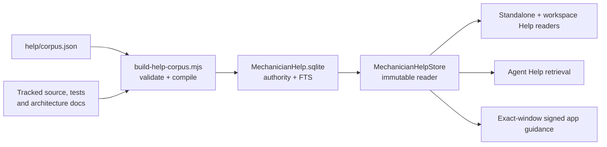

# Mechanician Help intelligence

## 1. Status and boundary

Mechanician ships a versioned product-knowledge corpus that powers the Help window and provides the
read-only retrieval boundary for an agent-facing Help tool. The corpus is product authority: it
describes the app, its workflows, architecture, extension points, diagnostics and history for one
specific build.

It is deliberately separate from every mutable store:

- `library.db` owns mutable user and product state.
- `projections.db` is disposable and may lag its authority.
- `Contents/Resources/MechanicianHelp.sqlite` is generated from reviewed repository sources for the
  current build, sealed by the app signature, and opened immutable/read-only.

Workflow advice combines signed product recipes with the exact standard conversation route's live
capability evidence. Nothing it returns is derived from a mutable store.

The current implementation includes the corpus compiler, package staging, strict Swift reader,
claim search, history filtering, evidence display, machine-readable demonstration plans, the
standalone and workspace-inspector Help readers, signed native guided tours, agent-directed
cross-app `ShowMechanician` presentation, the separate automation composer handoff, the
cross-provider `SearchMechanicianHelp`, `ShowMechanician`, `OperateMechanician`, and
`RecommendMechanicianWorkflow` tools in ordinary conversations, and a dedicated Help conversation
workspace with a closed expert profile.

## 2. One authored corpus, one built artifact

`help/corpus.json` is the reviewed authoring authority. An article has a stable id, section, kind,
lifecycle, aliases and reader Markdown. Its searchable claims are authored separately with stable
keys, atomic answer text, lifecycle and explicit evidence ids; the compiler never manufactures
claims from headings or sidebar blurbs.

Demonstrations are a second authored unit attached to an article. Each has a stable id, visible
outcome, claim grounding, exact canonical tool requirements, risk and reversal contracts, explicit
confirmation behavior, ordered steps, verification and fallbacks. The compiler accepts only a
closed set of app-owned tool names and rejects fallback cycles or action plans without confirmation
and post-action verification. Demonstration text is still untrusted corpus data: it cannot dispatch
a tool, grant approval, or prove that a provider route currently exposes the named tool.

Guides are a third authored unit attached to an article and grounded in current claims. Each names
one closed app-owned surface; its ordered steps carry only semantic targets, reveal actions, and
completion kinds valid on that surface.
They cannot contain URLs, selectors, coordinates, scripts, tool arguments, or provider input. The
compiler and Swift reader validate the same vocabulary before the native presenter admits a guide.

Every evidence path must be a non-symlink tracked by Git, stay inside the public repository and
contain its exact anchor exactly once. The authoring record also pins the reviewed source-file
SHA-256. A missing/ambiguous anchor or any later source drift fails compilation until a person
reviews the affected claims and updates the digest. Moving or rewriting source therefore does not
silently refresh or retire a fact. Every current claim has evidence and cannot rely only on
`docs/history`, because a historical design is not a current specification.

`scripts/build-help-corpus.mjs` compiles the source in stable order with Node's built-in SQLite
writer. It records:

- app version, build, bundle id and tenant id;
- source commit and a SHA-256 of the working-tree diff;
- a canonical content digest;
- source-file and evidence-anchor digests.

`--check` builds twice and requires byte-for-byte identical databases. It also checks SQLite
integrity, foreign keys, application/schema ids, FTS row parity and a search smoke query.

## 3. Package identity and launch admission

Both assemblers call `scripts/stage-help-corpus.sh` before signing:

- `dev.sh` uses the configured development Node and stages the corpus in the development bundle.
- `build-app.sh` uses the exact downloaded, SHA-256-verified Node that it bundles for release.

The assembler snapshots the tracked source commit and diff digest once and passes that identity to
the shared helper and the signed build record. It aborts if source changes during compilation or
before signing. The helper reads the assembled `Info.plist` and writes exactly
`Contents/Resources/MechanicianHelp.sqlite`. It refuses a missing output or live WAL/SHM sidecars.
Release `BuildProvenance.json` records both the Help schema version and the SHA-256 of the completed
SQLite artifact; the schema value is read from that artifact rather than copied as another literal.
Public and development bundles carry the `default` corpus tenant even when the public app loads an
external managed profile. A legacy tenant-specific bundle carries its validated packaged tenant.

`MechanicianHelpStore.openBundled` rejects the artifact unless all of these hold:

- SQLite opened with `mode=ro&immutable=1`, `SQLITE_OPEN_READONLY` and reports the main database as
  read-only;
- `application_id` is `MHLP` and `user_version` is the supported schema;
- quick-check, foreign keys, vocabulary and authority/FTS row counts are valid;
- the required strict tables, columns, FTS5 virtual/shadow tables, authority/index keys and indexed
  text match exactly, and every current claim has evidence;
- version, build, bundle id and packaged tenant match the running app;
- when signed build provenance is present, source commit and diff digest match too;
- when signed Help provenance is present, its schema and whole-file SHA-256 match before retrieval.

A missing, invalid or mismatched corpus is an explicit unavailable state. There is no hard-coded
fallback corpus: a fallback would let the UI and the agent disagree about product truth.

## 4. Schema and retrieval

Schema version 4 contains:

| Relation | Purpose |
|---|---|
| `help_meta` | Build and content identity |
| `help_section` | Ordered reader navigation |
| `help_article` / `help_article_alias` | Long-form reviewed topics and lookup vocabulary |
| `help_claim` | Atomic searchable statements or procedures |
| `help_evidence` / `help_claim_evidence` | Tracked support for each claim |
| `help_relation` | Reserved claim-to-claim edges for supersession and related facts |
| `help_demo` | Ordered demonstration identity plus a bounded, canonical typed recipe and digest |
| `help_demo_claim` | Stable claim grounding for each demonstration and its evidence union |
| `help_guide` | Ordered signed native-guide identity, closed surface, and lifecycle |
| `help_guide_claim` | Stable current-claim grounding and evidence union for each guide |
| `help_guide_step` | Ordered closed semantic target, reveal, and completion vocabulary |
| `help_claim_fts` / `help_article_fts` | Embedded disposable indexes inside the same sealed artifact |

The storage vocabulary reserves `current`, `historical`, `superseded` and `retired`. Schema-v4
authoring accepts current and historical material; superseded/retired material is rejected until
replacement relations have a complete authoring and validation contract. Normal search admits
current claims in current articles. Historical claims are considered only when the caller asks for
history. This keeps reverted architecture from answering a current implementation question while
preserving it for origin and design-history questions.

`MechanicianHelpStore.search` turns a byte-bounded caller query into bounded, quoted FTS terms.
Typeahead uses AND-prefix matching; question search removes common question words and uses OR
matching. It bounds result count and total complete-hit bytes, resolves candidate claim keys, then
re-reads the current authority row and its evidence before returning a hit. Current authority ranks
before requested history. The FTS index proposes candidates; it never becomes authority.

The result types in `MechanicianHelpModels.swift` are `Sendable` and contain complete claim,
article, lifecycle, score and evidence units. `MechanicianHelpProviderRetrieval` uses that app-owned
seam for `SearchMechanicianHelp`: it asks for at most six question-search hits and returns a complete
ranked prefix within a 24 KiB final provider-result budget. The single-line sorted JSON includes the
running version/build, corpus id/schema, full claim text, claim and article lifecycle, and evidence
path/anchor. The `mechanician.help.v2` envelope also includes at most four current, agent-callable
guide summaries whose signed
claim grounding intersects that exact ranked prefix. Those summaries contain only id, title,
summary, and closed surface; guide steps, reveal actions, targets, geometry, and routing stay
app-private. Only `conversationWorkspace` summaries are exposed to the agent. The
Help-local inspector tour remains a manual reader action because its reveal hooks are reader-local.
Scores, source digests, tenant identity and build-source identity stay app-private.
Corpus text is framed as untrusted reference data. The daemon only transports a correlated request
and response; it never opens or reinterprets the database directly.

The tool is available to ordinary Claude, OpenAI and Codex conversations under the standard
profile, including Plan mode because it is read-only. A missing, rejected or mismatched corpus is a
failed/unavailable tool result, never an empty match. Exact turn and request ids bind the result to
its route. A nonempty result stages a concise `.system` consultation receipt, but that receipt is
persisted only after the provider-specific result boundary acknowledges delivery. Timeout,
cancellation, failure and empty searches produce no receipt. Unattended runs withhold the tool
because their one-shot daemon has no foreground app bridge to answer it.

`MechanicianHelpProviderRetrieval.workflowMatches` is a second read-only projection over the same
sealed authority. It validates a goal before opening the database. An ordinary request performs
current-only claim search and selects at most six reviewed demonstrations whose signed claim keys
intersect those hits. A `Try workflow` request also carries the selected signed demonstration id; that
path loads exactly that current recipe and never substitutes a fuzzy match. Both paths deduplicate
and rank complete recipes deterministically. Neither accepts provider-supplied requirements, risk,
mode, recipe text, conversation ids, or workspace ids.

`RecommendMechanicianWorkflow` is exposed only to an interactive standard conversation. The app
revalidates the immutable root-turn route after retrieval and assesses each signed recipe against
that exact accepted `tool_surface`. It returns a complete ranked prefix of at most three recipes in
the 24 KiB `mechanician.workflow-advice.v2` envelope. The four app-owned readiness labels are
**Ready to try here**, **Switch out of Plan**, **Not available in this conversation**, and **Not
verified yet**. A provider must stop on any non-ready label; incomplete Codex native coverage can
therefore never turn an unobserved tool into a false negative. The result includes signed risk,
confirmation, reversal, steps, verification, fallback, claims, and evidence, but omits raw tool
inventory and every route, account, folder, session, and source digest. `ready` is explicitly
advisory: it grants no provider authorization, app approval, sandbox access, macOS permission,
live-resource existence, effect, or success. Approval language remains conservative in every mode:
an external action may still trigger its app-owned approval or macOS permission flow.

The workflow tool uses its own turn/request registry and stages a consultation receipt only for a
non-empty answer. Claude acknowledges immediately before returning the MCP result; OpenAI waits
until the next Responses request carrying the function output is accepted; Codex waits until its
JSON-RPC result write completes. Wrong-turn, duplicate, late, cancelled, failed, and empty results
cannot commit a receipt. Review does not advertise the adviser, and unattended runs
withhold it.

`MechanicianHelpArticle.demonstrations` contains the plans attached to that article;
`MechanicianHelpStore.demonstrations(articleID:includeHistory:)` provides the same stable ordered
retrieval directly. The reader byte-bounds recipe JSON before decoding, requires its exact nested
keys, validates its SHA-256 and typed vocabulary, caps every collection, checks step/tool and
verification relationships, and resolves evidence through the linked claims. Schema 4 needs no
active-authority migration: the database is a sealed bundle resource replaced with the app build,
not mutable user authority. Each app admits only its own compiled schema resource; an older app
continues reading the older sealed artifact bundled with that build.

Availability is deliberately not stored. Each app window's `AgentBridge` owns an ephemeral catalog
keyed by the immutable identity of one accepted provider turn: conversation, workspace, model and
account route, runtime generation, provider-session and instruction revisions, tool profile, and
the permission mode captured for that turn. Claude and direct OpenAI report their complete accepted
surface; Codex reports its complete Mechanician-supplied dynamic surface while explicitly leaving
provider-native coverage unknown. A missing name is therefore unavailable only under complete
coverage; a reported empty surface remains distinct from a turn that never reported one.

While the accepted turn is active, that route's captured permission mode and tool surface remain
authoritative even if the toolbar already displays a different pending choice marked **NEXT**.
After the turn completes, last-observed evidence is eligible only while the current model, account,
profile, and permission picker still match it. This preserves the truth about what the provider
accepted without letting completed-turn evidence survive a later route change.

The provider sends exact raw names, while the app recognizes product tools only through a fixed
app-owned alias map (for example, bare `ListCapabilities` versus Claude's exact
`mcp__capabilities__ListCapabilities`). An arbitrary MCP suffix remains visible but cannot
impersonate an app tool. Route-bound capability evidence is advisory and never grants a tool or
pre-approves its use: every invocation still passes its normal provider, app, approval, sandbox,
and macOS permission gates.

The automation handoff carries its exact signed demonstration id and canonical requirements into
its draft but
grants no tool. The new standard
conversation starts with an unverified surface and must establish its own exact route; it can never
inherit the Help conversation's closed-profile report. The draft instructs the standard agent to call
`RecommendMechanicianWorkflow` for that exact id and to continue only when the returned id matches
and its label is **Ready to try here**. Inventory probes such as
`ListCapabilities` and `DiscoverAppActions` then supply live user state. Action steps remain
interactive and respect Plan restrictions after the user agrees to the conversational preflight.

The initial reviewed set demonstrates app-action discovery, Shortcut inventory, saved-capability
inventory, an explicitly user-chosen capability run, and creation of a live artifact preview. The
first three only observe live inventory. A capability run inherits unknown effects and reversal
from the selected saved automation, so its contract is dynamic: sending the draft is not action
confirmation; the agent must list the available choices, state the exact name and arguments, and
obtain fresh confirmation immediately before `RunCapability`. Artifact creation is an additive,
Plan-compatible action. Sending that reviewed draft confirms only the named demo after the agent
explains what will appear; it records its manual removal path and grants no app or macOS approval.

## 5. Reader behavior

`HelpLibrary` is main-actor presentation state over the store. It owns loading, article retrieval,
cancellable search and stale-result suppression. A shared `HelpBrowserView` powers both the
standalone `HelpWindowView` and the Help inspector. It provides:

- sectioned topics sourced from the corpus;
- typeahead search and an explicit Include history switch;
- a matched atomic answer above the full article;
- current build identity, lifecycle labels and evidence anchors;
- current signed **Start tour** guides where an exact Help-workspace presenter exists;
- reviewed demonstrations where that host permits their explicit handoff.

The standalone window remains the recovery surface. In normal product mode it also shows the live
“What it can do” inventory and **Ask Mechanician** handoff. In storage recovery it constructs none
of those product-backed or action-bearing surfaces and reads only the signed corpus.

The dedicated Help workspace uses a 560-point Help inspector containing topics, search,
history, matched claims, evidence, manual Help-local tours, and reviewed automation handoffs beside
the conversation when the person opens it.
A Help window with no restored layout starts with the inspector closed; restored visible or hidden
state and later choices in that window win, so merely focusing Help never changes a panel the person
has already chosen. The inspector deliberately omits the self-referential **Ask
Mechanician** action and live capability inventory; the enclosing Help conversation is already the
expert, and its provider profile remains closed to signed Help search, one bounded signed-guide
request, and bounded app operation outside Plan. At compact widths the browser changes from a
split index/article layout to one-column navigation without losing its query or selected article.
Pressing the active Help tab again returns the reader to its topic root, while automatic window
restoration preserves its current navigation.

The reader keeps three authority levels visibly separate. **Explain** is the closed Help agent and
its signed corpus retrieval. **Start tour** is the manual Help-local native guide: it registers
semantic controls in the exact Help workspace window, temporarily reveals reviewed reader state,
draws an accessible spotlight and callout, and waits for Back, Next, Done, or Exit. It never sends a
message, calls a provider or tool, synthesizes input, guesses a coordinate, or widens the Help
profile. Missing, hidden, detached, or ambiguous targets stop that step visibly. Workspace,
conversation, window, or corpus-digest drift ends the session. The prior topic or catalog selection
restores on end unless the person made a later reader choice. A guide may leave the selected article
at its last highlighted location; version 1 does not preserve an arbitrary scroll offset.
Agent-directed **Show me** uses the same signed guide authority but crosses only to an admitted
app-owned surface. One destination is agent-callable: a `conversationWorkspace` guide presents an
ordinary product surface: the Files, Changes,
Artifacts, Agents, and Skills inspector tabs, and the model, reasoning-effort, permission, and
message-box controls. That destination is the source window when it is an ordinary standard
workspace, otherwise the frontmost window that is, and it is never created: no eligible conversation
window means the request fails rather than opening one. Asking the closed Help expert to show the
Changes panel therefore lands in the window the person actually works in, and both reserved
workspaces stay out of scope as destinations.

Tab reveal is presentation, not preference. The router publishes the tabs one live presentation
needs for the exact destination bridge, and `InspectorView` unions them into the visible set for as
long as the guide runs. It never writes the person's per-workspace tab choice, and the folder rule
still refuses Files and Changes in a folderless workspace, so a guide about either is honestly
unavailable from Home instead of spotlighting a panel with no repository behind it. On Done, a tab
the workspace already showed stays selected because seeing it is the point; a tab the guide had to
reveal is put back, so a demonstration never edits the tab bar by side effect. A guide whose steps
are all composer controls never touches the inspector at all. The provider never receives the steps or
presentation geometry. Reviewed external automation remains a separate unsent handoff to a standard
conversation.

Agent-directed **Operate** is the same boundary one step further: the app performs a named operation
instead of presenting it. `OperateMechanician` takes one name from a closed vocabulary
(`MechanicianOperationKind`) and, where the operation needs one, one target the app re-resolves
against its own authority. Window operations run on app-owned surfaces; everything else resolves the
same conversation window a conversation guide would, and is refused rather than satisfied by opening
a workspace. The vocabulary is the whole boundary: it contains no operation for permission mode,
account connection, sending, or deletion, so operating the app cannot widen what the agent may do
next. A model target must appear in the account's ready reported catalog — `AgentBridge.selectModel`
deliberately accepts an unconfirmed name so a person can pick from a stale picker, and that latitude
is wrong for a provider-supplied string. Authorization is one narrow class in `runtime-policy.mjs`:
allowed without a prompt, because prompting to open a panel the person just asked for would make the
feature pointless, and denied in Plan, because Plan is the person holding the app read-only. An
unattended run has no interface to operate and the tool is withheld from its list entirely. Swift
independently rejects a Plan operation request both before admission and when the asynchronous
operation revalidates its exact turn route.

`enableExtension` and `disableExtension` are the one class that stops and asks. An app setting
outlives the conversation that changed it and applies to every other one, so it is the person's
decision each time rather than a class the agent is trusted with once. The card is composed by the
app from `ExtensionsStore`, never from provider copy, and the connection name is re-resolved both
before the card is shown and again after the answer, because it can be renamed or removed while the
card is up. These operations are user-paced: `MECHANICIAN_CONFIRMED_OPERATIONS` suppresses the
daemon's 15-second deadline for them, the same way a question has none, and the turn ending is what
settles an unanswered one. Declined, abandoned, and never-asked are three
distinct outcomes, because only the first is a decision. Only one card is pending at a time; a second
proposal is refused rather than stacked, because a queue of settings cards is a queue of decisions
made without reading them — and that refusal must say it was never put to the person. Folding it
into a decline is what made a model that called the same operation twice answer "you declined the
confirmation" in a conversation where one card had been shown and one answer given.

Selecting a tab the workspace hides is where an operation and a guide deliberately differ. A guide
borrows the tab and puts it back; an operation the person asked for adds it to the tab set, which is
visible in the bar and reversible from the menu that hid it. The folder rule still wins for Files and
Changes.

The live inventory now follows the exact selected conversation and its bridge rather than whichever
provider lane reported most recently. Changing conversations, provider/account routes, workspaces,
profiles, permission modes, runtime generations, or tool-schema revisions immediately makes the
prior surface ineligible. The reader distinguishes opening, setup-required, discovering,
reported-empty, ready, failed, and not-yet-verified states. Help shows its intentional
closed-profile boundary; saved Mac capabilities appear only when that exact standard route
reported `ListCapabilities` or `RunCapability`. Codex also labels its provider-native inventory as
non-exhaustive.

This evidence remains guidance rather than an authorization boundary. It is omitted entirely in
storage recovery because constructing that product surface can seed support files. The immutable
Help scene itself remains available when `library.db` launch authority is blocked and may be needed
to explain recovery.

For a current automation demonstration in normal product Help or the Help inspector, the reader
handoff constructs only the internal
`MechanicianRoute.newStandardConversationDraft`. It has no URL spelling and no send path: it creates
a standard-profile conversation and fills its composer for review, leaving submission to the user.
The control is unavailable in storage recovery and for historical or otherwise non-current
demonstrations. Routing preserves the exact eligible active workspace; if that scope is closed or
cannot be resolved as standard, it explicitly targets Home instead. Delayed delivery revalidates
the same scope so the draft cannot drift into a different workspace or widen a closed profile.

Corpus strings render verbatim rather than entering the localization catalogue. App-owned controls
and status text remain localizable and use the app's existing card, color and pill-control styles.

## 6. Agent-facing retrieval and Help workspace

`SearchMechanicianHelp`, `ShowMechanician`, `OperateMechanician`, and
`RecommendMechanicianWorkflow` are app-owned authorities rather than provider-owned effects. Search
and the adviser call the signed store and return bounded, cited product authority. Show resolves one
signed guide into app-owned presentation, while Operate admits one closed app-owned operation. The
app owns build, lifecycle, recipe, route, capability, presentation, and operation admission;
returned corpus text is untrusted data, not permission to execute instructions. A visible
transcript receipt appears only after the provider acknowledges a non-empty Search or adviser
result. Search returns claims. The adviser returns complete reviewed recipes plus the app's
conservative readiness assessment, and has no execution path.

**Ask Mechanician** lazily creates or focuses a fixed, app-owned, folderless Help workspace. Help
conversations are ordinary durable conversations, so they inherit history, copy, cancellation,
fork, transcript, composer and native window behavior. The fixed workspace row is excluded from
user-workspace management and repaired to its canonical identity at either storage load boundary.
Its inspector defaults to the shared signed Help reader rather than empty Artifacts, Agents, and
Skills panels. Browsing or selecting an article does not inject hidden context into the transcript.

The provider profile follows that durable workspace id, never its title, current window or neutral
cwd. Across Claude, direct OpenAI and Codex, the `help-expert` profile exposes exactly
`SearchMechanicianHelp` and `ShowMechanician` in Plan, and exactly those two plus
`OperateMechanician` in every other permission mode. It clears project and repository instructions,
uses a deny-root neutral runtime, and excludes filesystem and shell access, web search, external
MCPs, skills, plugins, subagents, artifacts, arbitrary app automation and elicitation. The operation
tool accepts only the app's bounded vocabulary; Plan withholds and rejects it on all provider lanes,
and the app route rejects a forged request too. Unknown profile values and unadvertised calls fail
closed. The Help profile is interactive only; unattended runs have no app
bridge for the signed-corpus round trip and cannot select it.

The expert is therefore authoritative about the shipped corpus without acquiring authority over a
checkout or the Mac. `ShowMechanician` accepts exactly one current guide id that appeared in the
signed search result for the person's request. The app re-resolves it from the sealed corpus,
admits only an agent-callable surface, binds it to the exact turn and source/target windows, and
starts a reversible presenter after the target is visibly registered. It cannot accept a workspace,
window, conversation, route, selector, script, URL, coordinate, input, or mutation payload. A
successful tool response means the bounded presentation was admitted and verified, not that a
broader automation permission was granted. Understanding a checkout, collecting live evidence,
changing code, or running external automation still requires an explicit standard-profile handoff.

The corpus includes claims explaining native guided tours and the guides that leave Help. Search may
return provider-safe current guide summaries tied only to the matched claims, capped at four, so a
guide must be grounded in the narrowest claim that answers the request rather than a catch-all
overview. Question tokenization drops the framing words `show`, `me`, `my`, `in`, and `on` for the
same reason: "Show me the Changes panel" must retrieve the Changes claim, not the article that
happens to describe the Show me feature. The expert can pass one exact returned id to
`ShowMechanician`; only the app reads its steps and starts the guide. The Help-inspector tour stays
manual and is never offered as agent-callable in the provider envelope. The reverse gate matters as
much: the reader offers its own **Start tour** control only for `helpWorkspaceInspector` guides,
because a conversation guide's controls live in a workspace window and a reader-started overlay
would stall on its first step with no way to recover.

Current workflow answers compose two independent inputs:

1. shipped product claims from `MechanicianHelpStore`;
2. live capabilities reported for the exact accepted conversation route and provider turn.

Only the standard interactive profile exposes the adviser. The provider supplies a bounded goal;
the root `TurnRoute` supplies identity and captured permission mode; the signed corpus supplies all
requirements and safety fields. A route-owned snapshot may produce `ready` or
`needs-mode-change`. Complete coverage can prove `unavailable-here`; missing or partial evidence is
`not-verified`. None of these states enters authorization or persists as a permission decision.

A static corpus can match documented issue claims and explain invariants, but no complete typed,
version-applicable known-issue catalogue ships yet. Novel bug identification still
needs bounded, redacted live diagnostics; raw logs, prompts and unrelated user data should not be
attached by default. The diagnostic snapshot remains a later slice.

## 7. Change and verification map

- Author content in `help/corpus.json`; follow `help/README.md`.
- Change compilation or schema in `scripts/build-help-corpus.mjs` and update both schema constants.
- Change package staging only through `scripts/stage-help-corpus.sh`, which both assemblers call.
- Change runtime admission or retrieval in `MechanicianHelpStore.swift`.
- Change provider framing in `MechanicianHelpProviderRetrieval.swift` and correlated transport in
  `AgentBridge.swift` plus `agentd/src/agentd.mjs`.
- Change signed workflow ranking/projection in `MechanicianHelpProviderRetrieval.swift` and
  `MechanicianWorkflowProviderAdvice.swift`; never move recipe requirements into provider input.
- Change exact-turn capability evidence in `agentd/src/tool-surface.mjs`, its provider emission
  points in `agentd/src/agentd.mjs`, and the route-bound app authority in
  `AgentToolCatalog.swift` plus `AgentBridge.swift`. Legacy `tool_catalog` is not authority.
- Change reader behavior in `HelpLibrary.swift` and `HelpWindow.swift`; change Help inspector
  eligibility/defaults in `InspectorView.swift`, `InspectorTabPreference.swift`, and
  `InspectorWidthPreference.swift`; change its fresh/restored presentation through
  `HelpWorkspaceInspectorVisibilityPolicy` and the `AgentBridge.swift` application seams.
- Change the agent-callable operation vocabulary in `MechanicianOperationRouter.swift`, its
  transport in `AgentBridge.swift` plus `agentd/src/agentd.mjs`, its provider description and
  Codex guidance in `agentd/src/codex-tools.mjs`, and its authorization class in
  `agentd/src/runtime-policy.mjs`. Adding an operation that changes app or account authority is a
  product decision, not a table entry.
- Change signed native-guide presentation only through `GuidedHelpPresentation.swift`,
  `GuidedHelpOverlay.swift`, `MechanicianGuidanceRouter.swift`, and semantic target registrations in
  `HelpWindow.swift`, `InspectorView.swift` (one per `InspectorTab.guidedHelpTarget`), and
  `ContentView.swift` for the conversation controls and message box.
  Change the agent-callable surface policy in `MechanicianHelpGuideSurface`, the destination and
  reveal rules in `MechanicianGuidanceRouter`, and nothing in provider input. Never add raw UI
  selectors, payloads, or transcript scrolling to a guide.
- Change reserved Help identity/routing in `ReservedWorkspace.swift` and `HelpWorkspace.swift`, and
  change its provider boundary only through the closed profile in `AgentBridge.swift`,
  `agentd/src/codex-tools.mjs` and `agentd/src/agentd.mjs`.

The canonical `scripts/check.sh` runs the compiler syntax check, corpus contract tests,
deterministic rebuild, and expertise coverage/golden-question gate before the Swift suite. The
goldens verify retrieval, citations, lifecycle filtering, and lexical abstention; they do not prove
provider prose, semantic abstention, live diagnosis, or guide presentation. Packaging changes also
require `scripts/dogfood.sh`.
