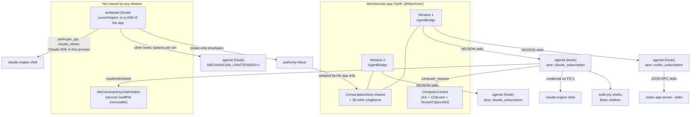
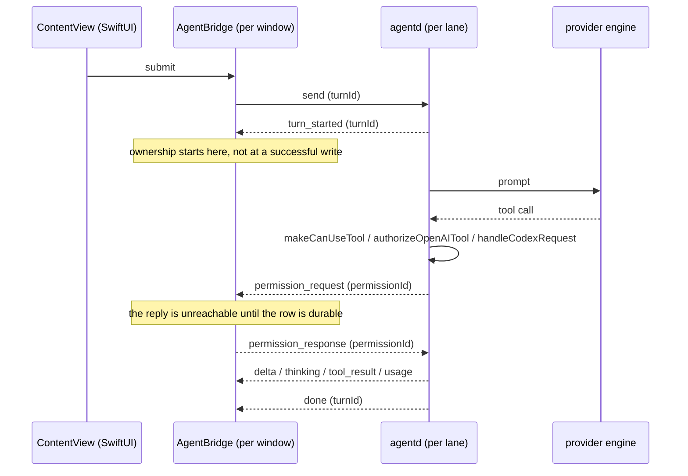

# Architecture Overview

The landing page for Mechanician's architecture documentation. It tells you which process a thing
runs in, which file to open, and which of the other documents covers the area you are about to
change. Audience: a macOS or Node developer who has never seen this codebase.

## 1. What Mechanician is

Mechanician is a native macOS application for running coding and automation agents. The user-visible
product is a window with a conversation transcript, a composer, an inspector (files, source-control
changes, artifacts, agents, skills) and a terminal. The agent itself does not run in the app. It runs
in a headless Node daemon called `agentd`, which the app spawns and drives over newline-delimited
JSON on stdio.

The daemon exists for one reason: the provider SDKs are Node libraries. Anthropic's Claude Agent SDK
and OpenAI's Codex engine are both npm packages (`agentd/package.json` pins
`@anthropic-ai/claude-agent-sdk` and `@openai/codex` at exact versions). Rather than reimplement a
provider protocol in Swift, the app is a native client of a JSON protocol it owns end to end.

What it is not: not an Electron app, not a web view wrapper, and there is no Xcode project (the Swift
side is a SwiftPM package assembled into a `.app` by `build-app.sh`). It is also not a thin chat
client: the transcript, permission prompts, artifacts, terminal, source-control view and scheduling
surfaces are app-side state with their own persistence.

One deliberate exception to "agent work happens in the daemon": computer use runs in the app process,
because macOS applies Accessibility and Screen Recording grants to the calling process and a spawned
CLI helper is not reliably covered by the app's grant. The header comment on `ComputerControl.swift`
states this. The daemon emits `computer_request` and the app performs the action.

## 2. Process topology

The process count depends on how many windows are open and how many provider lanes they use. Each
workspace window owns exactly one `AgentBridge`, constructed in `makeWorkspaceWindow()` in
`MechanicianApp.swift`. Each `AgentBridge` holds `private var runtimes: [ModelAccess: AgentdRuntime]`
(grep `var runtimes` in `AgentBridge.swift`), populated lazily by `ensureRuntime(for:)`. There is no
cross-window pooling: two windows both on the Claude subscription lane have two separate `agentd`
processes, and two windows each using two lanes is four `agentd` processes.



Ownership and lifetime, verified:

- **`agentd`** is a child of the app. `AgentdRuntime.start()` spawns `node agentd.mjs` with stdin and
  stdout as pipes and stderr redirected to a per-lane rotating file at
  `~/Library/Application Support/Mechanician/logs/agentd-<access>.log` (0600, rotated at 5 MiB into
  one `.previous.log` generation, see `openStderrLog(for:)` in `AgentdRuntime.swift`). That file is
  where you look when something goes wrong. The app itself has no `os.Logger` channel. Under
  `dev.sh` the whole support root moves: `MECHANICIAN_SUPPORT_DIR` is set to
  `~/Library/Application Support/Mechanician-dev`, so a dev build's log is in that tree, not the
  shipping one.
- **The provider engine** is a grandchild. On the Claude lane the SDK forks a `claude` engine process
  through `secureClaudeCodeSpawn` in `agentd/src/claude-secure-spawn.mjs`, which hands the credential
  over file descriptor 3 instead of the environment. On the Codex lane,
  `agentd/src/codex-app-server.mjs` spawns `codex app-server --stdio` and speaks JSON-RPC to it.
- **`ambientd`** runs one of two ways, and only one of them outlives the app. When the user turns on
  background scheduling, `AmbientDaemon.install` writes `~/Library/LaunchAgents/<label>.plist` and the
  daemon survives app quit. When that agent is *not* installed, the app spawns `ambientd` as an
  ordinary child of its own instead (`AmbientDaemon.startInProcess`, reached through
  `syncInProcessRunner`, flagged `MECHANICIAN_AMBIENT_INPROCESS=1`), so scheduled tasks still fire
  while Mechanician is open and are terminated by `stopInProcessRunner()` at quit. The gate is
  explicit: `shouldRunInProcess` begins `guard !backgroundAgentInstalled`. Do not assume a scheduled
  task implies a LaunchAgent.

  How it runs a task then depends on the lane. `usesDirectSdk` in `agentd/src/ambientd.mjs` sends
  `anthropic_api` and `claude_vertex` straight through the Claude Agent SDK *inside the `ambientd`
  process* (`runTaskViaSdk`), forking only a `claude` engine child; an absent `task.access` defaults
  to `anthropic_api`, so this is the common case. That path carries its own containment: a hard-coded
  read-only `allowedTools` under `dontAsk`, `disallowedTools: ['AskUserQuestion']`,
  `settingSources: []`, `enableWorkflows: false`, and the `ambientCanUseTool` credential-store denial.
  It never sets `MECHANICIAN_UNATTENDED`. Only `openai_api` spawns a one-shot `agentd` per run with
  `MECHANICIAN_UNATTENDED=1` (`agentd/src/ambient-agentd-runner.mjs`); `claude_subscription` and
  `codex_subscription` are not schedulable at all (`AmbientLanePolicy.schedulable`, `LANE_ROUTES`).

  Either way it never opens `library.db`, and publishes create-only, SHA-256-digested envelopes into
  `authority-inbox/` that only the app adopts (`agentd/src/authority-inbox-envelope.mjs`,
  `AuthorityInboxAdopter` in `BackgroundConversationInboxAdopter.swift`).
- **`MechanicianKeychainHelper`** is a second `executableTarget` in `app/Package.swift`, copied into
  `Contents/Resources` by `build-app.sh`. The daemon runs it to read and write MCP OAuth records
  (`agentd/src/mcp-oauth-keychain.mjs`). Secret bytes travel on stdin and stdout, never in argv.

## 3. The two nouns

The user-facing noun set is closed: **Conversation** and **Workspace**. A Conversation is the spine.
A Workspace is a container for conversations, an optional working folder, and artifacts. Home is the
default workspace, and one workspace maps to one top-level native tab group; its Conversations are
the tabs.

The code has not caught up with the second noun. The type is `struct Project` in
`ProjectStore.swift`, the store is `ProjectStore.shared`, the launcher is `ProjectsLauncherView.swift`,
and the foreign key on a conversation is `projectID`. This is the single most confusing thing in the
codebase for a newcomer: **"Project" in code means "Workspace" in the product.** The rename has not
been done. 25 of 188 Swift files mention `projectID`:

```
grep -rl "projectID" app/Sources/Mechanician/*.swift | wc -l    # 25
```

`Project.cwd` is the fork that makes one type serve two shapes. An empty `cwd` is a chat-only
workspace and the terminal, git and build surfaces stay dormant. A non-empty `cwd` is a
folder-backed workspace and drives all of them.

## 4. The five seams

Almost every change crosses at least one of these. A single turn crosses the transport,
authorization and persistence seams:



**App to daemon, over NDJSON.** One JSON object per line, no envelope, no version negotiation, no
sequence numbers, no ack cursor. `emit()` in `agentd/src/agentd.mjs` is the only stdout writer;
`rl.on('line')` with `switch (req.type)` is the only stdin dispatcher. On the Swift side
`AgentdRuntime.swift` is transport only and knows nothing about turns, while `AgentBridge.swift`
does all routing. A stray `console.log` in the daemon writes an unparseable line into the protocol.
See [AGENTD-PROTOCOL.md](AGENTD-PROTOCOL.md).

**AppKit to SwiftUI.** AppKit owns the shell, SwiftUI owns the content. This is written down in
[../adr/ADR-004-appkit-swiftui-boundary.md](../adr/ADR-004-appkit-swiftui-boundary.md) and the code
matches it, including the named exception (the Agents inspector panel is entirely AppKit behind one
lifecycle-only `NSViewRepresentable`). Workspace windows are deliberately not a SwiftUI
`WindowGroup`; the comment on `MechanicianApp.body` explains why. Scrolling the transcript has the
strictest rule: `TranscriptPinController` in `ContentView.swift` is the sole scroll authority and
SwiftUI must never scroll the transcript. See [APP-SHELL-AND-UI.md](APP-SHELL-AND-UI.md).

**Persistence authority.** The product is SQLite-only. `StorageAuthorityRecognizer.inspect` in
`StorageAuthorityMarker.swift` reads the durable root marker and cross-checks it against a read-only
probe of `library.db`; normal product construction additionally requires the process lease, a valid
SQLite marker paired with an `active` database, and a successful writable repository preflight. A
genuinely empty installation is provisioned synchronously before that decision and publishes its
marker last. An unmarked root with any Legacy library fact, or any other mismatch or uncertainty,
enters recovery without constructing a JSON writer and tells the user to finish migration with
0.26.21. See
[STORAGE-AND-PERSISTENCE.md](STORAGE-AND-PERSISTENCE.md).

**Tool authorization.** Every authorization decision is made in the daemon, none in Swift. The three
entry points are `makeCanUseTool()` (Claude), `authorizeOpenAITool()` (OpenAI) and
`handleCodexRequest()` (Codex), all in `agentd/src/agentd.mjs`. A call that policy does not
pre-approve surfaces as a `permission_request` event and blocks until the app writes back a
`permission_response`. Persistent grants live in `agentd/src/scoped-allowlist.mjs`, keyed by provider
route and canonical workspace. Containment is deliberately partial and the code says so. See
[SECURITY-AND-PERMISSIONS.md](SECURITY-AND-PERMISSIONS.md).

**Provider lane identity.** `ModelAccess` in `AgentBridge.swift` is the lane. Four cases are built in
(`ModelAccess.builtInCases` in `ProviderAccountStore.swift`): Claude subscription, Anthropic API,
Codex subscription, OpenAI API. Two more (`claudeVertex`, `claudeBedrock`) exist only when a signed
tenant profile declares them and are inert in the public build. A lane is fixed at spawn by
`MECHANICIAN_PROVIDER` and `MECHANICIAN_AUTH`, so changing provider restarts a daemon rather than
renegotiating on the wire. The lane also scopes the credential, the config directory, the stderr log,
the permission allowlist and the MCP OAuth records. See
[PROVIDER-LANES-AND-ACCOUNTS.md](PROVIDER-LANES-AND-ACCOUNTS.md).

## 5. Object ownership

```
per-window ........ AgentBridge, WorkspaceToolbarController (also the NSWindowDelegate),
                    the workspace UndoManager, terminal sessions, git state,
                    the transcript and its measured-height cache

per-lane .......... one agentd process, one credential, one stderr log file,
                    one permission-scopes directory, one MCP OAuth route scope
                    (keyed by ModelAccess, held inside a single AgentBridge)

per-process ....... ConversationStore.shared, ProjectStore.shared, ArtifactStore.shared,
                    ExtensionsStore.shared, AmbientStore.shared, ProviderAccountStore.shared,
                    ModelCatalogStore.shared, the storage-authority process lease

legal crossings ... ActiveWorkspace.shared  (RootView.swift) - the "last used window"
                                             seam that menus and utility scenes reach through
                    AgentBridge.live        (a weak NSHashTable) - lets a credential change
                                             restart that lane in every window at once
```

There are 38 singletons:

```
grep -rEn 'static (let|var) shared' app/Sources/Mechanician/*.swift | wc -l    # 38
```

Never reach a per-window object from a singleton by guessing. Utility scenes go through
`ActiveWorkspace.shared`; cross-window lane operations go through `AgentBridge.live` (see
`restartExistingRuntimes(for:excluding:)` in `AgentBridge.swift`).

## 6. Subsystem directory

"Not covered" means exactly that: no document in this set owns it, so the file anchors are your
starting point.

| Subsystem | Start here | Covered by |
|---|---|---|
| App shell, boot, windows, menus | `MechanicianApp.swift` (`AppDelegate`, `makeWorkspaceWindow()`), `RootView.swift`, `WorkspaceToolbarController.swift` | [APP-SHELL-AND-UI.md](APP-SHELL-AND-UI.md) |
| Transcript container and scrolling | `AppKitTranscriptHost.swift`, `TranscriptPinController` in `ContentView.swift`, `NativeAssistantCell.swift` | [APP-SHELL-AND-UI.md](APP-SHELL-AND-UI.md) |
| Transcript content rendering | `MarkdownText.swift`, `SyntaxHighlighter.swift`, `ActivityGrouping.swift`, `Theme.swift`, `TranscriptLinkHandler.swift`, `TranscriptPrinting.swift` | Not covered |
| App to daemon transport and routing | `AgentdRuntime.swift`, `AgentBridge.swift` (`handle`, `write(_:to:)`), `emit()` / `rl.on('line')` in `agentd/src/agentd.mjs` | [AGENTD-PROTOCOL.md](AGENTD-PROTOCOL.md) |
| Daemon internals, three provider runtimes | `agentd/src/agentd.mjs`, `claude-*.mjs`, `openai-runtime.mjs`, `codex-*.mjs` | [AGENTD-INTERNALS.md](AGENTD-INTERNALS.md) |
| Storage authority, conversations, workspaces | `StorageAuthorityMarker.swift`, `ConversationStore.swift`, `ProjectStore.swift`, `SQLiteLibraryStore.swift`, `LibraryAuthorityRepository.swift`, `ProjectionStore.swift` | [STORAGE-AND-PERSISTENCE.md](STORAGE-AND-PERSISTENCE.md) |
| Tool authorization and containment | `makeCanUseTool()` / `authorizeOpenAITool()` / `handleCodexRequest()` in `agentd/src/agentd.mjs`; `runtime-policy.mjs`, `scoped-allowlist.mjs`, `write-containment.mjs` | [SECURITY-AND-PERMISSIONS.md](SECURITY-AND-PERMISSIONS.md) |
| Extensions and MCP | `ExtensionsStore.swift`, `ExtensionsView.swift`, `agentd/src/mcp-oauth.mjs`, `mcp-oauth-keychain.mjs`, `app/Sources/MechanicianKeychainHelper/main.swift` | [AGENTD-INTERNALS.md](AGENTD-INTERNALS.md), [SECURITY-AND-PERMISSIONS.md](SECURITY-AND-PERMISSIONS.md) |
| Provider accounts, sign-in, model catalogs | `ProviderAccountStore.swift`, `ProviderSetupBanner.swift`, `ProviderSetupRecovery.swift`, `ModelCatalog.swift`, `ModelPickerView.swift`; `case 'login_start'` in `agentd/src/agentd.mjs` | [PROVIDER-LANES-AND-ACCOUNTS.md](PROVIDER-LANES-AND-ACCOUNTS.md) |
| Managed and tenant configuration | `TenantProfile.swift`, `ManagedConfigurationOverrides.swift`, `ManagedConfigurationView.swift`, `TenantProfileUpdater.swift` | [PROVIDER-LANES-AND-ACCOUNTS.md](PROVIDER-LANES-AND-ACCOUNTS.md) |
| Scheduled and unattended work | `AmbientStore.swift` (`AmbientDaemon`), `AmbientView.swift`, `agentd/src/ambientd.mjs`, `ambient-agentd-runner.mjs`, `BackgroundConversationInboxAdopter.swift` | [BACKGROUND-WORK.md](BACKGROUND-WORK.md) |
| Delegated agents and workflows | `WorkflowStore.swift`, `AppKitAgentsPanel.swift`, `WorkflowViews.swift` | [BACKGROUND-WORK.md](BACKGROUND-WORK.md) |
| Background processes | `agentd/src/background-processes.mjs`, `BackgroundProcessStore.swift` | [BACKGROUND-WORK.md](BACKGROUND-WORK.md) |
| Computer use, AppleScript, capabilities | `ComputerControl.swift` (runs in the app process), `AppCapabilities.swift`, `CapabilityStore.swift` | [SECURITY-AND-PERMISSIONS.md](SECURITY-AND-PERMISSIONS.md) |
| Artifacts | `ArtifactStore.swift`, `ArtifactsPanelView.swift`, `GlobalArtifactsView.swift` | Not covered |
| Terminal, source control, build runner | `TerminalPanelView.swift`, `GitPanelView.swift`; node-pty terminals, `git-fallback.mjs`, `build-scheduler.mjs` in `agentd/src` | Not covered |
| Attachments and media intake | `ConversationAttachmentIntake.swift`, `ConversationMediaStorage.swift`, `ConversationFileReference.swift`, `PhotoLibraryAccess.swift`, `CameraCapture.swift`, `ScreenAreaCapture.swift` | Not covered |
| Notifications and the background relay | `NotificationManager.swift`, `BackgroundNotificationRelay.swift`, `agentd/src/native-notification-relay.mjs` | Not covered |
| Sparkle update client | `UpdaterManager.swift` (the class is itself the `SPUUserDriver`), `UpdatePanelView.swift`, `TenantProfileUpdater.swift` | Server side only, in [../development/BUILD-AND-PACKAGING.md](../development/BUILD-AND-PACKAGING.md) |
| Spotlight, App Intents, Services | `SpotlightIndex.swift`, `MechanicianIntents.swift`, `MechanicianServices.swift`, `scripts/appintents.sh` | Registration and ordering in [../development/BUILD-AND-PACKAGING.md](../development/BUILD-AND-PACKAGING.md) |
| Mechanician Help intelligence | `MechanicianHelpStore.swift`, `MechanicianHelpModels.swift`, `HelpLibrary.swift`, `HelpWindow.swift`, `help/corpus.json` | [MECHANICIAN-HELP.md](MECHANICIAN-HELP.md) |
| Skills and conversation recovery | `SkillsPanel.swift`, `RecoveredConversationRecovery.swift`, `ConversationTrash.swift` | Not covered |
| Build, packaging, verification, release | `build-app.sh`, `dev.sh`, `scripts/check.sh`, `scripts/dogfood.sh`, `scripts/release.sh` | [../development/BUILD-AND-PACKAGING.md](../development/BUILD-AND-PACKAGING.md), [../../CONTRIBUTING.md](../../CONTRIBUTING.md) |

Repository shape, for scale:

```
ls  app/Sources/Mechanician/*.swift | wc -l    # 188 files
cat app/Sources/Mechanician/*.swift | wc -l    # 125451 lines
ls  agentd/src/*.mjs | wc -l                   # 65 files
cat agentd/src/*.mjs | wc -l                   # 25274 lines
```

Four files dominate, and each is large enough that line-number citations rot between releases:
`AgentBridge.swift` (17,318), `agentd/src/agentd.mjs` (10,280), `SQLiteLibraryStore.swift` (8,654),
`AppKitAgentsPanel.swift` (8,309), measured with:

```
wc -l app/Sources/Mechanician/AgentBridge.swift agentd/src/agentd.mjs \
      app/Sources/Mechanician/SQLiteLibraryStore.swift \
      app/Sources/Mechanician/AppKitAgentsPanel.swift
```

## 7. Documents that are history, not architecture

[../history/](../history/) holds superseded documents. Read them for context, never as a
specification.

`ADR-001-runtime-service.md`, `ADR-002-runtime-protocol.md` and
`ADR-003-runtime-availability-and-upgrades.md` (now in `docs/history/adr/`) describe a per-user
Runtime Service: an `SMAppService` LaunchAgent with a protobuf XPC protocol. It was implemented,
shipped, and **reverted on 2026-07-20**. Do not implement it. The shipped design is the direct
app-to-`agentd` NDJSON/stdio boundary described above, and nothing named `RuntimeService` remains:

```
grep -rn "RuntimeService" app/Sources agentd/src | wc -l    # 0
```

ADR-002 is the document most likely to be mistaken for the current wire protocol. It specifies a
protocol that never shipped; the one that did is in [AGENTD-PROTOCOL.md](AGENTD-PROTOCOL.md).
`docs/history/ARCHITECTURE-IMPLEMENTATION-PLAN.md` and
`docs/history/PHASE-1-RUNTIME-SERVICE-VERIFICATION.md` are plans and acceptance criteria for that
same reverted design.

The one ADR still in force is
[../adr/ADR-004-appkit-swiftui-boundary.md](../adr/ADR-004-appkit-swiftui-boundary.md). Its decision
and its named exception match the code; some of its supporting figures have drifted, which is what
section 8 is about.

## 8. Keeping this document honest

Two rules, both learned from documents in this repository that rotted.

**Anchor on symbol names, not line numbers.** In the four large files above, line numbers move within
a single release. Cite `makeCanUseTool()` in `agentd/src/agentd.mjs`, not `agentd.mjs:1283`, and give
the grep where a symbol is hard to find. Line numbers are fine in small, stable files.

**Every count ships the command that produced it.** ADR-004 recorded "19 of 93 source files" carrying
AppKit substrate; that is wrong in both halves now. Three independent passes counting the same thing
produced 24, 28 and 34, because none wrote down a method. By ADR-004's own criteria the answer is
24 of 188:

```
grep -rlE 'NSViewRepresentable|: NSView\b|: NSViewController\b|NSWindowDelegate|NSToolbarDelegate' \
  app/Sources/Mechanician/*.swift | wc -l    # 24
```

If you write a number into this document set, include the command. If you cannot run the command,
do not write the number.
