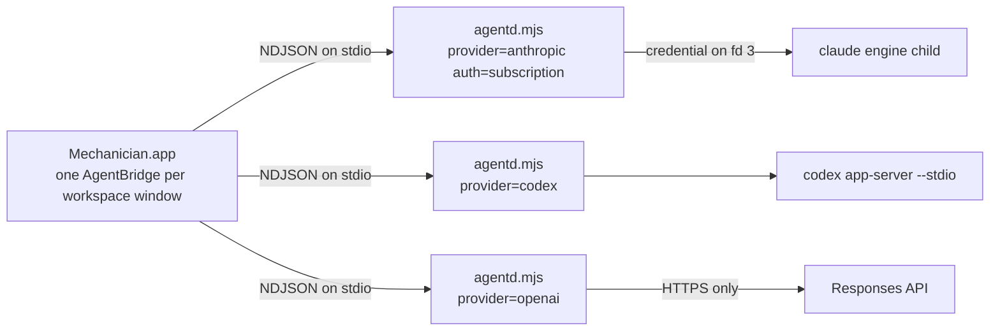

# Provider lanes, accounts, and models

Provider authentication is the most repeated bug class in this project. The failures share a shape:
a credential or a route selector leaks in from somewhere the code did not intend, or a lane is told
to use a model its deployment does not carry. This document names every lane in one place.

Related: [OVERVIEW.md](OVERVIEW.md), [AGENTD-PROTOCOL.md](AGENTD-PROTOCOL.md),
[AGENTD-INTERNALS.md](AGENTD-INTERNALS.md), [SECURITY-AND-PERMISSIONS.md](SECURITY-AND-PERMISSIONS.md),
[BACKGROUND-WORK.md](BACKGROUND-WORK.md), [../development/BUILD-AND-PACKAGING.md](../development/BUILD-AND-PACKAGING.md).

## 1. ModelAccess: the lanes

`ModelAccess` in `app/Sources/Mechanician/AgentBridge.swift` is the authority. Six cases exist:

```
awk '/^enum ModelAccess/,/^    var maker/' app/Sources/Mechanician/AgentBridge.swift | grep -c '^    case '
# 6
```

Four are in every build. The other two activate only when an installed tenant profile declares them
(section 8); see `builtInCases` and `allCases` in `app/Sources/Mechanician/ProviderAccountStore.swift`.

| Case | Raw value | provider / auth | Transport in agentd |
| --- | --- | --- | --- |
| `claudeSubscription` | `claude_subscription` | anthropic / subscription | Claude Agent SDK `query()`, credential owned by the bundled engine |
| `anthropicAPI` | `anthropic_api` | anthropic / apikey | the same Agent SDK, backed by a metered API key |
| `codexSubscription` | `codex_subscription` | codex / subscription | `codex app-server --stdio` over JSON-RPC |
| `openAIAPI` | `openai_api` | openai / apikey | a hand-written Responses loop with `store:false`, agentd runs every tool |
| `claudeVertex` | `claude_vertex` | anthropic / vertex | Agent SDK with the Vertex selector, Google ADC |
| `claudeBedrock` | `claude_bedrock` | anthropic / bedrock | Agent SDK with the Bedrock selector, ordinary AWS chain |

The picker invites an assumption that the two subscription lanes and the two API lanes are matched
pairs. They are not: the Anthropic API lane inherits nearly all of the Agent SDK harness, while the
OpenAI API lane is a narrower loop Mechanician owns (`runOpenAI` in `agentd/src/agentd.mjs`).

A lane owns its daemon process, remembered permission grants, MCP OAuth Keychain records, credential
epoch and account instance id, model catalog, and capability records. None of that is shared. The
provider config directory is the exception, and section 2 has the detail: only the profile-driven
routes are handed a private one. `usesInteractiveAccountFlow` returns `false` for Bedrock, which
resolves the same AWS chain the user's own `aws` CLI resolves.

## 2. One daemon per lane

`AgentBridge` holds `private var runtimes: [ModelAccess: AgentdRuntime]`, and one `AgentBridge` is
created per workspace window in `makeWorkspaceWindow` (`MechanicianApp.swift`). So the live process
count is one `node agentd.mjs` per lane per window that has used that lane, started lazily by
`ensureRuntime(for:)`.



`PROVIDER` and `AUTH_MODE` are read once at module load and never change, so switching lanes means a
different process, not a different mode. Four consequences:

- **Config directories.** `CONFIG_DIR` defaults to `~/Library/Application Support/Mechanician/claude`
  and is overridable with `MECHANICIAN_CONFIG_DIR`. `CODEX_CONFIG_DIR` is derived from its
  *basename*: a path ending in `/claude` gets the sibling `/codex`. Renaming that convention
  relocates Codex sign-in and thread state without saying so.
- **Allowlists.** `ScopedAllowlist` (`agentd/src/scoped-allowlist.mjs`) keeps one JSON file per
  canonical workspace under `permission-scopes/<provider>-<auth>/`. Several daemons hold the same
  file, so every mutation runs inside `withFileLock` and a stale lock is reaped only by
  token-verified atomic rename. Do not reintroduce a blind unlink.
- **MCP OAuth.** Tokens are keyed on `provider:auth:routeIdentity` (`MCP_OAUTH_ROUTE_SCOPE` in
  `agentd.mjs`, consumed by `mcpOAuthBinding` in `agentd/src/mcp-oauth-keychain.mjs`), so two
  managed backends cannot reuse each other's tokens.
- **Diagnostics.** Each lane writes its own stderr file,
  `~/Library/Application Support/Mechanician/logs/agentd-<rawValue>.log` (`openStderrLog` in
  `AgentdRuntime.swift`). That is where to look first.

## 3. Credential isolation at spawn

Two scrubs run, one on each side of the pipe.

`AgentdRuntime.start()` captures `ANTHROPIC_API_KEY`, `OPENAI_API_KEY` and `CLAUDE_CODE_OAUTH_TOKEN`
from the app's own environment, clears all three plus `ANTHROPIC_AUTH_TOKEN`, then re-injects at
most one, chosen by a switch on `access`. Codex, Vertex and Bedrock receive none.

At daemon boot, `scrubUnsupportedClaudeRoutes` deletes every enterprise backend selector it knows:

```
awk '/^const UNSUPPORTED_CLAUDE_ROUTE_ENVIRONMENT/,/^\]/' agentd/src/claude-secure-spawn.mjs | grep -c "^  '"
# 16
```

Only the selected route re-adds its own, from the explicit `VERTEX_ROUTE_KEEP` or
`BEDROCK_ROUTE_KEEP` list. Without this, a conversation labelled "Claude subscription" could route
and bill through a backend inherited from the launching shell. The Anthropic API key is then captured
into the module constant `ANTHROPIC_API_CREDENTIAL` and deleted from `process.env`. The subscription
lane is different and it matters when you are chasing a leak: it captures its token into
`EXPLICIT_CLAUDE_OAUTH_CREDENTIAL`, deletes `CLAUDE_CODE_OAUTH_TOKEN`, then writes it straight back,
because the engine child expects to find it in the environment.

`secureClaudeCodeSpawn` (`agentd/src/claude-secure-spawn.mjs`) hands it to the engine: the child is
spawned with `stdio: ['pipe','pipe','ignore','pipe']`, told which descriptor to read
(`CLAUDE_CODE_API_KEY_FILE_DESCRIPTOR` or `CLAUDE_CODE_OAUTH_TOKEN_FILE_DESCRIPTOR`, both `3`), and
the secret is written into that pipe. It never enters the child environment or argv.
`localChildEnvironment` applies the same scrub to terminal, git and build subprocesses.

**Authentication must never depend on the launch PATH.** `resolveClaudeBin()` returns `null` unless
`MECHANICIAN_CLAUDE_BIN` is set explicitly, leaving the Agent SDK to use its own package-locked
engine. PATH discovery produced the run of "signed out after a GUI or updater relaunch" patch
releases: a GUI or Sparkle relaunch has a minimal PATH, a third-party `claude` wrapper exits 127
there, and agentd read that as a signed-out account. Only the terminal launch gets tested by hand,
and it is the one with the richest environment.

The release build still gates on it. When `MECHANICIAN_DISTRIBUTION_BUILD=1`, `build-app.sh` runs
`scripts/verify-packaged-auth.mjs` against the freshly signed bundle before notarization, and
`scripts/dogfood.sh` runs the same check. It launches the bundled engine under a sanitized, GUI-like
environment. A machine with no login is a skip, not a failure.

## 4. Sign-in

One verb, `login_start`, hides four structurally different flows, all in the stdin switch in
`agentd/src/agentd.mjs` (`grep -n "case 'login_start'"`).

1. **Codex.** An `account/login/start` JSON-RPC call. The returned `authUrl` is emitted as
   `login_url` and Swift opens it; the App Server persists the completed flow.
2. **Vertex.** agentd owns a loopback listener with PKCE and a state check
   (`agentd/src/vertex-adc.mjs`). Only the consent URL crosses the protocol. The authorization code
   and the ADC file stay in the daemon, in a Mechanician-owned path, never the user's shared gcloud
   configuration.
3. **Claude subscription.** Delegated to the bundled login broker via `startLoginViaCLI`, which runs
   `claude auth login --claudeai` under a pty. Nothing crosses the protocol. On exit the daemon
   re-reads `claude auth status --json` through `classifyClaudeSubscriptionAuthStatus`, which
   rejects a `third_party` provider so enterprise traffic is never relabelled as a personal
   subscription.
4. **Key-configured lanes** (Anthropic API, OpenAI API, Bedrock) are refused with a `login_error`.

`account_reload` and `logout` are separate verbs. `MECHANICIAN_ACCOUNT_DISABLED=1` holds a whole
daemon in a disconnected state: it suppresses credential pickup at boot, keeps the process out of SDK
mode, and short-circuits `login_start` and `account_reload`. It does not gate `logout`, which still
performs its credential mutation. `AgentdRuntime.start()` clears the variable from every daemon
environment the app launches, so today it is a test and development input, not a product control.

## 5. Account state in the app

`ProviderAccountStore` is the provider-neutral authority. Its `State` has six cases: `checking`,
`connected`, `configured`, `managed`, `disconnected`, `unavailable`. `managed` means the credential
came from the app's launch environment rather than Mechanician's Keychain, so it can be used but the
UI must not offer to remove it.

A passive probe never overwrites a stronger runtime answer: `runtimeAuthenticationRejections` keeps
a definitive provider rejection authoritative while a cached OAuth file is still on disk. And
`credentialEpochs` plus `accountInstanceIDs` form a monotonic ownership boundary, so a reply from a
daemon predating a credential change is discarded. The instance id deliberately holds no email,
subject, or credential digest.

`refresh()` probes off-main and is side-effect-free: it never logs in, logs out, or reads a secret.
It fills in every lane except Bedrock, whose state arrives only from a daemon `ready` event or a
completed turn. API keys are written with `SecItemAdd`/`SecItemUpdate` rather than `security
add-generic-password -w`, which silently truncates at 128 characters.

`ProviderCenterView` in `SettingsView.swift` is the single provider-management screen, hosted by a
persistent Providers window. `ProviderSetupBanner.swift` is the in-conversation card for a blocked
lane, and `ProviderSetupRecovery.swift` binds that banner to a destination so an account action
resumes the exact conversation that was blocked. Opening the window carries no routing authority.

## 6. Model catalogs and capabilities

`requestModelCatalog` in `agentd/src/agentd.mjs` runs discovery: Claude routes open a real `query()`
probe in the requested workspace, Codex asks the App Server, OpenAI lists over HTTPS. Capability
records (`agentd/src/provider-capabilities.mjs`, `ProviderCapabilities.swift`) keep
`providerAvailability` and `mechanicianSupport` as independent axes, so a feature that exists
upstream does not become actionable when this adapter cannot honor it.

The rule easiest to get wrong: **the Claude SDK's `supportedModels()` is client-side.** The local
runtime answers it from its own build-time list. A probe against a nonexistent Vertex project with
no credentials still returns the full first-party catalog, led by the `default` alias. Treating that
as evidence about a managed deployment is what selected a model the project answered with 404 on
every turn.

`ModelCatalogStore.constrained` in `app/Sources/Mechanician/ModelCatalog.swift` therefore makes a
managed route's declared models **authoritative and subtractive**. A live catalog row only enriches
a declared model with efforts, capabilities and a description; undeclared rows are withheld, and
`withheldModelIDs` reports what was hidden. **An alias is never sent on a managed lane**, because an
alias re-resolves inside the same build-time list the constraint exists to overrule, so the wire id
is always the declared id. The two failures are not symmetric: withholding a model the deployment
carries is fixed by publishing an updated profile, while offering one it cannot serve leaves the
account with no working turn.

`discoverBedrockModelCatalog` is the same lesson in the daemon: it asks the `aws` CLI for inference
profiles instead of trusting `supportedModels()`, falling back to the built-in list rather than
showing an empty picker. And `resolveClaudeModel` in `agentd/src/claude-turn-options.mjs` rewrites
exactly one id: `claude-opus-4-8` becomes `claude-opus-4-8[1m]`, so the id in the logs is the
rewritten one. Everything else passes through, including Opus 5, which is natively 1M and would name
a model the provider does not publish if it were suffixed. The rewrite is also skipped entirely on
every third-party route: `THIRD_PARTY_ROUTES` holds `vertex`, `bedrock` and `foundry`, whose
publisher ids differ from the first-party names and whose 1M window is gated behind a separate
`native_1m_3p` flag. The window is a property of the model *and* the route, never the model alone.

## 7. Provider failures as a persisted record

`ProviderFailure` (`app/Sources/Mechanician/ProviderFailure.swift`) is a provider-neutral `Codable`
record attached to a transcript entry, so an error card survives relaunch with its recovery action
intact. Its `Kind` covers authentication, quota, rate limit, model access, context limit, output
limit, server, network, invalid request and unknown. Everything reaching the wire passes through
`normalizeAnthropicError`, `normalizeOpenAIError` or `normalizeCodexError` in
`agentd/src/provider-errors.mjs`, which scrub secrets and bound the payload first.

`ProviderFailure.from(event:authoritativeAccess:)` treats the turn's route as authoritative; the
wire `provider` and `access` fields are consistency checks only. If provider-neutral metadata is
present but does not reconcile, the record is bound to the turn's real route as a non-retryable
`unknown` rather than trusted or dropped, so a background failure cannot inherit whichever provider
happens to be visible in the window.

## 8. Managed and enterprise configuration

An administrator can add one separately signed `.mechanician-profile` file to an installation. Read
`app/Sources/Mechanician/TenantProfile.swift` before touching any of this.

**The trust rule: a profile only ever selects audited built-in adapters.** It never supplies
executables, commands, or raw environment variables. `ModelAccess(adapter:)` maps exactly
`claude-vertex` and `claude-bedrock`; every other adapter string resolves to nil and activates
nothing. Route metadata reaches the daemon through
`AgentdRuntime.tenantRouteEnvironment(for:profile:supportDirectory:)`, an explicit, testable,
secret-free mapping, which is what stops a profile from becoming a generic environment-variable
injection surface. The profile-signing public key is embedded in the app and is deliberately
separate from Sparkle's update-signing key. A missing profile resolves to `TenantProfile.default`;
an invalid one is a launch-blocking error.

The standard bundle owns the `.mechanician-profile` document type. Opening one from Finder or a
browser never sends it to a conversation: the app verifies its signature, opens Providers on the
same launch/session-restoration fence as other external ingress, and presents the existing review
sheet. Installation is explicit and relaunches the app so every store and provider runtime sees one
coherent profile for its whole process lifetime.

The signed document is never rewritten. `ManagedConfigurationOverrides.swift` layers per-user edits
on at resolution time, so `TenantProfile.current` is the effective configuration and existing
consumers keep working unchanged. One rule there is not negotiable: a source whose URL the user
changed loses its managed `authentication`, because that authentication hands an enterprise identity
token to the URL. `TenantProfileUpdater.swift` verifies a fetched revision before touching the
installed file, so an unreachable or hostile feed can only leave the current profile in place.

`update.profileUpdateMode` controls profile-feed traffic. `manual` means launch is network-silent
and only the Providers **Check for Updates** action consults `profileFeedURL`; `automatic` permits
the launch check. A missing field means `automatic` for compatibility with already-installed
profiles. Roll out a transition by releasing support for the field first, then publishing a higher
signed revision with `profileUpdateMode: "manual"`. The existing automatic behavior delivers that
one revision and subsequent launches stop consulting the feed. `update.revision` remains preserved
and visible even when a signed profile omits `profileFeedURL` entirely.

The app binary's Sparkle feed has a separate network-consent boundary in `UpdaterManager.swift`.
For an unmanaged install, neither the legacy Sparkle preference nor the bundle default counts as
consent: Sparkle is not constructed until the person records **Manual Check Only** (the default)
or **Automatic Update Checks**. A forced MDM update authority or `sparkleAutomaticChecks` value wins over
that local choice. Settings shows only the app-update hostname and effective mode. The Managed
Configuration inspector similarly derives a host-only inventory for the signed profile feed,
managed extension sources, and remote managed MCP servers; it never displays URL paths, query
values, user information, or configuration secrets in that disclosure.

**The packaging boundary a contributor can break without noticing.** `build-app.sh` refuses a bundle
identifier other than `ai.mechanician.app` unless `MECHANICIAN_TENANT_PROFILE` names a profile, and
then requires that profile's `bundleIdentifier`, `update.feedURL` and `update.publicEDKey` to equal
the values in `Info.plist`. The same block derives a per-identity URL scheme. Bundle identity,
`MechanicianEnvironment.urlScheme(for:)` and `MechanicianEnvironment.credentialServices(for:)` move
together: Keychain services carry the same identity suffix so one installed identity cannot read or
delete another's credentials.

## 9. Adding a lane

There is no `Provider` interface to implement. A route touches all three layers, and missing one
leaves a daemon running with a silently wrong route.

**Swift.**

1. New `ModelAccess` case in `AgentBridge.swift`, plus `maker`, `usesInteractiveAccountFlow` and the
   `init(provider:authMode:)`, `init(accountChoice:)`, `init?(adapter:)` overloads.
2. In the `ModelAccess` extension in `ProviderAccountStore.swift`: `builtInCases` or the
   profile-driven path, `displayName`, `accountChoice`, a `probe` entry, and an `apiKeyDescriptor`
   entry for a key-configured lane.
3. `AgentdRuntime.route(for:)`, the credential-injection switch in `start()`, and
   `tenantRouteEnvironment` if the route is profile-driven.
4. `ProviderFailure.Provider` and `expectedProvider(for:)` if the maker is new.

**agentd.**

5. `PROVIDER` / `AUTH_MODE` resolution at boot, including `resolveAnthropicAuthMode` in
   `claude-secure-spawn.mjs` for an Anthropic-family route, the keep-list of sanctioned selectors,
   and the config-directory branch.
6. A `runX(ctx, prompt, model, effort, permissionMode, history, ultracode)` that registers in
   `activeTurns`, emits the shared event vocabulary and cleans up in `finally`, then a branch in
   `handleSend`.
7. Discovery in `requestModelCatalog`, a `normalizeXError` in `provider-errors.mjs`, capability
   records in `provider-capabilities.mjs`.
8. `login_start`, `account_reload` and `logout` branches, even when the answer is a refusal.
9. Tool authorization in `runtime-policy.mjs` if the lane executes tools itself rather than through
   the Claude `canUseTool` gate.
10. `LANE_ROUTES` in `agentd/src/ambient-agentd-runner.mjs` if the lane should be schedulable. Three
    lanes are today: `grep -c "^  [a-z_]*: { provider:" agentd/src/ambient-agentd-runner.mjs`
    returns `3`. See [BACKGROUND-WORK.md](BACKGROUND-WORK.md).

**Packaging.** A new bundled provider binary means editing `scripts/stage-agentd.sh` and
`build-app.sh` and pinning its version everywhere the existing pins live. A new credential class
means adding it to `DEFAULTS` in `agentd/src/credential-services.mjs` and to
`MechanicianEnvironment.credentialServices(for:)`, which must agree.

One source-level test catches a shortcut: `agentd/test/runtime-hardening.test.mjs` counts `query({`
call sites and asserts every one sets `settingSources: []`. Today
`grep -n settingSources agentd/src/agentd.mjs | wc -l` returns `4`, matching the four call sites, so
adding a fifth fails CI even when it is configured correctly.
