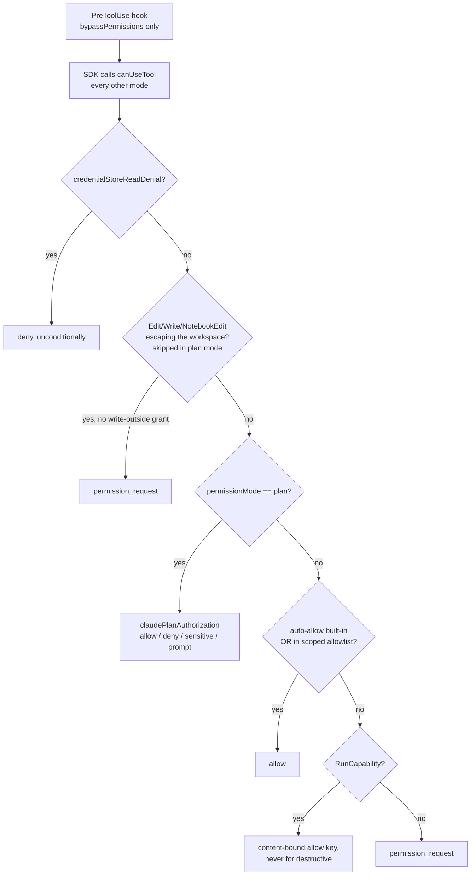

# Tools, permissions, and what is actually contained

[SECURITY.md](../../SECURITY.md) is the threat model and the reporting address. This document is the
enforcement architecture: which code decides what, in what order, and where the boundaries stop. A
document that overstates containment is worse than none, so the gaps are named.

## 1. What contains what, honestly

```
┌─ macOS TCC ─────────────────────────────────────────────────────────────┐
│  Automation (Apple Events), Accessibility, Screen Recording,            │
│  Microphone, Camera, Photos. Granted to the Mechanician app process.    │
│  ┌─ Hardened runtime, NO App Sandbox ─────────────────────────────────┐ │
│  │  ┌─ agentd (Node) userspace gates ───────────────────────────────┐ │ │
│  │  │  credential-store denial · write containment · plan policy    │ │ │
│  │  │  auto-allow list · scoped allowlist · per-capability keys     │ │ │
│  │  │  ┌─ Codex engine sandbox (Codex lane only) ────────────────┐  │ │ │
│  │  │  │  readOnly / workspaceWrite / dangerFullAccess           │  │ │ │
│  │  │  └─────────────────────────────────────────────────────────┘  │ │ │
│  │  └───────────────────────────────────────────────────────────────┘ │ │
│  └────────────────────────────────────────────────────────────────────┘ │
└─────────────────────────────────────────────────────────────────────────┘
   An approved Bash command escapes every ring except TCC. It runs with
   your full macOS user identity.
```

`app/Mechanician.entitlements` contains three device-access keys and nothing else, and says in a
comment that the app is hardened-runtime and not sandboxed. That is deliberate and permanent: the
App Sandbox disables cross-application Accessibility control and constrains arbitrary local process
execution, which are the capabilities this product is built on. Sandboxing would remove the product
rather than harden it, so the Mac App Store is a non-goal.

`build-app.sh` applies the JIT exceptions in `app/JITRuntime.entitlements` only to the bundled Node
and Codex binaries, never to the app. See
[../development/BUILD-AND-PACKAGING.md](../development/BUILD-AND-PACKAGING.md).

## 2. Where authorization happens

All of it is in the daemon. None of it is in Swift.

```
grep -rln "escapingWriteTarget\|credentialStoreReadDenial\|isClaudeBuiltInAutoAllow\|localToolAuthorization\|unattendedToolAuthorization" agentd/src app/Sources
→ agentd/src/ambientd.mjs, agentd/src/runtime-policy.mjs, agentd/src/write-containment.mjs, agentd/src/agentd.mjs
```

The app renders a card and returns an answer. `genericPermissionRow` in `ContentView.swift` always
offers Deny / Always allow / Allow once; it is the daemon that refuses to remember a grant for a
destructive capability. `AgentBridge.respondPermission` persists the conversation first, re-checks
that the route still owns the request, and only then writes `permission_response`; persistence,
ownership and delivery failures produce different messages. `ComputerControl.perform` runs
clicks, keystrokes and AX walks in the app process because that is where the TCC grants apply. It
performs; it does not authorize.

## 3. The Claude lane: `makeCanUseTool`, in order

`makeCanUseTool()` in `agentd/src/agentd.mjs` is the Claude Agent SDK's `canUseTool` hook. The order
is the security model.



Two properties are load-bearing. Credential-store denial and write containment run **before**
permission mode, including `bypassPermissions`: "do not ask me about tools in my workspace" is a
different statement from "write anywhere on this disk". And `isClaudeBuiltInAutoAllow` matches exact
names plus three reserved `mcp__` prefixes only.

The first of those needs two surfaces, and for a period it only had one. The SDK does **not** invoke
`canUseTool` under `permissionMode: 'bypassPermissions'`; it auto-approves first and warns
`[CLAUDE_SDK_CAN_USE_TOOL_SHADOWED]`, naming a PreToolUse hook as the way to gate every call. Both
checks lived only in `canUseTool` and were therefore running in no Full-access turn at all, while
this document said they were unconditional. `makeWriteContainmentHook()` in `agentd/src/agentd.mjs`
restores them on the surface that runs, calling the same two policy functions and raising the same
`permission_request`. It acts **only** when `permissionMode === 'bypassPermissions'`, so no call can
be gated twice. `agentd/test/write-containment-runtime.test.mjs` pins the wiring; the policy itself
is covered separately by `agentd/test/write-containment.test.mjs`, and a policy test cannot see a
gate that is never called. A hook refusal must use `preToolUseDenial()`
(`agentd/src/interaction-closure.mjs`): the SDK reads an unrecognized return as "no opinion" and
allows the call, so every path that settles a hook-raised prompt, including interrupt and turn end,
goes through `pendingPermissionDenial()`. Never widen it to a namespace heuristic; a test
asserts `mcp__skills__RunAnything` and `mcp__dev__Build` are not auto-allowed.

Every `query({ ... })` call into the SDK passes `settingSources: []`, so no project or user
permission rules, hooks or MCP servers are inherited. `agentd.mjs` has four such sites and
`agentd/test/runtime-hardening.test.mjs` asserts both the `query({` count and the
`settingSources: []` count are 4, so adding a fifth fails CI until the test is updated with it. The
scheduler has a fifth query of its own in `ambientd.mjs` that also passes the flag, outside that
test's reach.

```
grep -rn "settingSources" agentd/src
→ 4 in agentd/src/agentd.mjs, 1 in agentd/src/ambientd.mjs
```

## 4. The OpenAI lane and the Codex lane use different mechanisms

Assuming symmetry is the likeliest contributor error.

| | Claude | OpenAI | Codex |
|---|---|---|---|
| Gate | `makeCanUseTool` | `authorizeOpenAITool` | `codexAutomaticApproval` + engine sandbox |
| Path confinement | `escapingWriteTarget` (prompt, grantable, tmpdir allowed) | `openAIProjectPath` (throws, no prompt, no grant) | `codexSandboxPolicy` inside the engine |
| Credential-store denial | yes | no | no |

`openAIProjectPath` checks lexical containment and then realpaths the nearest existing ancestor, so
a project-local symlink cannot point outward. It refuses rather than asking. That lane's `Bash`
executor runs `/bin/zsh -lc` with no credential-pattern filter.

`codexSandboxPolicy` maps Mechanician's four permission modes onto the engine's own policy
(`dangerFullAccess`, `readOnly`, or `workspaceWrite` with `writableRoots: []` and
`networkAccess: false`) and sends it on every `turn/start`. Mechanician selects that policy; the
Codex binary enforces it. Codex's approval requests arrive over the app-server protocol and are
translated into the same wire `permission_request`, consulting the same allowlist under the keys
`Bash` and `Edit`. The ten Mechanician tools Codex may call go through `authorizeOpenAITool`
instead, so one lane runs two different mechanisms side by side. They are named in
`MECHANICIAN_DYNAMIC_TOOLS` (`agentd/src/codex-tools.mjs`). Four of them leave the machine's control
surface open (`RunCapability`, `ListCapabilities`, `ListShortcuts`, `DiscoverAppActions`), alongside
`ComputerScreenshot` and `ComputerAction`. Count them from source rather than trusting a
number in prose:

```
$ awk "/^const MECHANICIAN_DYNAMIC_TOOLS = new Set/,/\]\)/" agentd/src/codex-tools.mjs \
    | grep -cE "^  '"
      10
```

## 5. What is deliberately not contained

`WRITE_PATH_TOOLS` in `agentd/src/write-containment.mjs` is a Map from tool name to the input field
naming the file it writes, and it holds exactly `Edit` (`file_path`), `Write` (`file_path`) and
`NotebookEdit` (`notebook_path`). Bash is excluded on purpose, and the module says why: a shell command reaches the
same file through `$HOME`, a variable, or a path recorded turns earlier, and a gate an agent routes
around by accident is not a gate. `agentd/test/write-containment.test.mjs` asserts that
`rm -rf <root>/..` passes `escapingWriteTarget` untouched. That test is the contract.

Also uncontained by design:

- The system temp directory is always writable with no prompt.
- Allowlist matching is exact string membership, but the key is the permission RULE the engine
  suggested for the call, not the tool name: `Bash(npm test *)` rather than `Bash`. The engine
  classifies each call and offers the narrowest rule covering it, and Mechanician keys the grant on
  its rendering of that rule, so approving `npm test` does not approve `rm -rf`. No command matching
  is reimplemented here; a later call that the engine classifies the same way produces the same
  string. A bare tool name is still honored as a LEGACY key, because grants predating this were
  stored that way and are revocable in Settings, but nothing creates one once a suggestion exists.
  A tool the engine makes no suggestion for (an MCP tool arrives with no rule content) still grants
  by tool name, which is the engine's own rule for it.
- Write-escape grants are remembered per containing folder (`write-outside:<dirname>`), not per file.
- The daemon emits a `writeEscape: { target, workspace }` field with that prompt and nothing in
  `app/Sources` reads it (`grep -rn writeEscape app/Sources` is empty), so the card reads as an
  ordinary file-change request.

## 6. Persistent grants: the scoped allowlist

`ScopedAllowlist` in `agentd/src/scoped-allowlist.mjs` writes one 0600 JSON file per
(provider + authMode, canonical workspace):

```
<config>/permission-scopes/<provider>-<authMode>/<sha256(realpath(cwd))>.json
{"version":1,"provider":"anthropic","authMode":"apikey","cwd":"/abs/path","tools":["Bash(npm test *)"]}
```

`<config>` is agentd's `CONFIG_DIR`: `~/Library/Application Support/Mechanician/claude` unless
`MECHANICIAN_CONFIG_DIR` is set. Two things set it. `AgentdRuntime.tenantRouteEnvironment` sets it
per route, but only for the Vertex and Bedrock routes. `MechanicianEnvironment.processDefaults` sets
it process-wide for any bundle identifier carrying a suffix (`ai.mechanician.app.dev` and per-tenant
builds), which is why a Dev build's grants land under `Mechanician-dev/claude` and never mix with the
installed app's. The public bundle id gets no override, so most lanes share one directory and the
`permission-scopes/<provider>-<authMode>/` segment is what separates their grants. A record whose `provider`, `authMode` or
`cwd` does not match the reader is ignored. The workspace is realpath'd, so two paths symlinking to
the same directory share one grant, and the same provider on two auth routes does not.

Mutations run under `withFileLock`. **Standing rule: never blind-unlink a lock in the recovery path.**
Doing that was the lost-update race: a waiter deleted a lock a live process had just acquired, two
holders entered the critical section, and one user's approval was silently dropped. A lock is reaped
only when its owner is provably dead *and* it has aged past `REAP_GRACE_MS`, and then only through
`reapStaleLock`, which renames the file aside atomically and deletes it only if it still carries the
exact stale owner token, restoring it otherwise. Two deterministic regressions in
`agentd/test/scoped-allowlist.test.mjs` pin both halves.

## 7. Credential handling

`AgentdRuntime.start()` nils every inherited provider key and re-adds at most the one its lane owns
(the Codex, Vertex and Bedrock lanes get none; each resolves its own credential store). Inside the
daemon, `agentd/src/claude-secure-spawn.mjs` does the rest:

- `withoutClaudeSecrets` strips `ANTHROPIC_API_KEY`, `ANTHROPIC_AUTH_TOKEN`,
  `CLAUDE_CODE_OAUTH_TOKEN`, `OPENAI_API_KEY` and both credential-descriptor variables.
- `secureClaudeCodeSpawn` hands the Claude engine its credential on file descriptor 3 as a one-shot
  pipe (`stdio: ['pipe','pipe','ignore','pipe']`). The child's environment carries the descriptor
  number, never the bytes, and the pipe cannot be re-read once drained.
- `scrubUnsupportedClaudeRoutes` removes every enterprise-backend selector unless the route
  explicitly keeps it, so a lane labelled one provider cannot silently use another.
- Every local child (terminal, build, `osascript`) is spawned with `localChildEnvironment()`, which
  applies both scrubs.

MCP credentials never appear in `extensions.json`. It holds `keychain://` references whose Keychain
account is bound to a SHA-256 of the server's transport plus command and args, or transport plus URL,
so changing a configured server's command or URL invalidates its secret references by design. OAuth
token bundles live in a separate Keychain service. See
[./PROVIDER-LANES-AND-ACCOUNTS.md](./PROVIDER-LANES-AND-ACCOUNTS.md).

Keychain protects credentials at rest. It is not a boundary against a shell command you approved.

## 8. Unattended authorization: withheld, not denied

A scheduled run has nobody to prompt, so it decides from policy alone. It does not decide by
trusting everything, and older summaries of this app that say it does have it backwards.

The default for a scheduled task is `dontAsk`, and on the Claude lanes `ambientd.mjs` caps its
`allowedTools` at `['Read','Glob','Grep','mcp__artifacts__CreateOrUpdateArtifact']`. Trust all
(`bypassPermissions`) is the second option in the task editor's Access picker and requires an
explicit choice. A task the agent creates for you is forced to `dontAsk` by
`AmbientStore.createFromAgent`, which also clears the task's working directory.

On the Claude lanes `ambientd.mjs` also passes `canUseTool: ambientCanUseTool(...)`. It does not
re-derive authorization; `allowedTools` and `disallowedTools` already did that. It enforces the one
boundary that is absolute in every permission mode: `credentialStoreReadDenial` refuses any read of
a provider or MCP credential store, and the refusal is recorded in the run report rather than only
logged. It is also the whole of that lane's runtime gating: everything else returns `allow`.

Eleven tools are removed from the advertised list rather than denied at call time
(`UNATTENDED_WITHHELD_TOOLS` in `runtime-policy.mjs`: Question, WaitFor, RequestProviderAccess, the
Shortcuts and AppleScript family, Capabilities, and Computer use). Offering a tool that can only fail
invites the model to plan around it.

Non-Claude lanes run through `ambient-agentd-runner.mjs`, which spawns agentd with
`MECHANICIAN_UNATTENDED=1`. That flag is consulted in `authorizeOpenAITool` and when assembling the
OpenAI tool specs; nobody is prompted, the answer is allow or deny. One wrinkle to know about: the
runner replies to a stray `permission_request` with a `behavior` field while agentd's handler reads
`allow`, so any such prompt resolves as a denial regardless of the task's mode. It fails closed.

Inbox-triggered runs wrap attacker-controlled sender and subject text in an `<untrusted-email>`
fence. That is a prompt-level mitigation, not enforcement. More in
[./BACKGROUND-WORK.md](./BACKGROUND-WORK.md).

## 9. Background processes and the kill gate

`kill_background_process` first requires a tracked pid, then re-reads `ps` and refuses unless its
uid and `lstart` identity still match; this narrows the window in which pid reuse could transfer kill
authority. Duplicate stop requests for one pid are serialized. The control still names only a pid,
and `lstart` has one-second resolution, so a replacement the tracker independently authorizes before
an old UI row is clicked remains ambiguous. Orphan adoption in `background-processes.mjs` requires
all four of: reparented to pid 1, same uid as agentd, started after agentd, and a cwd inside a
workspace agentd is responsible for.
`usableWorkspaceRoots` drops `/`, the home directory, and every ancestor of home, and with no usable
root adoption is off entirely.

## 10. Adding a tool: the classification checklist

Writing the tool is the visible half. Classifying it is the half that fails silently.

- **Claude lane.** Add a `tool(...)` to one of the servers built in `buildToolServers`
  (`grep -c "createSdkMcpServer(" agentd/src/agentd.mjs` → 10). Then classify it in
  `runtime-policy.mjs`: `CLAUDE_SAFE_EXACT_TOOLS`/`CLAUDE_SAFE_PREFIXES` for auto-allow,
  `CLAUDE_PLAN_SAFE_*` for plan mode, `UNATTENDED_WITHHELD_TOOLS` for scheduled runs. Unclassified
  means promptable interactively and denied unattended.
- **OpenAI lane.** Add a spec to `openAITools`
  (`node -e "const s=require('fs').readFileSync('agentd/src/agentd.mjs','utf8');const b=s.slice(s.indexOf('const openAITools = ['),s.indexOf('const codexDynamicTools'));console.log(b.match(/type: 'function'/g).length)"`
  → 18), an executor case in `executeOpenAITool`, and a set membership in `READ_ONLY_TOOLS`,
  `EDIT_TOOLS` or `SENSITIVE_READ_TOOLS`. `localToolAuthorization` defaults anything unknown to
  `prompt`. Anything touching the filesystem must route through `openAIProjectPath`.
- **Codex lane.** The name must be in `MECHANICIAN_DYNAMIC_TOOLS` in `agentd/src/codex-tools.mjs`
  (ten today), and it must also be described in `MECHANICIAN_CODEX_GUIDANCE` in the same file.
  `agentd/test/codex-tools.test.mjs` fails any tool sent to Codex that the guidance does not name,
  because that lane gets no system-prompt append. A name absent from the set is not denied; the
  model never sees it.
- Built-in server names are reserved. A user-configured MCP server with a colliding name is dropped
  in favour of the built-in, because `ask`, `artifacts` and `waitmode` carry auto-allow prefixes.
- Add the name to `AgentToolCatalog.groupings` or it lands in the `ungrouped` bucket in the
  Extensions window.
- If you add a `query({ ... })` site, it must pass `settingSources: []`.

## 11. In the tree, not in the app

`agentd/src/mac-bridge/` is an OAuth 2.1 authorization server plus an MCP server exposing three tools
that drive this Mac (`list_shortcuts`, `run_shortcut`, `ask_on_device`). It has a README, and three
test files in `agentd/test/mac-bridge-*.test.mjs` that drive the real process and run in CI.

It is **not shipped**. `build-app.sh` runs `rm -rf "$APP/Contents/Resources/agentd/src/mac-bridge"`
while assembling every bundle, so it cannot be reached from a released app, and nothing in
`app/Sources` references it. It stays in the repository because it is the only OAuth-speaking MCP server the
project controls, which makes it the test target for MCP authorization work on both provider lanes.
Consent is asked of the parent over stdio and an unanswered request times out as a denial;
`MAC_BRIDGE_AUTO_APPROVE=1` is the only bypass, is opt-in by environment, and announces itself.

## Related

[./OVERVIEW.md](./OVERVIEW.md) ·
[./AGENTD-PROTOCOL.md](./AGENTD-PROTOCOL.md) ·
[./AGENTD-INTERNALS.md](./AGENTD-INTERNALS.md) ·
[./APP-SHELL-AND-UI.md](./APP-SHELL-AND-UI.md) ·
[./STORAGE-AND-PERSISTENCE.md](./STORAGE-AND-PERSISTENCE.md) ·
[../../CONTRIBUTING.md](../../CONTRIBUTING.md)
