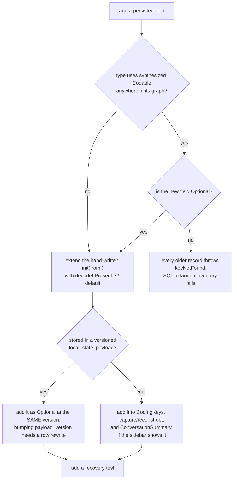
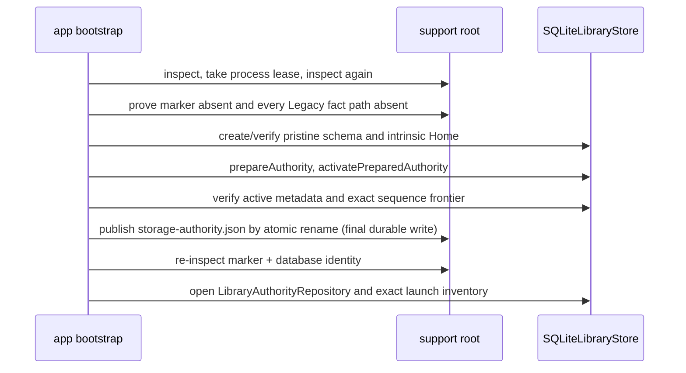

# Storage, authority, and the persistence traps

Everything Mechanician persists lives under one support root. `library.db` is the only product
authority; whether it is safe to open is decided once per process, at launch, by reading a marker,
probing the database and taking the single-writer lease. This document describes the contract that
decision creates, and the two ways contributors have repeatedly destroyed user data by not knowing
about it.

Census, if you want to see the size of what follows:

```
find app/Sources/Mechanician -maxdepth 1 -type f \
  \( -name 'Library*.swift' -o -name 'Storage*.swift' -o -name 'Projection*.swift' \
     -o -name 'AuthorityInbox*.swift' -o -name 'SQLiteLibrary*.swift' \) -print0 \
  | xargs -0 wc -l
```

Related: [OVERVIEW.md](OVERVIEW.md), [SECURITY-AND-PERMISSIONS.md](SECURITY-AND-PERMISSIONS.md),
[BACKGROUND-WORK.md](BACKGROUND-WORK.md), [AGENTD-INTERNALS.md](AGENTD-INTERNALS.md).

## 1. Status, 2026-08-23

Authoritative today, and safe to build on:

- The support root layout and the `MECHANICIAN_SUPPORT_DIR` override.
- The authority marker protocol: one decision per process, marker plus database cross-check,
  uncertainty resolves to blocked.
- SQLite-only product launch. A normal launch requires the process lease, a valid SQLite marker, an
  `active` database and a successful writable-repository preflight.
- Synchronous marker-last bootstrap for a genuinely empty installation. Any Legacy fact makes the
  root ineligible and leaves it untouched for recovery.
- One writer per library, enforced by an `flock` and a process-wide repository registry.
- The `library.db` schema at version 15, its append-only checksummed migration ledger, and the rule
  that `projections.db` is disposable.
- Every rule in section 4. Those are the ones that have already cost users data.

Retained temporarily for users who migrated through 0.26.21:

- Verified SQLite backups, rollback metadata/generations, frozen Legacy source evidence and the
  guarded post-soak reclaim. They are recovery compatibility, not a second product authority.
- `StorageAuthorityMarkerMode.legacy`, rollback database states, migration-era SQL values such as
  `authority_state='shadow'`, `shadow_change_sequence`, and several snapshot type names. They remain
  readable because changing persisted vocabulary or old schema checksums would strand installed
  libraries. Do not copy those names into new APIs.

Removed after the last known installation migrated:

- The interactive migration window, progress/status UI, activation worker and relaunch flow.
- The JSON-to-SQLite shadow coordinator, launch/read rehearsal and fresh reverse-Legacy generator.
- The Legacy JSON product-writer branch. An unmigrated or uncertain root now opens recovery only and
  instructs the user to install and open Mechanician 0.26.21 before returning to a current build.

Still expected to change:

- `ProjectStore` still spells Workspace as `Project` and `projectID`. These are compatibility names,
  not vocabulary to copy into new code.
- Interchange formats. `.convrec` is an experimental v0 export plus a read-only inspector, gated on
  dogfood builds in the File menu, with no importer and an explicit no-compatibility flag in its
  prelude bytes (`agentd/src/convrec/experimental-binding.mjs`). `.mecha` is not implemented: it
  appears once in the tree, in a comment in `ProjectStore.swift`. Neither is a live file format.

## 2. The support root

Default: `~/Library/Application Support/Mechanician`. A non-public bundle id derives its own folder
(`Mechanician-dev`, `Mechanician-<slug>`), and `MECHANICIAN_SUPPORT_DIR` overrides everything. See
`MechanicianEnvironment.currentSupportRoot` and `processDefaults`. The root is repaired to 0700 on
first touch, never merely checked (`OwnerOnlyDirectory.makePrivateReason`).

```
<support root>/
  storage-authority.json     product authority decision; must name active SQLite
  .storage-authority.lock    flock target, held for the process lifetime
  library.db (+ -wal, -shm)  authoritative library once the marker names it
  projections.db (+ -wal)    disposable FTS5 + summary cache. delete freely

  conversations/<UUID>.json  frozen migration source/recovery evidence, if present
  workspaces/<UUID>.json     frozen migration source/recovery evidence, if present
  projects -> workspaces     frozen compatibility symlink, if present
  home-workspace.json        frozen migration source/recovery evidence, if present
  artifacts/                 frozen migration source/recovery evidence, if present
  ambient/                   frozen scheduler source, if present
  ambient-projection/        disposable scheduler projection under SQLite authority

  conversation-media/        live attachment bytes referenced by SQLite
  trash/                     live undo/recovery storage
  authority-inbox/v1/        external producer handoff adopted by the app

  runtime/, runtime-resources/, runtime-service.sqlite
                             residue of a reverted design. nothing reads them.
                             see ../history/adr/ADR-001-runtime-service.md
```

The JSON tree is not a product store in current builds. On a migrated installation it is frozen
source evidence: not read, written or watched by normal product persistence, and not deleted for the
reasons in section 7. On a pristine installation these paths do not exist; their presence before a
marker is published is evidence of an unmigrated root and blocks bootstrap.

## 3. How authority is decided

`MechanicianApp.init` calls `MechanicianEnvironment.bootstrapProcessIfNeeded`, which sets the path
environment and then calls `StorageAuthorityBootstrap.recognizeCurrentProcess(acquireLease:)`.
That function inspects the root, takes `flock(LOCK_EX|LOCK_NB)` on `.storage-authority.lock`, then
**inspects again under the lease**. The second read is the decision every store uses, because a
marker publication is atomic but can still land between the two.

`StorageAuthorityRecognizer.inspect` reads `storage-authority.json` as a bounded, owner-only,
single-link regular file, then opens `library.db` read-only with `query_only = ON` and
`trusted_schema = OFF` and reads `application_id`, `user_version` and the `library_metadata`
singleton. Marker and probe must agree on database instance id (so a copied or replaced file cannot
inherit authority by filename), schema version, activation id and minimum-writer identity.

Recognition retains old dispositions so a database or rollback produced by 0.26.21 can be diagnosed,
but `StorageAuthorityLaunchDecision.resolve` has only two product decisions:

| observed root after the lease | launch result |
| --- | --- |
| valid SQLite marker + matching `active` database + writable repository opens | product |
| truly empty, unmarked root | synchronously bootstrap Home into a new SQLite database, publish the marker last, re-recognize and preflight, then product |
| markerless pristine bootstrap interrupted in exact `prepared`/`active` state | verify the pristine shape and writer identity, complete marker-last bootstrap, then product |
| unmarked root containing any Legacy fact | recovery; leave every byte untouched and instruct the user to open 0.26.21 |
| invalid/missing/mismatched marker, unsafe database, non-active state, failed lease or failed repository open | recovery |
| recognized Legacy rollback generation | recovery in current builds; it is recovery material, not a product authority |

`SQLiteLibraryBootstrapService` is intentionally not a migration. `LegacyLibraryFootprint` treats
the existence of every former JSON fact path as evidence even when it is empty, unreadable, symlinked
or the wrong file type. Only an unmarked root with no such fact may be provisioned. The service seeds
the intrinsic Home workspace, verifies the pristine database shape, moves its metadata through
`prepared` to `active`, verifies the exact sequence frontier, publishes `storage-authority.json` by
atomic rename as its final durable write, re-inspects the pair and opens the launch inventory. A
Dev background-verification launch may inspect an existing library but does not provision one.

`StorageAuthorityBootstrap.preflightSQLiteRepository()` then proves the *writable* repository opens
before any scene exists, rewriting the disposition to blocked on failure. `StorageProductAccessGate`
applies the same lease + product decision + marker-active SQLite requirement to AppDelegate callbacks,
App Intents, Services, notification clicks and scene entry. Every SwiftUI scene is wrapped in
`StorageAuthorityContentGate`, so a recovery root shows the recovery surface and constructs no
product store at all. There is no asynchronous activation worker, migration workspace window or
automatic relaunch in a current build.

Never call `SQLiteLibraryStore.configureOwnedDatabase()` on a file that has not proven it is ours.
It sets `journal_mode = WAL`, which persists in the header. Probing an unknown or future-schema
database with it would mutate that database and spawn `-wal`/`-shm` files next to it.

## 4. The persistence traps

### 4.1 Adding one non-optional field quarantines every older record

Swift's synthesized `Decodable` **ignores property default values**. A stored property with a
default still compiles to `try container.decode(...)`, which throws `keyNotFound` when the key is
absent, and `Codable` structs decode all-or-nothing, so one missing key drops the whole entity.

This has shipped as user-visible data loss twice: subagent rows in 0.11.7, and later a nested
extension type where the top-level struct *did* have a tolerant decoder and the nested one did not,
so the schema looked forgiving. See the comment at `TranscriptEntry.providerFrameUUID` in
`AgentBridge.swift` and the one above `extension MCPServer` in `ExtensionsStore.swift`.

Wrong, even though it has a default:

```swift
struct TranscriptEntry: Codable {
    var kind: Kind
    var text: String
    var providerFrameUUID: String = ""   // synthesized decode ignores this
}
```

Right, and what shipped:

```swift
    var providerFrameUUID: String? = nil   // Optional: decodeIfPresent, absent is nil
```

Or hand-write the decoder and default explicitly. Put it in an `extension` when you need the
memberwise initializer to survive, the way `MCPServer` does:

```swift
extension Thing {
    init(from decoder: Decoder) throws {
        let c = try decoder.container(keyedBy: CodingKeys.self)
        newField = try c.decodeIfPresent(String.self, forKey: .newField) ?? ""
    }
}
```

`Conversation` already has a hand-written tolerant `init(from:)`. `TranscriptEntry`, `WorkflowRun`,
`SubagentRun` and the ambient and extension records rely on synthesized decoding somewhere in their
graph, so every new field there must be Optional. `Failable<T>` in `AgentBridge.swift` is the
per-element backstop (`init(from:) { value = try? T(from: decoder) }`); the subagent and workflow
dictionaries decode through it, so one undecodable delegate row costs that row rather than the
conversation.

`TranscriptEntry.verifiedKnowledgeReceipt` follows that compatibility rule. It is optional, so rows
written before typed receipts decode as ordinary tool rows with no receipt. When present, it is the
canonical JSON bytes of a validated, content-free `VerifiedKnowledgeReceiptAdmission.Receipt`,
stored inside the Conversation local-state payload on the exact tool row. The first production
writer is the app-owned Build adapter. Its payload contains identifiers, closed enums, timestamps
and one-way digests only; output, diagnostic prose and workspace paths are not copied into it. This
does not change the library schema or local-state payload version.

Compaction visibility follows the same transcript-shaped compatibility rule. The optional
`compactionSequence`, `compactionSummary`, `compactionSummarySource`,
`compactionSummaryTruncated`, and `compactionAccess` fields live on the durable compaction entry.
Claude's hook summary and streamed token boundary are paired by turn plus the positive per-turn
sequence even when they arrive in the opposite order. The stored summary is the exact
provider-authored `PostCompact` continuity text unless the explicit 1 MiB safety cap marked it
truncated; it is not a reconstruction of the provider's complete effective context and it never
replaces or deletes canonical conversation messages. Codex persists the boundary without summary
text because App Server keeps its compacted state opaque.

Large Claude summaries use a 0600 file in the process temporary directory only as a control-channel
handoff. Swift validates the expected random filename, regular-file type, UTF-8 byte count, and 1 MiB
ceiling, then deletes the file whether admission succeeds or fails. The handoff file, raw SDK
session id, and prompt id are never library authority; only the admitted transcript fields enter
`library.db` and portable capture.

**What failure looks like.** In the retired JSON writer, `ConversationStore` renamed the sidecar to
`<UUID>.json.corrupt-<epoch>` and the conversation vanished from the sidebar. The current product
failure is a break in a SQLite `local_state_payload`: reconstruction throws out of the adapter and
fails the entire launch inventory (`ConversationStore.failAuthorityLaunch`), so the library refuses
to open instead of partially discarding the record. Frozen `.json.corrupt-*` files remain recovery
evidence and are why reclaim does not sweep the old structured-source directories.

**Any change of this class ships with a recovery test**: write a record with the old shape, decode
it with the new code, assert it survives with the expected default.



### 4.2 Declare what a tolerant decoder throws away

`Conversation.init(from:)` performs product-defined repairs during decode: it drops a provider-root
pseudo agent, discards workflow aggregates manufactured by older builds, and heals a review left in
`.running` to `.stopped`. Decoding is therefore not read-only; it sets `needsStaleStatePersistence`
and the store writes the healed record back.

Every such discard must be appended to `Conversation.decodeNormalizations`. The migration-era
canonical-loss checker, `LibraryCanonicalLossPreflight.compare`, remains as compatibility and
recovery evidence even though current builds no longer run an interactive migration. It walks source
JSON against the model's canonical re-encoding and reports every RFC 6901 path the encoding would not
reproduce. Declared repairs are pruned from the source before that comparison; an undeclared discard
is still unexplained loss and must never be silently normalized by a recovery/conversion tool.

### 4.3 Versioned payloads fail closed

`decodeBounded` in `LibraryAuthorityAdapters.swift` requires an exact `payload_version` match and
throws `unsupportedPayloadVersion` otherwise. `LibraryConversationLocalStatePayload.currentVersion`
is 1. Add new fields as Optional at version 1. Bumping the version without rewriting every existing
row makes every stored conversation unreconstructable.

### 4.4 The schema is append-only and checksummed

`schemaV2Statements` is kept byte-for-byte stable because migration 1's persisted checksum is
derived from it, and every opener re-verifies the whole `schema_migrations` ledger against the
expected checksum map (`verifyExactHeaderAndMigrationLedger`, `verifyExactReadOnlySchema`). Editing
an existing statements array changes its checksum, and every installed database then fails to
recognize.

### 4.5 Retired product paths do not retire persisted vocabulary

Removing the shadow coordinator and migration UI does **not** authorize a storage rename. Existing
databases and manifests still contain `authority_state='shadow'`, `shadow_change_sequence`,
`activation_id`, rollback states and the application id; old support roots may still contain
`library.db.shadow-resettable`. The migration rows in `schema_migrations`, including their exact SQL
text-derived checksums, are permanent history. Marker format version 1 and
`minimum_writer_build='storage-authority-v1'` are likewise durable protocol identifiers.

Keep reading and validating those values. New product code calls the engine `SQLiteLibraryStore` and
describes its current behavior in SQLite/authority terms, but it must not rewrite an installed
database merely to modernize names. A future schema migration may add new vocabulary; it still may
not edit an existing migration's statements or checksum.

## 5. Reading and writing

Product writes funnel through `ConversationStore.save(_:)`, which stages a coalesced snapshot. If an
undrained snapshot for that id already exists it is replaced and `save` performs no write, so a
burst of mutations costs one encode. Tests that assert "one save equals one transaction" are wrong;
use `flushSaves()`, which is `saveQueue.sync {}`, a real barrier including the three retry sleeps.
`MechanicianApp` calls it on termination.

```
                      ConversationStore.save(c)   [@MainActor]
                                 |
                    coalesce into ConversationSaveState
                                 |
                 serial queue ai.mechanician.conversation-io
                                 |
                    repository.commit(conversation:)
                    authoritativeTransaction:
                      CAS committed_sequence
                      SQL trigger -> projection_outbox
                      COMMIT
                                 |
                       Spotlight index
                       outbox worker -> projections.db
                                 |
                      DispatchQueue.main.async -> finishSave
```

Ordering rules you must not invert. The durable write happens first; Spotlight and the projection
follow it and may lag it. Results hop back with `DispatchQueue.main.async` rather than a detached
`Task`, because the serial main queue preserves attempt order and independent Tasks do not. The
frozen JSON tree is not updated in parallel and there is no shadow publication/reconciliation
callback on this path.

Launch reads one consistent snapshot through `repository.launchInventory()`:
metadata, workspaces, all conversation summaries, and full records only for the residency set.
Opening an unloaded conversation hydrates it off-main through `acquireConversation`.
`recentTranscriptPage` races that hydration through a dedicated read-only SQLite connection; it
returns *entries only*, and building a `Conversation` from that page and letting it reach a save path
would truncate the transcript permanently. `LibraryAuthorityRepository` opens this second handle
with `SQLITE_OPEN_READONLY`, `query_only = ON`, and its own user-initiated queue only after the marker
and primary opener have proved the database instance and active WAL authority. Every page pins a
deferred snapshot and re-checks the active-state/activation fence before reading bounded rows, so
projection replay or a full Conversation snapshot on the primary queue cannot delay first paint.
Failure to open the optimization never blocks product launch: the same cancellable API falls back to
the verified primary handle. Cancellation is checked before queue entry, after queue acquisition,
and between decoded rows; the request is canceled when its selection is superseded or full hydration
wins.

Under bounded residency `conversations` is the resident working set and `summaries` is the closed
inventory, so answer "does this exist" with `conversationIDs`.

## 6. Pristine bootstrap and the retired cutover

`SQLiteLibraryBootstrapService.provisionIfNeeded` is the only current path that creates a product
authority. It creates an empty library; it never interprets or imports old JSON.



Crash before marker publication leaves no product authority. A later current build may resume only
when the unmarked database has the exact pristine bootstrap shape, state and writer identity; any
Legacy fact or ambiguity enters recovery instead. Crash after publication leaves a marker/database
pair that normal recognition and repository preflight verify. There is no JSON writer to race with
either side.

The marker is written to a temp file, fsynced, renamed, and the directory fsynced. Publication still
refuses if `library.db.shadow-resettable` exists. That name is migration-era persisted vocabulary,
but its meaning remains safety-critical: an older build may treat the receipt as permission to
destroy and rebuild the database, so it cannot coexist with an authority marker.

The old `SQLiteAuthorityActivationService`, migration progress/completion UI, shadow coordinator,
SQLite read rehearsal, canonical cutover worker, reverse-Legacy generation and unreadable-source
carrier are removed. Existing frozen source bytes and `preserved-sources` remain untouched; current
builds simply do not convert them. To migrate a root that still has Legacy facts, install and open
0.26.21, let that release publish a valid active marker, then return to the current release.

One writer, one mechanism. The library lock is `StorageAuthorityProcessLease` plus the registry in
`LibraryAuthorityRepository.open`. An observe-only lease over an agent's working directory used to
sit beside it in `agentd/src/write-lease.mjs`; it was removed once it had answered its question.

## 7. Backups, rollback, reclaim

`LibraryBackupService` takes a SQLite online backup (`sqlite3_backup_init`) plus a checksummed
manifest of every retained byte the snapshot references, into a content-addressed object pool. A
metadata-only copy is not a backup. Verification means calling `verifyAndRestore` into an isolated
support root and comparing instance id, schema version, committed sequence and manifest digest.
`LibraryBackupLifecycle` retains the migration-era cadence/retention implementation for the verified
generations already stored in the **sibling** directory `<root> Library Backups/`: at most one per
24 hours, keeping 7 generations. The removed activation worker was its product caller; current launch
does not manufacture a new migration backup. `hasVerifiedBackup(for:)` requires a receipt whose
restore this app actually proved, not merely a directory that exists, because that proof remains a
reclaim precondition.

Rollback material is recovery-only in a current build. `LibraryBackupService.verifyAndRestore`
continues to verify a generation from `<root> Library Backups/generations/`, and migrated users may
still have a sibling `<root> Legacy Rollback <uuid>/`. Neither a Legacy marker nor pointing
`MECHANICIAN_SUPPORT_DIR` at that JSON tree enters the current product. If a JSON generation must be
made live, open it with 0.26.21 so that release performs the cutover, then open the resulting
marker-active SQLite library with the current build.

The reclaim (`StorageRollbackReclaimPolicy`) needs all of: active authority, a passed integrity
check, a verified backup, every frozen source accounted for, and 7 days elapsed since the marker
was created. It then releases only the sibling rollback generations, by moving them to the Trash
rather than unlinking, and re-checks `isProtected` immediately before every move. The app now starts
this coordinator in public builds after `ConversationStore.whenLaunchProjectionSettles`; it used to
sit behind a dogfood-only shadow flag and strand multi-gigabyte generations indefinitely.

What it may never touch, and why that is not obvious: `conversation-media/` was adopted **in place**,
so those bytes are the live attachments the database references by path, not a copy. `trash/` is
undo storage. `conversations/` still holds the only copy of the `.json.corrupt-*` bytes that
`RecoveredConversationRecovery.swift` restores.

## 8. External producers

`ambientd` never writes `conversations/` (`grep -rn "conversations/" agentd/src/*.mjs` returns
nothing) and never opens `library.db`. `publishAuthorityInboxEnvelope` in
`agentd/src/authority-inbox-envelope.mjs` builds a canonical envelope and publishes it: open 0600,
write, fsync, chmod 0400, fsync, `link(2)` into
`authority-inbox/v1/pending/ambientd/<operationID>.json`, then fsync both directories. `link` cannot
replace, so a retry with identical canonical bytes is idempotent and different bytes under the same
operation id are a hard collision that never overwrites the first fact.

`AuthorityInboxAdopter` is the app-owned half. Production starts it only after the process has
entered marker-active SQLite product mode and owns the lease. It watches `pending/`, validates,
commits the entity plus the operation plus its receipt in one authority transaction, and moves the
file to `adopted/` as the durable receipt or to `quarantine/`.

Validation uses deliberately **finite** decoders, never the app's tolerant persistence models:
`requireExactAuthorityInboxKeys` rejects unknown keys, `RejectedAuthorityInboxValue` proves
producer-owned collections stayed empty, and an ambient create is rejected outright if it carries a
provider session handle. The reason is stated in the source: accepting the tolerant schema would let
an external producer populate provider handles, tool lifecycle, permissions, questions or media
paths straight into the authoritative library. An unknown domain or kind is quarantined by design.

The wire format is implemented twice by hand, in `agentd/src/authority-inbox-envelope.mjs` and
`app/Sources/Mechanician/AuthorityInboxOperationScanner.swift`, down to the identifier regexes and
the 128 MiB payload / 192 MiB envelope limits. Change them together.

Library schema v11 adds `memory_relationship_review` and v12 two content-free Memory maintenance
tables. **Schema v14 releases all of it**: 24 tables and 62 triggers, the whole memory,
learned-skill and Memrank authority. `PRAGMA defer_foreign_keys = ON` is the rung's first statement
because `learned_skill_lifecycle_decision` references itself with `ON DELETE RESTRICT`, and every
trigger drops before any table because `DROP TABLE` compiles the triggers on the table it drops.
Fourteen of those triggers sit on `conversations`, `conversation_events` and `workspaces`, which
survive; one left behind fails the next ordinary write to a surviving table.

The historical statement arrays are not edited. Their checksums are compared by exact map equality
on every open, so a v7-to-v13 array that stopped creating a table would refuse to open every
existing library. The ladder still builds all of it on the way up and v14 removes it at the top.

`SQLiteAuthorityUpgradeTests` builds its previous-version fixture by winding the current schema
back, which for a rung that only removes means putting everything back. Those statements are
filtered out of the frozen historical arrays rather than restated, and two tests assert what nothing
in this repository asserted before v14: that the objects are ABSENT afterwards, and that an ordinary
write to a surviving table still succeeds.

Schema v15 adds exact-key Conversation work evidence. `conversation_repository_observations` binds
one mechanical Git snapshot to a Conversation id, provider turn id, canonical Git common directory,
worktree and full HEAD facts. It may retain exact entry ids plus bounded 4 KiB prefixes for the root
prompt and final assistant entry, and explicit index/worktree/untracked counts; unavailable status is
stored as unknown, never as zero. HEAD proof is independent: a failed status may still retain the
attached, detached or unborn HEAD which a separate Git command proved. `conversation_file_observations`
binds successful provider file tools (or an explicitly opaque around-tool delta) to the parent
snapshot with an exact matching Conversation/turn/tool edge, before/after existence and optional
SHA-256 facts plus a bounded 256 KiB patch. Both tables are authority; neither contains generated
intent text, similarity matches or relevance scores. The repository/common-directory and
Conversation ids are the only browse joins.

Evidence reads run behind the Conversation store's serial authority-write lane and report failures
as failures; a reader must preserve its last proven presentation rather than replacing it with an
empty result. An append which exhausts disk retries remains in a count- and byte-bounded in-memory
retry queue, and unrelated Conversation saves cannot clear its persistence warning. Reversible
Conversation deletion snapshots the exact cascading evidence rows into the in-session Undo receipt
inside the delete transaction, then restores those immutable identities after the Conversation row.
Permanent deletion never constructs that snapshot and leaves no evidence rows behind.

The pre-authority capture retry queue is deliberately not a repository guess: until Git proves a
canonical common directory, it remains process-memory evidence keyed by the exact
Conversation/turn/tool/CWD event. A process crash in that narrow pre-proof window can still lose the
pending receipt; closing that gap requires a future durable unresolved-capture outbox whose rows do
not claim repository membership before Git supplies it.

## 9. `projections.db`

Schema version 16. `summaries` and FTS5 `entry_fts` project conversation authority, and that is
now all it holds: v16 drops the ten retired memory, Memrank and learning-observation tables. It
deliberately does NOT discard `entry_fts` while doing so — dropping a retired table invalidates no
indexed transcript row, and re-tokenizing the corpus would be minutes of work for nothing. It is fed
strictly after a successful authoritative write. It may lag authority; it may
never lead it. Deleting the file is never data loss: `openOrRebuild` deletes and recreates on any
schema mismatch or corruption, and if that fails the store marks itself broken for the session and
callers use their ordinary fail-open behavior.

## 10. Checklists

**Adding a persisted conversation field.** Decide whether it is a transcript-shaped fact
(a `conversation_events` row via `LibraryConversationAdapter.capture`) or user/session state
(`LibraryConversationLocalStatePayload`, new Optional field, same version). Then: add it to
`Conversation.CodingKeys` or it is not persisted at all; extend the tolerant `init(from:)`; extend
`capture` and `reconstruct` or it is lost in `library.db`; extend `ConversationSummary` if the
sidebar shows it; add a recovery test.

**Adding a `library.db` table or column.** Append a new `schemaV16Statements` array. Never edit an
existing one. Bump `SQLiteLibraryStore.schemaVersion` to 16. Add the migration and its checksum to
*both* `verifyExactHeaderAndMigrationLedger` and `verifyExactReadOnlySchema`. Add the
`migrateV15ToV16` step in both upgrade ladders, include it in pristine provisioning, and update the
previous-version active-authority fixture so it proves the real v15-to-v16 shape transition.

**Adding a durable operation.** `LibraryOperationKind` has four cases today
(`conversation_delete`, `artifact_delete`, `workspace_move`, `background_adoption`). Adding one
means a schema migration to widen the `CHECK` constraints on `operations` and `operation_receipts`,
a payload struct, and a capture path through `ConversationStore.recordTransientOperations`. The old
shadow-named entry point is gone. These are the durable records; the in-session Edit menu undo stack
is separate
(`ConversationDeleteUndo.swift`, `WorkspaceMoveUndo.swift`, `AmbientTaskDeleteUndo.swift`) and
registers with `UndoManager`, not with `library.db`.

**Adding a producer operation.** Extend the Node envelope builder, add an explicit finite decoder in
`AuthorityInboxOperationScanner.validatedOperation` plus a `ValidatedAuthorityInboxOperation` case,
and a commit path in `AuthorityInboxAdopter`.

**Adding a whole new persisted store.** Do not create a fifth sidecar tree or a Legacy fallback.
Extend the SQLite schema, `LibraryAuthorityRepository`, the relevant finite capture/reconstruction
adapter and launch inventory; route every product mutation through the repository transaction and
its committed-sequence CAS. Keep an injectable repository/support-root seam for tests and a serial
`ai.mechanician.<name>-io` queue with a `flushSaves()` barrier when the store coalesces asynchronous
writes. `ArtifactStore.swift` is the smallest current example; `AmbientStore` writes inline on the
MainActor and therefore has no io queue or `flushSaves()`, so do not copy that half blindly.

## 11. What is not settled, and what is settled as a no

SQLite ownership is settled. The remaining lifecycle questions are when it is safe to remove the
temporary backup/rollback/reclaim compatibility and when to clean up non-persisted migration-era
type names; `Project`/Workspace naming and interchange formats also remain open. The items below look
open and are not. They were considered and rejected, so please do not re-propose them without new
information.

- No live user-visible file per conversation, and no security-scoped bookmarks for conversations.
  Making each one a document buys permanent cost: missing-file repair, external edits, duplicate
  identities, and endless file-versus-database reconciliation.
- Never `library.db` or its WAL in a file-syncing folder. File-level sync of a live SQLite database
  corrupts it.
- No loadable SQLite extensions. The app links the macOS system SQLite through `import SQLite3`;
  nothing is bundled. This does rule out the usual extension-based vector search route.
- No reverse migration or JSON product fallback in current builds. Retained backups and rollback
  generations are recovery evidence; an old JSON root must go through 0.26.21 rather than a new
  converter being added to the current launch path.
