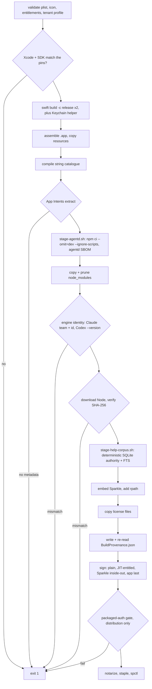

# Build lanes, packaging, and release

## There is no Xcode project

Nothing here is opened in Xcode. There is no `.xcodeproj` and no `.xcworkspace`:

```
$ git ls-files | grep -cE '\.(xcodeproj|xcworkspace)'
0
```

(The only ones on disk belong to checked-out SwiftPM dependencies under `app/.build/checkouts`.)

`app/Package.swift` is a plain SwiftPM package: two executable targets, `Mechanician` and
`MechanicianKeychainHelper`, plus a test target. It declares no `products` (`swift package dump-package`
prints `"products": []`); the assemblers' `swift build --product Mechanician` works because SwiftPM
infers a product per executable target. Everything an Xcode app target would do is hand-written bash:
bundle layout, `Info.plist` embedding, string catalogue compile, App Intents metadata, the bundled Node
runtime, framework embedding, signing, notarization, DMG, and the Sparkle feed. So `swift build` alone
produces a bare executable, not an app: no bundle, no embedded `Info.plist`, no App Intents metadata, no
compiled localizations, no bundle identity. Use `./dev.sh`, which does not use `swift run` either. Xcode
is still required for `swiftc`, `xcstringstool`, `appintentsmetadataprocessor`, `notarytool` and
`stapler`; `codesign` is `/usr/bin/codesign` and ships with macOS.

## The three lanes

| | `./dev.sh` | `scripts/dogfood.sh` | `scripts/release.sh` |
|---|---|---|---|
| Assembler | itself | `build-app.sh`, `MECHANICIAN_DOGFOOD_BUILD=1` | `build-app.sh`, `MECHANICIAN_DISTRIBUTION_BUILD=1` |
| Output | `build/Mechanician-dev.app` | `build/Mechanician.app` | that, plus DMG, PKG, zip, dSYM, manifests, appcast |
| Configuration | debug, newest installed SDK | release, `--arch arm64`, pinned SDK | release, `--arch arm64`, pinned SDK |
| Bundle id | `ai.mechanician.app.dev` | `ai.mechanician.app` | `ai.mechanician.app` |
| Support directory | `~/Library/Application Support/Mechanician-dev` | `.../Mechanician` | `.../Mechanician` |
| Signing | ad-hoc, no entitlements, no hardened runtime | Developer ID, hardened runtime | that, plus notarized and stapled |
| agentd | repo tree, via `MECHANICIAN_AGENTD` | bundled, pruned `node_modules` | same as dogfood |
| Node | Homebrew, via `MECHANICIAN_NODE` | bundled, pinned, SHA-256 verified | same as dogfood |
| Sparkle | all four `SU*` plist keys deleted | present, real feed | present, appcast published |
| `en-XA` pseudo-locale | always | yes | never |
| `BuildProvenance.json` | absent | `dogfood: true` | `dogfood: false` |
| Clean worktree required | no | yes, incl. untracked | yes, incl. untracked |

Dev uses a Homebrew Node deliberately: npm ships node-pty's `pty.node` ad-hoc signed, macOS refuses to map
an ad-hoc library into a Team-ID-signed process, so pointing a dev build at the app's own Developer-ID
Node makes every terminal fail to spawn.

`dev.sh` ends by `exec`ing the assembled binary, so it never returns. `MECHANICIAN_DEV_BUILD_ONLY=1
./dev.sh` stops once `build/Mechanician-dev.app` is assembled, signed and registered, which is what you
want from a script or when a dev build is already running.

**A bug that reproduces only on a dogfood build is expected, not surprising.** Six things differ at
once: release optimization, a pinned SDK, the bundled Node and pruned dependency tree, a hardened
runtime with entitlements, the installed app's bundle identity (so the real support directory, TCC
grants and `UserDefaults` domain), and the signed `dogfood` bit. The remaining dogfood switch exposes
diagnostics and a memory-residency safety valve; storage authority itself is identical in dogfood and
public builds. See [STORAGE-AND-PERSISTENCE.md](../architecture/STORAGE-AND-PERSISTENCE.md).

## Bundle identity and what it controls

`MechanicianEnvironment` derives, from `Bundle.main.bundleIdentifier` alone: the Application Support
folder name, the `mechanician://` URL scheme, the four Keychain service names, `MECHANICIAN_CONFIG_DIR`
and `CODEX_HOME`. `bootstrapProcessIfNeeded()` writes those into the process environment at launch, so
opening a non-public bundle directly cannot fall back to the public app's data. macOS keys the rest off
the same id: TCC grants, the `UserDefaults` domain, LaunchServices registration.

The same rule is written out three times (`MechanicianEnvironment.swift`, plus the plist rewrites in
`build-app.sh` and `dev.sh`) and must agree; `MechanicianEnvironmentTests` and `URLSchemeIdentityTests`
(in `app/Tests/MechanicianTests/MechanicianURLTests.swift`) pin the Swift half. Only `ai.mechanician.app` may own the
`.convrec` Conversation Record type; `scripts/downgrade-conversation-record-plist.sh` demotes every other
bundle to importer, or whichever build launched last steals double-clicks from the installed app.

## What `build-app.sh` does, in order



Four gates are worth naming, because each exists because something shipped broken.

**Pinned toolchain.** `PINNED_XCODE_VERSION`, `PINNED_XCODE_BUILD` and `PINNED_SDK_VERSION` are
exact-match, and the script exits when the installed toolchain differs: release artifacts must not change
because a beta Xcode happens to be installed. `dev.sh` does the opposite on purpose, so dev and release
builds routinely compile against different SDKs.

**Packaged-auth verification.** `scripts/verify-packaged-auth.mjs` runs the freshly signed app's own
bundled Claude engine under a sanitized, GUI-like environment (minimal PATH, no token overrides).
Distribution builds run it before notarization, so a build that cannot authenticate fails in seconds
rather than after a notarization round trip. `scripts/dogfood.sh` runs the same script after its build,
which is the only place a dogfood candidate is checked. It exits 0 and skips when the machine has no
app-scoped login, so a skip is not a pass.

**Collision-proof build numbers.** `release.sh` derives `CFBundleVersion` as
`max(local plist, highest published build on the live appcast) + 1`. An interrupted or `NO_PUSH=1` run
leaves the local plist behind the live feed, and deriving from the plist alone then reuses a published
build number, which Sparkle silently refuses to offer as an update.

**Provenance.** A distribution build cannot be stamped dogfood, and `release.sh` refuses to publish an app
whose `BuildProvenance.json` says `dogfood: true`.

## Signing and entitlements

Signing runs in four classes, inside-out:

1. Ordinary nested Mach-O binaries: hardened runtime, timestamped, no entitlements.
2. The bundled `node`, `codex` and `codex-code-mode-host`: `app/JITRuntime.entitlements` (`allow-jit`,
   `allow-unsigned-executable-memory`). The script asserts both landed and that
   `disable-library-validation` did **not**.
3. Anthropic's `claude` engine: never re-signed. Its vendor signature is part of the Keychain access
   boundary for the credential `claude auth login` creates, and re-signing it once stripped its JIT
   entitlements and crashed the engine at startup.
4. Sparkle's XPC helpers, `Autoupdate` and `Updater.app` before the framework, then the app last with
   `app/Mechanician.entitlements`. An outer signature is invalidated by later inner changes, and a
   privileged installer must not inherit the app's exceptions.

The app is hardened-runtime and **not** sandboxed. `app/Mechanician.entitlements` carries only
audio-input, camera and photos-library, and its own comments say those are kept correct in case the app
is ever sandboxed, not what gates access today. TCC does that, from the plist embedded in the binary.

**What an outside contributor gets.** With no Developer ID identity, `build-app.sh` falls through to
`codesign --force --deep --sign -`: no app entitlements, no JIT entitlements, no `--options runtime`, and
`MECHANICIAN_DISTRIBUTION_BUILD=1` refused outright. You structurally cannot produce or verify a
hardened-runtime build, or reproduce the entitlement invariants locally. That is not a misconfiguration on
your side. One trap if you do hold a certificate: the identity search is scoped to the `SIGNING_TEAM_ID`
default, and after signing the script asserts the signed team equals that same value, so
`MECHANICIAN_SIGNING_IDENTITY` alone fails. Set `MECHANICIAN_SIGNING_TEAM_ID` too.

## Static resource staging is duplicated; generated Help is shared

`app/Resources` is not a SwiftPM resource. Both assemblers copy files into `Contents/Resources` by hand,
and they copy different sets:

```
$ grep -n 'app/Resources/' build-app.sh dev.sh
```

`build-app.sh` stages the icon, the display font, `magic_and_lasers.PNG` (renamed to
`magic-and-lasers.png`) and `figure-source.png`; `dev.sh` stages the first three. Anything you add must be
added to both, or it works in every local test and is missing from the shipped app. Fonts need a third
edit: `MechanicianTypography.registerBundledProductDisplayFont` in `Theme.swift` registers the woff2 with
`CTFontManagerRegisterFontsForURL` at launch (macOS does not discover a font file in `Resources` on its
own) and hard-codes the PostScript name.

The generated product-knowledge resource is the exception. Both assemblers call
`scripts/stage-help-corpus.sh` before signing, and that helper compiles `help/corpus.json` plus its
tracked evidence into `Contents/Resources/MechanicianHelp.sqlite`. Development uses
`MECHANICIAN_NODE` (or the resolved Node); release uses the exact pinned Node already downloaded for
the bundle. The compiler checks two byte-identical outputs, and release `BuildProvenance.json` records
`helpCorpusSchemaVersion` and `helpCorpusSHA256`. See
[MECHANICIAN-HELP.md](../architecture/MECHANICIAN-HELP.md).

## App Intents metadata

`swift build` does not emit `Metadata.appintents`. `scripts/appintents.sh` reproduces Xcode's extraction
phase: `prepare` flattens the toolchain's const-gather protocol list and prints its path, which the caller
passes through `-Xswiftc` alongside `-emit-const-values-path`; `extract` runs
`appintentsmetadataprocessor`.

Two rules. **`extract` must run before `codesign`**, because the signature has to cover the metadata. And
**it must use only the single `-emit-const-values-path` file in the bin directory**, never a glob of the
Intermediates tree: that tree accumulates stale `.swiftconstvalues` from earlier builds, the processor
unions everything it is handed, and a deleted intent silently reappears. That shipped once.

`dev.sh` only warns when extraction fails; `build-app.sh` fails hard. A dev build with silently missing
intents is a supported state, so verify on a packaged build. Registration is a separate problem from
extraction: see [APP-SHELL-AND-UI.md](../architecture/APP-SHELL-AND-UI.md).

## Localization

`scripts/compile-string-catalog.sh` is shared by both assemblers. It runs `xcrun xcstringstool compile` on
`app/Resources/Localizable.xcstrings` into `.lproj` directories inside the assembled bundle. It is a build
step rather than a SwiftPM resource because SwiftPM does not compile `.xcstrings` at all, and SwiftUI's
literal lookup goes through `Bundle.main`, which a SwiftPM resource bundle is not.

It guards three failures: a compile producing no `.lproj`; a declared plural missing from the built
`.stringsdict` (the singular exists only in the catalogue, so call sites carry no `count == 1` branch);
and the pseudo-locale filename trap. `--pseudo` generates `en-XA` via `scripts/make-pseudo-locale.py`, and
the staged file **must** keep the name `Localizable.xcstrings`: `xcstringstool` names its output table
after the input filename, so `pseudo.xcstrings` produces a table nothing looks up, every lookup falls back
to the source language, and the build reports success.

An untransformed string on screen under `en-XA` is an unlocalized string. Dev builds always carry the
pseudo-locale because their distinct bundle id is what makes a `defaults write` locale override land on
the binary under test, rather than on whichever of the installed and dogfood builds LaunchServices picks.

## Dependencies: four mechanisms, nothing vendored

```
$ git ls-files | grep -c node_modules
0
```

1. **SwiftPM source dependencies.** `app/Package.swift` declares open lower bounds (`from:`) for SwiftTerm
   and Sparkle while `app/Package.resolved` pins exact revisions, so manifest and lock look inconsistent
   by design. Sparkle also delivers release tooling as a SwiftPM binary artifact: `generate_appcast` and
   `generate_keys` under `app/.build/artifacts/sparkle/Sparkle/bin`, where `release.sh` expects them.
2. **npm production dependencies.** Exact versions in `agentd/package.json` with a committed
   `package-lock.json`. `scripts/stage-agentd.sh` installs with `npm ci --omit=dev --ignore-scripts` into a
   temporary directory, so release inputs never execute registry lifecycle hooks; the one hook the runtime
   needs, node-pty's `spawn-helper` executable bit, is done explicitly instead. It then smoke-imports five of the daemon's production modules (the Claude Agent SDK, `diff`,
   `isomorphic-git`, `node-pty`, `zod`; `@modelcontextprotocol/sdk` is a static import of `agentd.mjs`
   and is currently *not* among them). It also checks every
   module the daemon needs and emits a determinism-normalized CycloneDX SBOM.
3. **Vendor executables arriving inside npm packages, verified by identity at build time.** `build-app.sh`
   requires the bundled `claude` to carry Anthropic's team identifier and bundle id, and the bundled
   `codex` to report exactly the pinned version.
4. **The Node runtime, downloaded and hashed.** `DEFAULT_NODE_VERSION` and `DEFAULT_NODE_SHA256` change
   together; overriding the version by environment without `MECHANICIAN_NODE_SHA256` is a hard error.
   The archive's embedded npm must match `DEFAULT_NPM_VERSION`; a Node experiment that carries a
   different npm must also declare that expected version through `MECHANICIAN_NPM_VERSION`.

Bumping Codex means editing five files that must agree byte for byte, which `scripts/check.sh` enforces:

```
$ grep -n "0\.148\.0" agentd/package.json agentd/src/codex-runtime.mjs \
    app/Sources/Mechanician/CodexRuntime.swift build-app.sh scripts/stage-agentd.sh
```

License inventory entries are not optional: every top-level item is installed through the
fail-closed `copy_license` helper, including `Package.resolved`, `package-lock.json`, and the
agentd-only production SBOM.
The dependency-notice tests keep the required package and runtime coverage synchronized with their
authoritative pins.

## Release as a transaction

`scripts/release.sh` is ordered so nothing externally visible changes until every local artifact verifies.

```
clean tree, correct branch, HEAD == origin        reversible
green CI for this exact commit (gh api)           reversible
bump plist  ──── EXIT trap restores it on any failure
build, sign, notarize, staple                     reversible
stage signed feed branch heads (not bucket history) reversible
zip, notes, appcast, branch gate, DMG, PKG, dSYM, checksums/manifests reversible
──────────────────── git commit (trap released) ────────────────────
git push origin main         <- first externally visible mutation
create-only upload zip, DMG, PKG, checksums, provenance, release manifest, deltas
verify every candidate-feed object, DMG, PKG and release record
push the version tag
CAS-publish appcast.xml      <- update becomes visible
generation-CAS Stable aliases from immutable sources
re-fetch the live feed and assert the version is present
```

The local point of no return is the `git commit`: before it the EXIT trap restores the version plist,
after it the trap is released. The first external mutation is the source push, so a release is never
downloadable without its source commit on the canonical branch, and the appcast is last so the feed never
points at an object that is not yet uploaded. Immediately before that commit, the script reasserts that
`HEAD` is still the exact commit whose CI result it accepted and that the signed bundle's source commit
and diff digest match it; after committing, it proves those provenance values match the release parent
and version-only commit. `NO_PUSH=1` stops between commit and push; `--resume`
re-enters after a successful notarization, re-verifying the bundle's provenance against the release commit
first.

Release staging is feed-directed, not a bucket mirror. `scripts/stage-update-history.sh` snapshots the
live appcast at one GCS object generation, downloads only each item's direct full ZIP enclosure, and checks
the declared length and existing EdDSA signature before `generate_appcast` can re-sign it. Historical
deltas remain in GCS and are not delta-generation inputs. On the current two-branch feed this reduces the
download from roughly 7.3 GiB to 350 MiB while retaining both the macOS 26 and macOS 13 branch heads.

After generation, the same helper compares Sparkle's complete six-field compatibility key (minimum update
version, minimum and maximum system version, minimum autoupdate version, hardware requirements, and
channel). Every old branch must remain, and an unaffected branch must retain its exact leader. Before the
feed changes, every full and delta enclosure in the candidate is checked against GCS at its declared length;
every locally staged or generated archive also passes EdDSA verification. The final appcast upload uses the
generation captured during staging as a compare-and-swap precondition, so a concurrent release fails safely
instead of overwriting a newer feed; uploaded versioned files are then harmless orphans that a resumed
release or the pruning transaction can reconcile.

Every release channel produces the same immutable distribution set. A Daily release builds, signs,
notarizes, checksums, and uploads its versioned DMG and enterprise PKG, but does not move the Stable
website aliases. Versioned ZIPs, DMGs, PKGs, checksum/provenance/release-manifest records, and deltas are create-only: a retry succeeds only
when the existing remote object is byte-for-byte identical. `--resume` reuses and revalidates the exact
cached ZIP, DMG, PKG, and dSYM archive rather than recreating timestamped package bytes. Even after the
appcast wins its compare-and-swap, resume re-proves those exact immutable objects before performing
the idempotent Stable alias reconciliation.

### Promoting a Daily build to Stable

Stable is a confidence decision, not a second build. `scripts/promote-daily.sh` promotes the exact
Daily ZIP and DMG already offered to Daily users; it never calls the app builder, DMG creator,
code-signing, or notarization submission paths. It verifies the signed live feed, Sparkle enclosure
signature, checksums, Developer ID signatures, staples, Gatekeeper results, ZIP/DMG app identity,
embedded and uploaded provenance, annotated remote tag, version-only release commit, provenance diff,
and green CI. It then removes only the target item's `daily` channel and its displaced older Stable
leader, re-signs only `appcast.xml`, semantically proves every other feed fact unchanged, and publishes
with the staged appcast generation as a compare-and-swap precondition.

Promotion also requires an explicit attestation matching the exact artifact digests. At least two
distinct machines must pass launch, update, storage, Claude, Codex, background-process, and crash-free
checks. The normal minimum soak is 24 hours. `--urgent-reason` may waive only that duration; it never
waives either machine, a failed check, an unresolved blocker, CI, signatures, provenance, or artifact
identity. Start from [the strict example](stable-promotion-attestation.example.json), replacing every
placeholder with the candidate's actual facts:

```bash
./scripts/promote-daily.sh 0.26.24 \
  --attestation /absolute/path/to/0.26.24-stable-attestation.json
```

The script uploads a sanitized, version/build-scoped, create-only promotion authorization before
changing the feed. It proves eligibility and approval, not that the later compare-and-swap won; a
failed CAS can therefore leave harmless authorization evidence. Free-form urgent text is represented
only by its SHA-256 digest. The appcast is published before either mutable Stable alias. A rerun
recognizes an already-promoted item and reconciles only missing or stale aliases; a newer Stable item
or alias prevents rollback. Alias copies are pinned to the exact ZIP and DMG generations validated by
the promotion transaction.

`scripts/prune-updates.sh` remains dry-run by default. Apply mode rejects non-root or wildcard bucket
targets, rechecks the appcast generation around deletion batches, and will not delete any object less
than 24 hours old. That age floor keeps an in-progress release's pre-CAS immutable uploads outside a
concurrent prune plan.

A still-running CI check counts as a failure, not as "not yet failed". `scripts/publish-update.sh` is a
tombstone that exits 64 and points at `release.sh`: publishing only the zip and the appcast bypassed the
source push, DMG notarization, provenance, and the ordering above.

## What outsiders cannot run, and what a fork must repoint

None of these are secrets, and no key material is committed. A fork needs to know about them.

- **The signing team.** `build-app.sh` defaults `SIGNING_TEAM_ID` to the maintainers' Apple Developer team
  and asserts the signed bundle matches it. Override `MECHANICIAN_SIGNING_TEAM_ID` and
  `MECHANICIAN_SIGNING_IDENTITY` together, or accept the ad-hoc path.
- **The Sparkle feed.** `app/Mechanician-Info.plist` carries `SUFeedURL` and the EdDSA **public** key
  `SUPublicEDKey`, both pointing at the maintainers' published appcast, so a fork that leaves them in
  place ships an app that checks the upstream feed and will offer upstream builds as updates. Repoint or
  delete them. The private key is not in the repo; it lives in a Keychain account read by
  `generate_keys`. `dev.sh` deletes all four `SU*` keys and `UpdaterManager` treats a missing `SUFeedURL`
  as "updates are handled elsewhere", so dev builds never self-update.
- **The release script's external dependencies.** `gcloud` with write access to the update bucket
  (`MECHANICIAN_UPDATE_BUCKET`, `MECHANICIAN_UPDATE_URL_PREFIX`), `gh` with access to this repository's
  check runs, a `notarytool` keychain profile named by `NOTARY_PROFILE`, and Sparkle's Keychain signing
  account.
- **The toolchain pin**, which a fork will usually hit first.

`./dev.sh` and `./scripts/check.sh` need none of the above. On a fresh clone `build-app.sh` normally
stops at the toolchain pin, before it reaches anything to do with signing. With a matching toolchain and
no Developer ID it does not fail: it takes the ad-hoc branch and finishes, producing a bundle that runs
on your machine and is not distributable.

## Related

- [CONTRIBUTING.md](../../CONTRIBUTING.md) for the verification workflow and `scripts/check.sh`.
- [../architecture/OVERVIEW.md](../architecture/OVERVIEW.md) for how the app and daemon fit together.
- [../architecture/SECURITY-AND-PERMISSIONS.md](../architecture/SECURITY-AND-PERMISSIONS.md) for the
  runtime side of the trust model these signing rules protect.
- [../history/](../history/) for superseded designs. ADR-001, ADR-002 and ADR-003 describe a runtime
  service that was built and reverted; they do not describe the current build.
